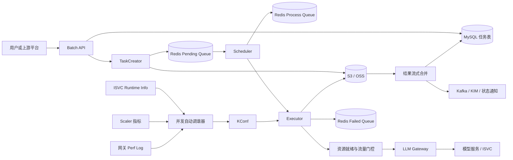
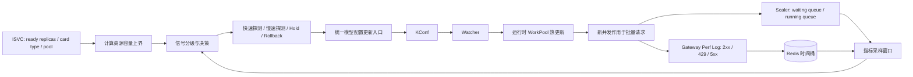

# 批量推理平台项目背景与核心链路

## 1. 项目背景

### 1.1 为什么需要独立的批量推理平台

大模型推理通常可以分为在线推理和批量推理两类场景。

在线推理主要服务聊天、搜索、推荐等交互式业务。用户发起一次请求后同步等待结果，因此系统首先关心首 Token 延迟、单 Token 延迟、P99 延迟和在线可用性。在线服务必须预留相对稳定的资源水位，流量到达后立即处理，通常不允许形成长时间积压。

批量推理服务数据标注、内容生成、离线评测、知识库加工、行业数据处理等异步任务。用户一次提交一个包含大量请求的 JSONL 文件，不要求每条请求立即返回，而是约定一个 `completion_window`，在完成窗口内通过任务状态和结果文件交付结果。批量推理更关注单位时间吞吐、任务完成率、GPU/KV Cache 利用率和单请求成本，所以可以排队、拆分和异步错峰执行。

两类系统的核心差异如下。

| 维度 | 在线推理 | 批量推理 |
| --- | --- | --- |
| 服务形态 | 同步 RPC，请求到达后立即执行 | 异步任务，提交后返回任务 ID |
| 输入粒度 | 单次请求或小批请求 | 包含大量请求的 JSONL 文件 |
| 时延目标 | 毫秒或秒级，关注 TTFT、TPOT、P99 | 保障24h，关注完成窗口和总吞吐 |
| 调度方式 | 实时路由，通常不允许长期排队 | 允许排队、分片、错峰和失败重试 |
| 资源策略 | 为在线 SLA 预留资源，优先稳定性 | 尽量填满离线或闲置资源，优先利用率和成本 |
| 失败语义 | 单请求失败后立即返回调用方 | 请求、分片和任务三级容错，最终统一交付结果 |
| 结果交付 | HTTP 响应 | OSS/S3 结果文件、任务查询、消息通知 |
| 核心指标 | 可用性、P99、TTFT、TPOT | 吞吐、完成率、排队时间、资源利用率、成本 |

因此，批量推理不能简单地实现为“循环调用在线接口”。当输入规模增长到 GB 级、请求数达到几十万甚至更多时，平台必须额外解决以下问题：

- 大文件不能整体加载到内存，需要流式读取和有界内存处理。
- 一个任务不能作为单一执行单元，需要拆成可并行、可重试的 shard。
- 模型实例数、卡型、请求长度和引擎状态持续变化，静态并发无法同时兼顾稳定性和利用率。
- 服务多实例部署、滚动升级或节点故障时，已经认领的 shard 不能丢失或重复执行。
- 用户取消、任务超时、账号冻结等控制信号需要及时传递到正在执行的请求。
- 大量分片结果必须按原有语义汇总，并以稳定、可查询的方式交付。

### 1.2 项目定位

本项目位于用户数据集和底层模型服务之间，本身不负责模型训练，也不实现推理引擎。它更接近一个面向大模型的异步任务控制面和数据执行面：

- 向上提供 Batch API、任务状态查询、取消和结果交付能力。
- 向下通过 OpenAI 兼容网关调用具体模型服务。
- 中间负责数据分片、持久化队列、调度、并发控制、重试、进度聚合和结果合并。
- 通过 ISVC、Scaler 和 KConf 感知模型资源变化，并动态调整批量流量。

平台要解决的核心矛盾，是持续到来的大规模异步请求与有限、异构、动态变化的 GPU 资源之间的匹配问题。

## 2. 总体架构

### 2.1 整体链路



当前代码中，Manager 和 Scheduler 是逻辑模块。服务启动时会同时初始化 HTTP API、TaskCreator、Scheduler、失败重试、并发调谐和监控周期任务，参见 [`internal/service/service.go`](../internal/service/service.go)。

### 2.2 三级执行粒度

系统采用 Batch Task、Shard、Request 三层执行模型。

| 层级 | 面向对象 | 主要职责 |
| --- | --- | --- |
| Batch Task | 用户 | 生命周期、完成窗口、取消、进度和最终结果 |
| Shard | 调度器 | 并行调度、失败重试、升级恢复和结果分片 |
| Request | 模型网关 | 实际推理调用、请求级重试和成功失败记录 |

Shard 是整个架构中最重要的中间抽象。它既避免了大任务一次性执行带来的内存和故障风险，又把调度粒度从“整份数据集”降低到可控制、可恢复的小单元。

### 2.3 存储与基础设施分工

| 组件 | 在系统中的职责 |
| --- | --- |
| MySQL | 保存用户可见的任务信息、任务状态和最终统计 |
| Redis | 保存 pending/process/failed 队列、分布式锁、任务进度、自动调谐窗口和临时状态 |
| S3/OSS | 保存原始 shard、shard 元数据、shard 输出、失败请求和最终结果文件 |
| KConf | 保存模型级并发、分片数、单副本容量和自动调谐配置 |
| ISVC | 提供底层模型服务、ready replicas、卡型和资源池信息 |
| Scaler | 提供推理引擎的 waiting queue、running queue、成功率等运行指标 |
| Kafka | 承载网关 perf log、实时请求结果和任务通知等异步消息 |

## 3. 核心工作一：重构 JSONL 大任务处理链路

### 3.1 背景与问题

批量推理任务的输入通常是 JSONL 文件，每一行代表一个独立模型请求。当单文件扩大到数 GB 甚至 20 GB 时，传统的“完整下载json请求文件—整体解析—分片执行推理完成——全量加载进内存聚合shard结果—一次上传”方案会暴露明显问题：

- 输入文件或最终结果整体进入内存，内存占用与文件大小线性增长，容易触发 OOM。
- HTTP Client 使用固定总超时时间时，大文件即使持续正常传输，也可能因总耗时过长被误判超时。
- 分片上传和结果合并的失败粒度过大，任意阶段失败都可能导致大范围重复处理。

本次重构的目标不是单纯放宽文件大小，而是让输入和输出两端都成为有界内存、可诊断、可重试的数据通道。

### 3.2 重构后的输入处理链路


完整链路如下：用户把请求文件分片上传到blob store批量推理大文件请求提交时，平台侧，然后返回这个文件在blob store的可下载的url，以请求体的形式发给batch-inference。 这部分面向我们 batch-inference 侧是透明的，和小文件没有区别。
batch-inference 设置 max_line_per_shard 固定切片大小，两次流式下载，第一次逐行校验，第二次扫描切片加入current buffer，达到 max_line_per_shard ，上传 OSS 并清空 buffer。

1. 用户通过 API 创建 MySQL 任务记录后，异步调用batch-inference的 `TaskCreator.CreateTask()`。
2. 批量推理在校验阶段通过 HTTP 流式下载数据集，使用 `bufio.Scanner` 逐行检查 JSON 对象格式并统计总行数。达到 `max_line_per_shard` 上传完整 shard 到  oss，
3. 目前大文件切片实现逻辑是：
   
3. 根据数据量计算 `linePerShard`：小任务使用最小 shard 行数，大任务根据最大 shard 数动态计算每片大小；同时允许 `max_line_per_shard` 配置直接指定生产环境的分片行数。
4. 正式分片阶段再次流式读取 JSONL，每次只在内存中维护当前 shard 的 `bytes.Buffer`，达到阈值后立即上传 S3 并释放该 buffer。
5. 每个 shard 都生成独立数据文件和元数据，记录起止行、总行数、对象路径、模型信息和状态。
6. 所有 shard 和 task 元数据写入成功后，再统一加入模型维度 pending queue，避免半初始化任务提前被调度。
7. 初始化成功后，任务由 `init` 进入 `pending`。

主要实现位于：

- [`manager/validation.go`](../manager/validation.go)
- [`manager/processor_http_downloader.go`](../manager/processor_http_downloader.go)
- [`manager/dataset_error.go`](../manager/dataset_error.go)
- [`manager/task_creator.go`](../manager/task_creator.go)

### 3.3 大文件下载的超时与错误诊断

大文件传输不能使用一个简单的整体超时时间。20 GB 文件可能需要较长时间下载，只要数据仍在持续到达，就不应该被中断。因此下载器把超时拆成了三个维度：

- `connect timeout`：限制建立 TCP 连接的时间。
- `response header timeout`：限制服务端返回响应头的时间。
- `read idle timeout`：只在连续一段时间没有读取到任何数据时终止下载。

自定义 `datasetHTTPReadCloser` 会记录 `bytesRead`、`contentLength`、最后一次错误和是否发生 idle timeout。扫描失败后，系统能够进一步区分：

- JSON 格式错误；
- 单行超过 `max_jsonl_line_bytes`；
- read idle timeout；
- `unexpected EOF`；
- 实际读取字节数小于 `Content-Length`；
- 其他网络读取错误。

对于明确的流读取中断，创建 shard 阶段会按配置重新下载并重试；用户数据格式错误则直接失败，不做无意义重试。这种错误分类既提高了恢复能力，也显著降低了大文件问题的排查成本。

### 3.4 动态分片设计

未设置强制分片行数时，基础分片计算规则可以概括为：

```text
if N <= maxShardNumber × minShardSize:
    linePerShard = minShardSize
else:
    linePerShard = ceil(N / maxShardNumber)
```

其中 `N` 是数据集总行数。该策略在小任务上避免产生过碎 shard，在大任务上限制 shard 总数。生产环境还可通过 `max_line_per_shard` 直接覆盖每片行数，使 shard 大小与模型单请求耗时、结果大小和失败重试成本相匹配。

分片带来的收益包括：

- 将大任务拆为可并行执行的小任务，提高整体吞吐。
- 将失败重试范围限制在单个 shard，而不是重跑完整文件。
- 通过 `max_execute_shard` 独立控制模型同时处理的 shard 数量。
- 将单次内存峰值限制在一个 shard 的输入或输出规模附近。

### 3.5 S3 Multipart 流式结果合并

重构前的结果合并会把所有 shard 输出读入一个全局 `bytes.Buffer`，内存占用随最终文件大小增长。重构后，合并链路改为：

```text
顺序下载一个 shard 输出
        ↓
逐行写入 multipartMergeWriter
        ↓
内存缓冲达到 64 MiB
        ↓
UploadPart 到 S3，并清空缓冲
        ↓
处理下一个 shard
        ↓
CompleteMultipartUpload
```

`multipartMergeWriter` 实现了标准 `io.Writer` 接口，对上层屏蔽 Multipart 细节。关键设计包括：

- 内存中只保留当前下载流和最多约 64 MiB 的上传缓冲。
- 每个 part 保存 `PartNumber` 和 `ETag`，最终调用 Complete 完成远端合并。
- Initiate、UploadPart、Complete 均支持重试。
- 中间失败主动调用 Abort，避免遗留无效 Multipart Upload。
- Complete 返回错误时，通过对象 metadata 再次确认结果是否已经成功生成，处理“服务端已成功、客户端响应丢失”的不确定状态。
- 小结果未触发 Multipart 时，退化为普通 `PutObject`，避免不必要的分片上传开销。

主要实现位于 [`scheduler/executor/executor.go`](../scheduler/executor/executor.go) 和 [`services/oss/s3_multipart.go`](../services/oss/s3_multipart.go)。

### 3.6 最终效果

这次重构把输入和输出阶段的空间复杂度从近似 `O(文件大小)` 降低为 `O(单个 shard 大小 + Multipart part 大小)`，消除了大任务初始化和结果汇总阶段最主要的内存瓶颈，并支持 20 GB 单文件稳定处理。

它对应简历中的第一项工作：

> 负责批量推理系统核心功能开发与性能优化，重构 JSONL 任务处理链路，实现流式下载、动态分片及 S3 Multipart 流式结果合并，提升大任务处理稳定性，支持 20 GB 单文件处理。

### 3.7 设计取舍与可继续优化点

当前实现为了在调度前完整确认数据合法性，采用“流式全量校验一次 + 正式流式分片一次”的两遍读取方案。它避免了格式错误直到文件末尾才暴露、前面 shard 已经开始执行的问题，但网络读取量接近原文件的两倍。

如果未来需要进一步降低初始化时延，可以考虑：

- 输入对象不可变时，将校验与分片合并为单遍处理，同时通过 staging queue 保证元数据提交后再开放调度。
- 让 shard 直接使用 Multipart 或流式上传，进一步降低超大单 shard 的内存占用。
- 将最终结果合并锁从进程内锁升级为任务级分布式幂等控制，增强多实例下的唯一合并语义。

## 4. 核心工作二：模型并发自动探测与闭环调谐

### 4.1 背景与问题

批量推理希望尽量吃满离线 GPU，但大模型的安全并发不是一个固定值。它会同时受到以下因素影响：

- ready replica 数量随扩缩容和故障恢复变化。
- X40、X50、X60 等不同卡型的单副本能力不同。
- Prompt 长度、输出长度和请求类型会改变 KV Cache 占用。
- 推理引擎版本、调度策略和模型结构会改变真实承载能力。
- 并发过低会导致 waiting queue 为空、GPU 和 KV Cache 利用率不足。
- 并发过高会造成队列堆积、429、Watchdog 529、5xx 和容量相关失败。

只使用静态 `max_execute_goroutine` 时，需要人工反复压测和修改配置；实例数变化后原有值很快失效。只按照 `readyReplicas × 单副本并发` 直接计算也不够，因为这是理论容量上界，无法反映请求分布和引擎实时状态。

因此系统采用“资源上界 + 在线反馈”的闭环调谐方案：先根据底层资源计算最大安全搜索空间，再通过真实成功率和队列负载逐步探测可用并发。

### 4.2 自动调谐总体链路



### 4.3 第一步：计算资源容量上界

Reconciler 从配置中读取需要自动调谐的模型，并通过 `modelServiceName` 关联 ISVC Runtime Info。对于每个底层 KSN（推理服务单元），读取：

- ready replicas；
- device type；
- 所属 online/offline pool；
- 模型服务名称。

单 KSN 容量计算为：

```text
perReplicaCapacity = baselineConcurrency × cardTypeRatio
readyCapacity      = readyReplicas × perReplicaCapacity
```

多个 KSN 容量汇总后，再除以 batch-inference 服务实例数，得到单个批量推理实例的 goroutine 上界，并受全局最小值和最大值约束。

这里的上界只表示“当前资源规模下允许探索的最大范围”，并不会直接把并发一次性推到该值。相关实现位于：

- [`internal/isvc/ready.go`](../internal/isvc/ready.go)
- [`internal/service/modelconcurrency/model_capacity_deriver.go`](../internal/service/modelconcurrency/model_capacity_deriver.go)
- [`internal/service/modelconcurrency/model_concurrency_reconciler.go`](../internal/service/modelconcurrency/model_concurrency_reconciler.go)

### 4.4 第二步：构建真实运行反馈

自动调谐主要使用两个信号。

#### 请求成功率

系统消费 LLM Gateway perf log，通过 Kafka 获取离线请求的真实返回码，并以模型和 30 秒时间桶聚合到 Redis：

- 2xx 计为成功；
- 429 和 5xx 计为容量相关失败；
- 其他 4xx 通常属于参数或业务错误，不参与容量判断；
- 样本量低于最小阈值时不使用该结果，回退到 Scaler/引擎成功率，避免小样本误判。

与只看引擎内部指标相比，网关成功率更接近用户实际感知，也能覆盖网关到模型服务整条路径上的容量问题。实现位于 [`internal/service/gatewaymetrics/request_success_collector.go`](../internal/service/gatewaymetrics/request_success_collector.go)。

#### 队列负载

系统从 Scaler View 读取推理引擎的：

```text
queueLoadRatio = queue.waiting / queue.running
```

原方案曾使用 `load1` 判断负载，但它难以直接表达推理请求是否积压。`waiting/running` 比值更贴近批量推理的调度状态：

- 比值较低，说明当前并发仍有提升空间。
- 比值适中，说明系统接近稳定工作区间。
- 比值过高，说明请求进入速度超过实际处理速度，需要停止探测或回滚。

实现位于 [`internal/scaler/views.go`](../internal/scaler/views.go)。

### 4.5 第三步：滑动窗口与多实例一致性

当前默认调谐节奏为：

- 每 30 秒采集一次指标；
- 使用最近 10 分钟滑动窗口做平均；
- 每 5 分钟执行一次调谐决策。

指标样本和上一次调谐结果保存在 Redis。采样器和 Reconciler 使用全局分布式锁，保证 batch-inference 多实例部署时，同一周期只有一个实例负责写入和决策，避免多个实例同时修改 KConf。

系统还会检查模型是否存在 `pending/running` 批量任务。没有活跃任务时停止探测，避免在无真实流量时根据空指标调整并发。

### 4.6 第四步：决策策略

当前配置将成功率和队列负载分别划分为 bad、ok、good 三档：

| 信号 | Bad | Good | 中间区间 |
| --- | --- | --- | --- |
| 请求成功率 | `< 99.0%` | `> 99.5%` | OK |
| waiting/running | `> 1.0` | `< 0.4` | OK |

单个 KSN 的决策规则为：

- 任一信号为 bad：`rollback`。
- 成功率和队列负载都为 good：`probe_fast`。
- 一个 good、另一个 ok：`probe_slow`。
- 两者处于稳定区间：`hold`。
- 必要指标缺失：`insufficient_metrics`。

对应的默认步长为：

- 快速探测：增加资源上界的 5%。
- 慢速探测：增加资源上界的 2%。
- 回滚：减少资源上界的 10%。
- 首次探测：从配置的初始并发开始，而不是直接打满理论上界。

一个模型可能对应多个 KSN。系统采用偏保守的聚合规则：任一有效 KSN 要求回滚，则模型整体回滚；指标缺失的 KSN 从本轮有效容量和探测决策中排除，避免用无法观测的容量推高并发；只有全部有效 KSN 都允许继续探测时才会增加并发。

决策实现位于 [`internal/service/modelconcurrency/model_concurrency_signal.go`](../internal/service/modelconcurrency/model_concurrency_signal.go)。

### 4.7 第五步：配置写回与运行时生效

Reconciler 不直接修改本地 WorkPool，而是调用与人工配置 API 共用的统一业务入口：

1. 构造 `ModelConfigUpdateRequest`。
2. 校验目标并发和单副本容量配置。
3. 写回 KConf。
4. KConf Watcher 更新内存中的 `GlobalModelExecuteConfig`。
5. 周期任务调用 `ExecuteCoreController.UpdateConcurrencyController()`。
6. 模型对应 WorkPool 动态调整容量，后续请求使用新的并发值。

这样保留了完整的审计日志和指标，也避免自动调谐与人工配置走两套更新逻辑。相关实现位于：

- [`internal/service/apiserver/model_config_service.go`](../internal/service/apiserver/model_config_service.go)
- [`pkg/kconf/model/model_execute_watcher.go`](../pkg/kconf/model/model_execute_watcher.go)
- [`scheduler/executor/concurrency_controler.go`](../scheduler/executor/concurrency_controler.go)

### 4.8 灰度效果

在核心离线模型灰度期间：

- 高峰期容量相关失败率由 **12.1% 降至 1.8%**，下降 10.3 个百分点，相对下降约 85%。
- KV Cache 平均利用率由 **37% 提升至 71%**，提升 34 个百分点。

这说明闭环调谐同时改善了两端问题：一方面在过载时及时回滚，降低容量失败；另一方面在资源有余量时持续探测，提高模型引擎和 KV Cache 利用率。

它对应简历中的第二项工作：

> 开发模型并发自动探测机制，基于网关成功率、队列负载等实现闭环自动调谐，核心离线模型灰度期间，高峰期容量相关失败率由 12.1% 降至 1.8%，KV Cache 平均利用率由 37% 提升至 71%。

## 5. 关键链路：模型维度调度与双层并发控制

### 5.1 模型维度队列

TaskCreator 按 `model_service_name` 将 shard 加入独立队列：

```text
{model}_pending_queue
{model}_process_queue
{model}_failed_queue
```

模型维度队列的意义在于：不同模型可以拥有独立的并发、分片数和重试节奏，某个模型过载或不可用不会直接阻塞其他模型。

### 5.2 Starter、Executor、Ender

一次调度周期分为三段：

1. Starter 遍历已配置模型，在 `max_execute_shard` 范围内认领 shard。
2. Executor 并发执行 shard，并在 shard 内通过模型 WorkPool 提交请求。
3. Ender 收集成功和失败 shard，把可重试失败重新放入 failed queue。

认领普通任务时，Redis Lua 会把元素从 pending queue 原子移动到 process queue，避免多实例重复消费。相关实现位于：

- [`scheduler/scheduler.go`](../scheduler/scheduler.go)
- [`scheduler/executor/starter.go`](../scheduler/executor/starter.go)
- [`scheduler/executor/executor.go`](../scheduler/executor/executor.go)
- [`scheduler/executor/ender.go`](../scheduler/executor/ender.go)
- [`scheduler/queue/queue_controller.go`](../scheduler/queue/queue_controller.go)

### 5.3 双层并发

系统分别控制：

- `max_execute_shard`：一个模型同时执行多少个 shard。
- `max_execute_goroutine`：多个 shard 内部一共允许多少个请求同时访问模型。

如果只有 request 并发而没有 shard 并发限制，一个大任务可能同时持有过多 shard，放大结果文件、元数据扫描和失败恢复压力；如果只有 shard 限制而没有 request WorkPool，不同大小 shard 的实际请求量又无法受控。双层并发将调度压力和模型请求压力分开治理。

## 6. 关键链路：请求执行、重试与模型就绪门控

Executor 获取 shard 后，会从 OSS 下载 JSONL 并解析为请求列表。请求进入模型级 WorkPool 前后还要经过执行门控：

1. 检查任务是否已经取消、停止、完成或超时。
2. 根据模型公有/私有属性解析目标资源池。
3. 调用 ISVC 接口确认目标池存在 ready replica。
4. 无 ready replica 时进行指数退避等待，而不是持续把请求打到不可用服务。
5. 等待期间持续检查任务状态，防止资源恢复后继续执行已经被取消或过期的任务。
6. 构建 OpenAI 兼容客户端，带上项目、账号、模型、Workload 等链路 Header。
7. 对 429、Watchdog 529 和 5xx 进行指数退避重试；明确的参数类错误不重试。
8. 将每条请求的成功或错误写入 shard 结果，并以请求 ID 幂等记录进度。

资源门控位于 [`scheduler/executor/execution_gate.go`](../scheduler/executor/execution_gate.go)，实际请求执行位于 [`scheduler/executor/executor.go`](../scheduler/executor/executor.go)。

## 7. 关键链路：失败重试、滚动升级与故障恢复

系统的失败恢复分为两层。

### 7.1 请求级重试

请求级重试处理短暂过载和下游网络抖动。只有明确可恢复的状态码才重试，并使用指数退避限制重试风暴；最终失败的请求仍会作为一条带 `error` 的 BatchResponse 写入结果文件。

### 7.2 Shard 级重试

如果 shard 在下载、元数据更新、模型调用或结果保存等阶段发生系统级错误，Ender 会将 shard 放入 `{model}_failed_queue`。失败调度器等待配置的 retry interval 后重新执行，超过最大重试窗口才停止重试。

普通认领会将 shard 留在 process queue 作为正在执行的持久化痕迹。滚动升级时，执行实例周期刷新 shard 的 upgrade live key；其他实例扫描 process queue，如果发现某个 shard 已执行足够长时间且 live key 消失，就认为原执行实例已经退出并重新接管。

这种设计使恢复依据来自 Redis 持久化状态，而不是进程内 goroutine。即使服务实例被直接终止，shard 仍可被重新发现。

## 8. 关键链路：任务状态、进度聚合与结果交付

### 8.1 任务状态机

任务从创建到结束主要经历：

```text
init → pending → running → completed
  └→ failed
  └→ stopping → stopped
  └→ expired
```

状态变化由显式事件驱动，例如 `INIT_SUCCESS`、`SCHEDULE`、`RUN_COMPLETE`、`STOP` 和 `TIMEOUT`。状态机集中定义在 [`internal/models/db/batch_task_status.go`](../internal/models/db/batch_task_status.go)，减少并发执行过程中任意覆盖任务状态的问题。

### 8.2 进度聚合

每条请求结束后，系统使用 Redis Set 按请求 ID 幂等记录完成状态，并分别维护 completed 和 failed 数量。查询任务时可以直接读取进度快照，避免频繁遍历所有结果文件。任务进入终态后关闭并清理进度集合，防止迟到请求重新写入终态任务。

实现位于 [`services/redis/batch_progress.go`](../services/redis/batch_progress.go)。

### 8.3 结果语义

请求级失败不一定意味着整个任务失败。只要 shard 的执行流程和结果写入成功，shard 会进入 completed，并记录其中的 `success_count` 和 `failed_count`；最终任务仍可进入 completed，结果文件同时包含成功响应和错误信息。

初始化失败或出现最终失败的 shard 等任务级故障，才会使任务进入 failed；只有结果文件成功合并并写入输出信息后，系统才触发 `RUN_COMPLETE` 进入 completed。这样更符合批量任务“尽可能交付全部可用结果”的语义。

## 9. 关键链路：公有、私有模型与夜间在线资源复用

项目已经支持根据 `model_scope` 查询公有或私有模型实例，并将私有模型的 `model_project_id`、模型服务名和部署信息带入完整执行链路。

在资源就绪检查中：

- 普通批量模型默认只使用 offline pool。
- 私有模型允许检查其实际部署资源池，不强制要求 KSN 名称带 offline 属性。
- 如果模型配置了夜间在线借用窗口，执行器可以在指定时段把批量请求路由到 online pool。
- 夜间在线路由通过 Redis 分布式 QPM/Burst 限流器预约请求槽位，防止批量流量影响在线服务。
- 请求在等待窗口或预约槽位期间，会重新读取配置、检查 ready replica 和任务状态，避免使用过期策略发送请求。

这一能力体现了批量推理相对于在线推理的重要优势：批量任务允许错峰和等待，因此可以消费离线资源或夜间闲置在线资源，把非实时 SLA 转换为更高的资源利用率和更低的推理成本。

仓库中的私有模型二阶段文档还规划了固定 GPU 池的 lease 调度：按行业优先级和模型活跃度决定当前资源池归属，在现有 shard 认领之前增加资源所有权判断。该部分目前属于设计方案，参见 [`docs/PRIVATE_MODEL_PHASE2_TASK_WINDOW_SCHEDULING.md`](PRIVATE_MODEL_PHASE2_TASK_WINDOW_SCHEDULING.md)。

## 10. 工程评价与后续演进

### 10.1 当前架构的主要优点

- Batch、Shard、Request 三级模型清晰，故障和并发粒度合理。
- MySQL、Redis、OSS 的职责分离明确：任务状态、调度控制和大对象分别使用适合的存储。
- 输入分片与输出合并都采用有界内存设计，可以支撑大文件场景。
- 并发调谐不是简单公式，而是资源上界和实时反馈组合的闭环控制。
- Redis 原子认领、失败队列和 upgrade live key 提供了多实例故障恢复基础。
- KConf 作为统一配置事实源，使人工操作和自动调谐共用一套生效链路。

### 10.2 可继续演进的方向

- `scheduler/executor/executor.go` 同时承担请求执行、状态控制、结果保存、合并和通知，职责较重，可以继续拆分为 RequestRunner、ShardRunner、ResultAggregator 等组件。
- 当前调度器以周期轮询为主，可以引入事件唤醒或阻塞队列，降低空轮询和调度延迟。
- 输入校验和分片目前读取两遍数据，可通过 staging/commit 机制演进为单遍流式处理。
- shard 元数据主要存放在 OSS，进度更新需要扫描多个元数据文件；可以引入聚合索引或事件驱动的 shard 状态表。
- 结果合并的进程内锁可以升级为任务级分布式幂等锁，强化多实例一致性。
- 私有资源池调度落地后，需要进一步定义抢占、扩缩失败、lease 过期和用户可见状态语义。

## 11. 面试介绍建议

### 11.1 30 秒项目介绍

批量推理平台是部署在用户数据集和底层大模型服务之间的异步任务系统。用户提交包含大量请求的 JSONL 文件后，平台负责流式校验和分片，通过 Redis 做模型维度调度，在 shard 内使用模型级 WorkPool 控制请求并发，最终将结果写入 S3 并流式合并。系统还会根据 ISVC 资源、网关成功率和引擎队列负载自动调节模型并发，在保证稳定性的同时提高 GPU 和 KV Cache 利用率。

### 11.2 第一项工作建议展开顺序

1. 先讲 20 GB 大文件导致输入和结果汇总内存随文件线性增长。
2. 再讲输入端流式下载、read idle timeout、逐行校验和动态分片。
3. 重点讲输出端从全量 buffer 改为 `io.Writer + S3 Multipart`，内存降为 shard/part 级别。
4. 补充失败重试、Abort、Complete 不确定态校验和先落元数据后入队。
5. 最后给出支持 20 GB 单文件的结果。

### 11.3 第二项工作建议展开顺序

1. 先讲静态并发无法适配副本数、卡型和请求长度变化。
2. 区分资源容量上界与实时反馈：ISVC 决定搜索上界，成功率和队列负载决定升降。
3. 讲清楚成功率、waiting/running、滑动窗口和 fast/slow/rollback 策略。
4. 说明通过 KConf 写回和 WorkPool 热更新形成闭环，并通过 Redis 锁保证多实例唯一决策。
5. 最后给出失败率 12.1% → 1.8%、KV Cache 37% → 71% 的灰度结果。
