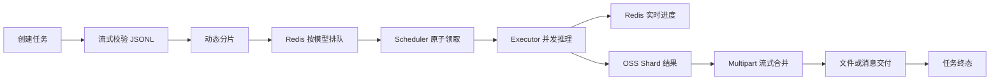
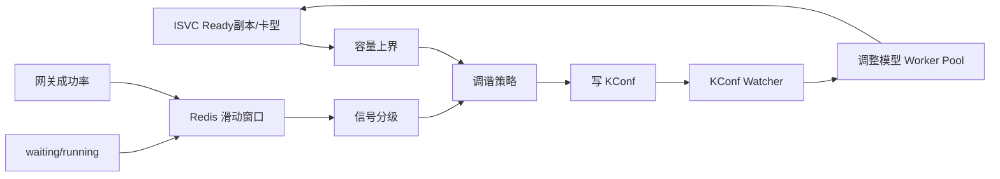

# 系统介绍

## 1. 系统定位

Batch Inference 是一个面向大规模离线模型请求的任务编排与执行平台。用户提交 JSONL 数据集和目标模型实例后，平台负责完成：

- 数据集读取和格式校验；
- 大任务切分为可调度 Shard；
- 按模型进行排队和并发控制；
- 调用 OpenAI-compatible 模型网关执行每条请求；
- 记录实时进度和失败请求；
- 合并 Shard 结果并以文件或消息方式交付；
- 根据模型运行容量和质量指标自动调整并发。

它解决的不是单次在线推理请求，而是“如何在小时级完成窗口内，稳定、高吞吐地执行大量可延迟请求”。

## 2. 核心设计目标

### 2.1 大文件稳定性

输入可能达到数十 GB，不能把完整 JSONL 文件或最终结果一次性放入内存。系统通过流式 HTTP Reader、按 Shard 缓冲和 S3 Multipart 合并，将内存使用从“与整个任务文件大小相关”降低为“与单个 Shard 或 Multipart Part 大小相关”。

### 2.2 多模型隔离

不同模型的吞吐能力差异很大，因此队列和并发控制都以 `model_service_name` 为隔离维度：

- 每模型独立 pending/process/failed 队列；
- 每模型独立最大运行 Shard 数；
- 每模型独立请求 Worker Pool；
- 每模型独立并发调谐状态。

### 2.3 多实例并发执行

服务可以部署多个实例。普通 Shard 领取通过 Redis Lua 原子迁移保证单次 claim；需要全局单写的周期任务通过 Redis `SET NX` 锁选主执行。

### 2.4 可恢复性

系统通过 process queue、Shard heartbeat、failed queue、OSS Shard 元数据和任务状态机组合实现恢复。它不是采用现成 MQ 的消费 ACK，而是在 Redis List 之上构建自己的领取、在途和恢复语义。

### 2.5 容量自适应

模型 Ready 副本数、卡型、单副本能力只给出容量上界；真实可用并发还受排队和失败率影响。因此系统同时使用：

- 静态/半静态容量模型；
- 网关请求成功率；
- waiting/running queue 负载比；
- 探测、保持和回滚策略。

最终把并发调整结果写回 KConf，并动态修改运行时 Worker Pool。

## 3. 两条闭环

### 3.1 任务执行闭环

### 3.2 容量控制闭环

## 4. 技术组成

| 层次 | 技术 | 用途 |
| --- | --- | --- |
| HTTP API | Gin | 创建、查询、取消、删除任务和模型配置管理 |
| 持久化 | MySQL + GORM | BatchTask 主记录和状态 |
| 协调 | Redis Sentinel | 队列、锁、缓存、进度、调谐窗口 |
| 对象存储 | S3-compatible OSS | Shard 数据、元数据、结果文件 |
| 消息 | Kafka | 状态通知、逐条结果、Gateway 指标 |
| 动态配置 | KConf | 模型并发和调谐相关配置 |
| 并发池 | ants | 每模型请求级 Worker Pool |
| 模型调用 | OpenAI-compatible SDK | Chat Completion 流式/非流式调用 |
| 资源观测 | ISVC + Scaler | Ready 副本、卡型和引擎运行指标 |

## 5. 系统边界

平台负责：

- Batch 任务编排；
- 输入数据处理；
- 调度与并发；
- 模型网关请求；
- 结果交付；
- 并发配置闭环。

平台不负责：

- 模型本身的推理实现；
- GPU Pod 的直接调度；
- 用户输入文件的长期源站存储；
- Kafka 下游业务消费；
- 计费系统和账号状态本身。

这些能力由 LLM Gateway、ISVC、Scaler、Billing、OSS、Kafka 等外部系统提供。

## 6. 当前运行形态

`Inference`：仓库虽然包含 `apiserver` 和 `scheduler` 两个命令入口，但容器 entrypoint 只启动 `apiserver`；而统一 `Service.Start()` 会启动任务创建、调度执行、自动调谐和监控循环。因此当前快照更接近：

> 多副本单体式 Batch 编排服务，通过共享 MySQL、Redis、OSS 和 KConf 协调。

这与 README 中“Manager 与 Scheduler 独立服务”的描述不完全一致，后续文档以实际装配和启动路径为准。
