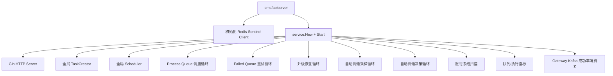
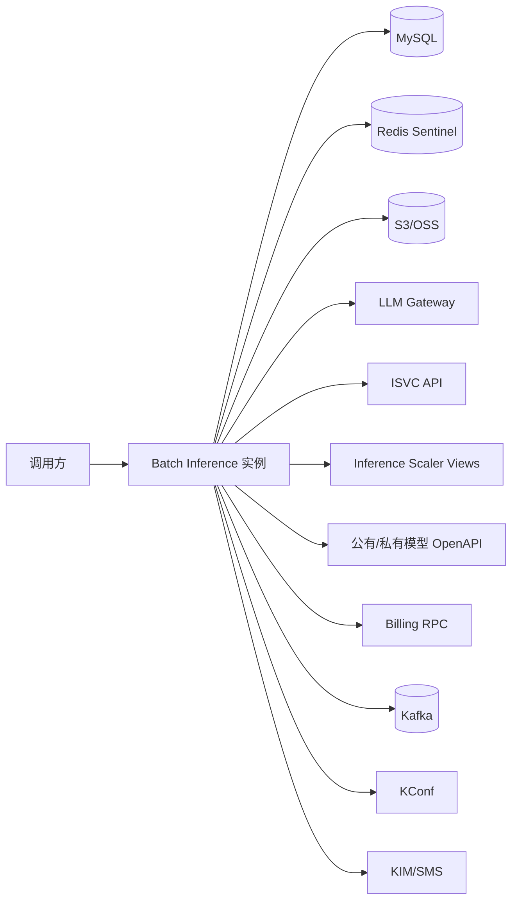

# 运行时架构

## 1. 实际进程边界

### 1.1 容器入口

当前容器入口执行：

```text
/work/apiserver -c ${KCONF}
```

`apiserver` 启动前显式初始化 Redis，然后构建统一 `Service`。该 Service 并不只提供 HTTP API，还会同时启动 Scheduler、Executor、自动调谐、账号冻结扫描和指标采集。

### 1.2 Service 启动内容



这意味着每个服务副本都具备完整的 API 和执行能力。

## 2. 多实例协调方式

不同后台循环采用两种模式。

### 2.1 所有实例都可执行

普通 Process/Failed Queue Scheduler 在所有实例运行。它们依赖 Redis 队列的原子操作竞争 Shard，因此不需要全局 Leader。

典型操作：

```text
LPOP model_pending_queue
RPUSH model_process_queue
SET upgrade@shard TTL
```

三条命令在一个 Lua 脚本中执行。

### 2.2 每个周期只允许一个实例执行

以下任务通过 Redis `SET NX` 周期锁实现全局单写：

- 丝滑升级恢复扫描；
- 自动调谐指标采样；
- 自动调谐决策与 KConf 更新；
- 账号冻结扫描。

锁带 TTL。实例退出后不需要主动交接，TTL 到期后其他实例可以接管。

## 3. 外部依赖



| 依赖 | 主要用途 | 失败影响 |
| --- | --- | --- |
| MySQL | BatchTask 持久化和状态机 | 无法创建/查询任务，终态无法提交 |
| Redis | 队列、锁、缓存、实时进度 | 无法调度，部分读取降级，后台单写失效 |
| OSS | Shard 与结果数据 | 分片、执行、汇总链路阻断 |
| LLM Gateway | 实际模型推理 | 请求重试或失败 |
| ISVC | Ready 副本与运行时信息 | Ready 检查等待，调谐暂停 |
| Scaler | queue 和引擎指标 | 自动调谐采样缺失 |
| KConf | 动态模型并发配置 | 新模型无法调度，调谐结果无法生效 |
| Kafka | 状态通知、逐条结果、Gateway 指标 | 核心文件链路可继续，但消息交付或调谐信号受损 |
| Billing | 欠费/冻结判断 | 当前执行侧选择记录错误并继续，扫描能力受损 |

## 4. HTTP 路由

主要业务路由挂在 `/v1`：

| Method | Path | 作用 |
| --- | --- | --- |
| POST | `/v1/batches` | 创建任务 |
| GET | `/v1/batches?batch_ids=...` | 批量查询任务 |
| GET | `/v1/batches/:batch_id` | 查询单个任务 |
| POST | `/v1/batches/:batch_id/timeout` | 延长完成窗口 |
| POST | `/v1/batches/:batch_id/cancel` | 取消任务 |
| DELETE | `/v1/batches/:batch_id` | 删除任务记录 |
| POST | `/v1/models/config` | 更新模型执行配置 |
| GET | `/v1/models/:model_name/config` | 查询模型配置 |
| GET | `/v1/models/config` | 查询全部模型配置 |

另有 `/health`、`/healthz`、`/readyz`、`/metrics` 和可选 pprof 路由。

## 5. 关键共享单例

当前实现使用若干进程内全局对象：

- `manager.TaskManager`：TaskCreator；
- `scheduler.TaskScheduler`：Scheduler；
- `executor.ExecuteCoreController`：模型 Worker Pool 与 Shard 并发配置；
- `statistics.MCounter`：执行器、模型 Shard 和 Worker 运行计数；
- `globalOnceTaskExec`：基于 Redis 的一次性事件执行器。

这些对象在 `Service.Start()` 初始化后供后台循环和 API 使用。

## 6. 独立 scheduler 二进制的状态

`Legacy/Unwired`：仓库中存在 `cmd/scheduler`，但它同样调用统一 Service，且没有像 `cmd/apiserver` 一样显式初始化 Redis。容器入口也未启动它。因此不能把它描述为当前线上独立部署的 Scheduler 服务。

## 7. 架构优点与代价

### 优点

- 部署简单，一个实例具备完整处理能力；
- 依赖共享存储即可横向扩容；
- API 和执行侧复用模型、存储和配置客户端；
- Redis 原子 claim 能让所有副本共同消费。

### 代价

- API 与重 CPU/IO 后台任务共享进程资源；
- API 本地 goroutine 创建 Shard，缺少持久化消费边界；
- 部分进程内锁不能天然覆盖多副本；
- 各副本都启动多个 Timer，必须依赖 Redis 锁避免重复单写；
- 独立 Scheduler 的代码入口容易让维护者误判部署架构。

## 8. 源码定位

| 内容 | 文件/函数 |
| --- | --- |
| 容器入口 | `scripts/entrypoint.sh` |
| API 主入口 | `cmd/apiserver/main.go` |
| 未装配 Scheduler 入口 | `cmd/scheduler/main.go` |
| 统一服务启动 | `internal/service/service.go: Service.Start` |
| 依赖上下文 | `internal/proxy/context.go: NewContext` |
| 全局周期锁 | `scheduler/timer.go: GlobalScheduledTaskSafely` |
