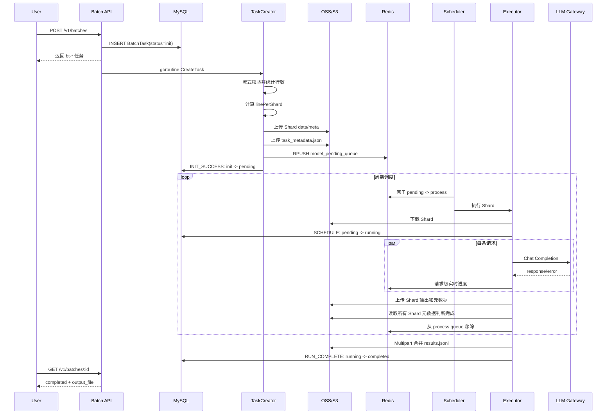
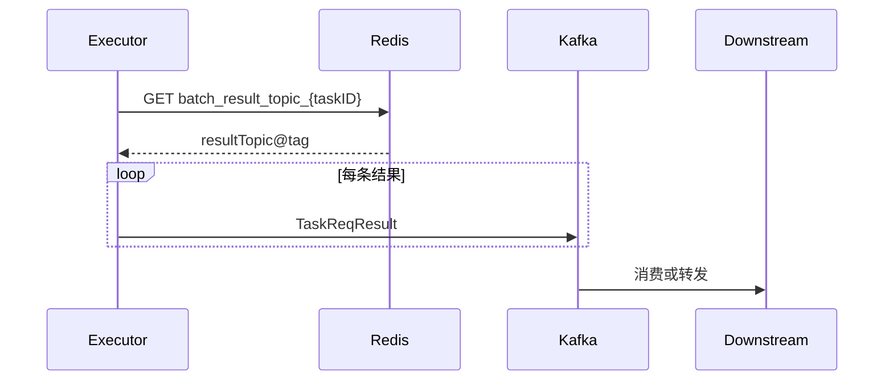
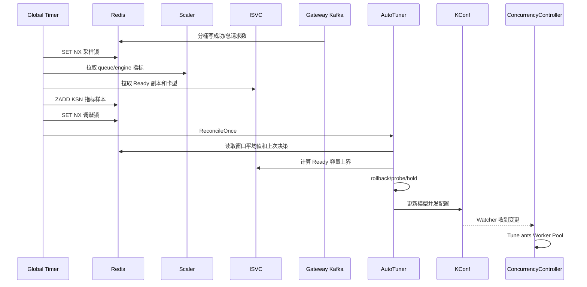

# 端到端链路

## 1. 文件模式任务

### 1.1 正常时序



### 1.2 关键状态

```text
API 创建成功       Task=init
全部分片入队成功   Task=pending, Shard=pending
首个分片开始执行   Task=running, Shard=processing
单分片完成         Shard=completed
全部分片完成并合并 Task=completed
```

## 2. Message 模式任务

Message 模式的输入处理和执行与文件模式一致，区别在结果交付：

1. 创建分片时把用户 `result_topic` 和 `tag` 保存到 Redis，并设置 168 小时 TTL。
2. 每个 Shard 得到结果后，异步把每条 `BatchResponse` 封装为 `TaskReqResult`。
3. 消息先发送到平台配置的 `task_req_result_topic`，消息体携带真正的业务 `result_topic` 和 `tag`。
4. 下游转发/消费链路不在本仓库内。
5. 任务仍会维护 OSS Shard 输出和 MySQL 终态；当前 merge 对 Message 类型只取有限 Shard，不能把它理解为与文件模式完全相同的最终文件语义。



## 3. 创建失败链路

```text
下载失败 / JSONL 非法 / Shard 上传失败 / 入队失败
    → TaskCreator 返回错误
    → INIT_FAIL
    → Task=failed
    → errors 字段记录 taskID -> error message
    → 可选发送终态 KIM 通知
```

传输中断型错误可以按配置重跑完整 Shard 创建；确定的 JSON 格式错误不重试。

## 4. Request 失败链路

```text
请求执行
  → 检查任务超时/取消/账号冻结
  → 检查 Ready KSN
  → 调用 Gateway
  → 429 / 529 / 5xx: 指数退避重试
  → 不可重试错误或耗尽重试
  → 写 BatchResponse.error
  → 将原请求写入 failed request 文件
  → 实时失败计数 +1
```

单条 Request 失败不等于 Shard 执行失败。只要 Executor 能生成包含成功或错误的结果数组并写入 Shard 输出，该 Shard 可以进入 `completed`，其 `FailedCount` 大于零。

## 5. Shard 执行失败与恢复

Shard 级基础设施错误，例如无法下载 Shard、无法写元数据、processShardData 返回错误，会使执行单元进入 failed queue：

```text
pending --原子领取--> process
process --执行失败--> 从 process 移除 + 写入 failed
failed --到达重试时间--> 再次执行
failed --超过最大重试窗口--> 丢弃队列项
```

Shard 元数据状态和 Task 进度决定任务最终是否失败。

## 6. 取消与超时

### 6.1 取消

当前取消 API 直接把任务更新为 `stopped`，并设置 `stopping_at`、`stopped_at`。正在执行的请求在下一次状态检查时把 `stopping` 或 `stopped` 视为取消，返回错误结果并停止继续执行。

`Risk`：状态机设计表达的是 `running → stopping → stopped`，API 实现却直接写 `stopped`。手册后续会把“设计语义”和“当前实现”分开说明。

### 6.2 超时

每条请求执行前根据：

```text
deadline = task.created_at + completion_window
```

判断是否到期。命中后通过数据库条件更新再次确认，避免 timeout 配置刚被延长时使用旧缓存错误过期任务。

## 7. 自动并发调谐时序



## 8. 源码定位

| 链路 | 文件/函数 |
| --- | --- |
| 创建 Batch | `internal/service/apiserver/api_batch/api_batch.go: CreateBatch` |
| 创建和切分 Shard | `manager/task_creator.go: CreateTask/createShardsOnce` |
| 原子领取 | `scheduler/queue/queue_controller.go: MoveShardBetweenQueuesAndSetElement` |
| 调度入口 | `scheduler/scheduler.go: ScheduleExecutor` |
| Shard 执行 | `scheduler/executor/executor.go: processShard` |
| Request 执行 | `scheduler/executor/executor.go: funcCall/handleRequest` |
| 进度与完成判断 | `scheduler/executor/executor.go: updateTaskProgress` |
| Multipart 合并 | `scheduler/executor/executor.go: MergeShardOutputs` |
| 自动调谐 | `internal/service/modelconcurrency/model_concurrency_reconciler.go` |
