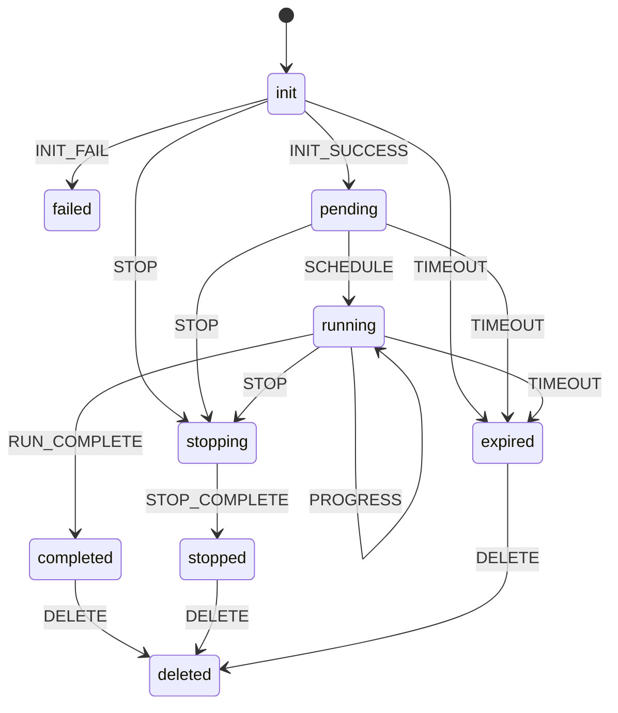

# Task 状态机

## 1. 状态定义

| 状态 | 含义 | 是否终态 |
| --- | --- | --- |
| `init` | MySQL 记录已创建，数据集尚未完成分片 | 否 |
| `pending` | 分片创建完成，至少部分 Shard 在等待调度 | 否 |
| `running` | 已有 Shard 被调度执行 | 否 |
| `stopping` | 设计上的停止中状态 | 否 |
| `stopped` | 用户取消后停止 | 是 |
| `completed` | 任务结果已经完成并提交 | 是 |
| `failed` | 初始化或任务级执行失败 | 是 |
| `expired` | 超过 completion window | 是 |
| `deleted` | 逻辑上的删除状态 | 是 |

当前删除 Store 实际调用 GORM Delete；是否能观察到 `deleted` 状态取决于表和删除方式，主 API 没有通过 `DELETE` 事件进行状态转换。

## 2. 设计状态图



## 3. 事件与写入方

| 事件 | 常见写入方 | 附加字段 |
| --- | --- | --- |
| `INIT_SUCCESS` | TaskCreator | `total_count` |
| `INIT_FAIL` | TaskCreator | `failed_at`、`errors` |
| `SCHEDULE` | Executor 首个 Shard | `running_at` |
| `PROGRESS` | Executor | `success_count`、`failed_count` |
| `RUN_COMPLETE` | Result Merger | output_file、计数、`completed_at` |
| `FAIL` | Executor/任务汇总 | 任务失败 |
| `TIMEOUT` | Executor 条件更新 | `expired_at` |
| `STOP/STOP_COMPLETE` | 设计事件 | 当前取消 API 没按这两步执行 |

## 4. 状态转换实现

Store 更新事件时执行：

```text
1. 从 MySQL 查询当前 BatchTask。
2. 在内存中根据 event 计算 nextStatus。
3. 使用 WHERE id=? AND status=oldStatus 更新。
4. 删除 Redis Task Cache。
5. 如果进入终态，关闭并清理 Redis 实时进度。
```

这是乐观并发控制思路：只有状态仍等于读取值时才能成功写入。

`Risk`：当前实现只检查 GORM `Error`，没有统一检查 `RowsAffected`；在并发竞争导致条件未命中但数据库未返回 Error 时，调用方可能把未落库的转换视为成功。查询也没有使用同一个事务句柄。面试中应把它作为可改进点，而不是描述成已经完全解决的严格 CAS。

## 5. 特殊转换

代码对两个事件做了特殊处理：

- `FAIL`：无条件把状态设为 failed；
- `RUN_COMPLETE`：无条件把状态设为 completed。

这有利于最终汇总重试，但也意味着它们可以覆盖理论上的终态。若 failed Shard 后续重试成功，存在 failed → completed 的实现可能性。

改进方向是明确允许的来源状态，例如：

```text
RUN_COMPLETE only if status = running
FAIL only if status in (init, pending, running)
```

## 6. 当前取消语义

取消接口当前直接执行：

```text
status = stopped
stopping_at = now
stopped_at = now
```

Executor 把 `stopping` 和 `stopped` 都视为取消。因此功能能生效，但绕过了状态机的 `STOP → STOP_COMPLETE` 两阶段语义。

可能的后果：

- 无法区分“正在等待存量请求退出”和“已经全部停止”；
- API 返回 stopped 时仍可能有短时间在途请求；
- 状态机文档和实现不一致。

## 7. 超时语义

Deadline：

```text
deadline = created_at + completion_window
```

执行请求前先通过任务缓存判断是否到期。命中后再调用数据库条件更新：

```sql
UPDATE batch_task
SET status='expired', expired_at=now
WHERE id=?
  AND status IN ('init','pending','running')
  AND created_at + completion_window <= now;
```

二次确认用于处理 completion window 被 API 延长、但 Executor 本地缓存仍是旧值的情况。

## 8. 查询时的状态与进度

非终态任务查询时：

1. 读取 MySQL/Redis Task Cache 得到状态和总数；
2. 读取 Redis 实时进度 Snapshot；
3. 用 Snapshot 覆盖响应中的 completed/failed；
4. 不把实时值立即写回 MySQL。

终态任务直接使用 MySQL 固化计数，Redis 进度会被关闭和删除。

## 9. 面试问题

### 为什么需要状态机而不是任意更新 status？

状态机限制非法转换，并让 running/completed 等状态与对应时间戳和业务事件绑定。多实例下还可以用旧状态作为乐观锁条件。

### 为什么超时需要数据库二次确认？

Executor 使用缓存提高每条请求的检查效率，但 timeout 可以在线延长。缓存判断只用于发现候选超时，最终过期必须用数据库最新 `completion_window` 条件更新确认。

### completed 是否表示所有请求成功？

不表示。completed 表示任务处理和结果生成完成，可以同时包含成功和失败的 BatchResponse；具体看 success_count 和 failed_count。
