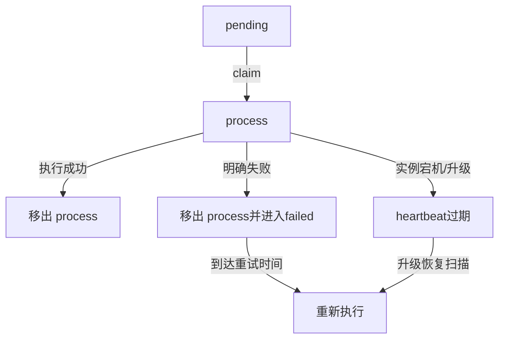

# Failed 重试与升级恢复

## 1. 两种恢复场景

系统区分：

1. Executor 明确返回 Shard 级失败：进入 failed queue 延迟重试；
2. 实例在执行中退出，没有机会返回失败：Shard 留在 process queue，由 heartbeat 过期后恢复。



## 2. Failed Queue 重试

### 2.1 进入条件

`processShard` 返回非 nil 时，Execute 把 ShardExecuteUnit 放入 failedUnits。执行 goroutine仍会先：

- 减少 Shard Counter；
- 从 process queue 移除；
- 停止 heartbeat。

Ender 再把原始 queueValue 写入 `{model}_failed_queue`。

### 2.2 重试间隔

Failed Scheduler 按 `failed_scheduler_interval` 运行。取出元素后计算：

```text
elapsed = now - joinTimestamp
```

- `elapsed < failed_task_retry_interval`：放回 failed queue；
- 达到间隔：本轮执行；
- `elapsed > failed_max_retry_interval`：丢弃，不再重试。

代码快照示例配置：

```yaml
failed_scheduler_interval: 28800
failed_task_retry_interval: 25200
failed_max_retry_interval: 82800
```

分别约为 8 小时、7 小时、23 小时。实际线上值由 KConf/启动配置决定。

### 2.3 重试计数

队列元素没有显式 retryCount；重试边界完全按首次 joinTimestamp 的时间窗口控制。因此无法直接回答“这个 Shard 已重试几次”，只能结合日志/指标推断。

## 3. Upgrade Heartbeat

claim Shard 时写：

```text
upgrade@{fullQueueValue} = 1
TTL = 360 seconds
```

执行期间后台 goroutine按 `mark_update_minutes` 续期，把 TTL 设置为 `mark_live_minutes`。

正常结束后停止续期，但当前删除 heartbeat 的调用被注释；Key 依靠 TTL 自动过期。

## 4. 孤儿 Shard 扫描

开启 `open_silky_upgrade` 后，全局周期任务扫描每模型 process queue：

```text
for shard in LRANGE process_queue 0 -1:
    if runningShard >= modelShardLimit:
        skip
    if selected >= maxExecuteShardNum:
        break
    if upgrade@shard exists:
        skip
    if now - joinTimestamp < 300s:
        skip
    select shard for recovery execution
```

扫描由 Redis 全局 Timer 锁控制，避免多个实例同时恢复同一批孤儿 Shard。

## 5. 为什么需要 300 秒保护期

新领取 Shard 的 heartbeat 创建、执行 goroutine启动和续期存在时间窗口。立即把“暂时看不到 heartbeat”认定为孤儿会导致重复执行。300 秒用于给正常实例足够时间建立守护状态。

该值是代码常量，和 heartbeat TTL、更新周期必须协调：

```text
保护期 < 首次 heartbeat TTL
更新周期 < live TTL
```

否则可能误恢复或恢复过慢。

## 6. 恢复语义

升级恢复不会把 process 元素重新搬队列，而是直接构造 ShardExecuteUnit 执行。执行结束仍会 LREM 原 process 元素。

它无法知道前一个实例在退出前已经完成到哪一步，所以可能重复：

- 模型 Gateway 请求；
- Shard 结果写入；
- Kafka Message 结果投递；
- OSS Metadata 更新。

因此它提供的是可用性优先的 at-least-once 恢复。

## 7. Task/Request 层保护

重复执行的缓解机制：

- 每条 BatchRequest 有稳定平台 ID；
- Redis 实时进度用 requestID Set 去重；
- Task running notice 和 SCHEDULE 使用 Redis ExecuteOnce；
- Shard 输出使用确定性 OSS Key，重复写覆盖同名对象；
- Task 状态更新带旧状态条件；
- 终态关闭实时进度。

不足：

- Gateway 调用本身可能重复产生推理与计费；
- Kafka 逐条结果没有这里可见的消费端幂等保障；
- OSS Shard 元数据没有 ETag CAS；
- 最终 merge 仅进程内锁。

## 8. 最大窗口后的处理

超过 failed_max_retry_interval 后：

- 记录 `time_out_shard_in_fail_queue` 指标；
- 不再把队列元素放回；
- 没有独立 DLQ；
- Shard Metadata 应保留 failed 状态，任务汇总后可进入 failed。

如果 Metadata 或进度未正确更新，可能留下 running/pending Task，需要 Reconciler 扫描兜底；当前 TaskReconciler 尚未实现。

## 9. 改进方向

### 9.1 Redis Streams/MQ

使用具备 consumer group、pending entries、claim 和 delivery count 的队列，减少自建 ACK/heartbeat 复杂度。

### 9.2 显式 Attempt

队列载荷增加：

```text
attempt
lastError
lastAttemptAt
nextRetryAt
```

支持指数退避、最大次数和人工诊断。

### 9.3 Task Reconciler

周期扫描：

- 长时间 init；
- DB running 但没有 pending/process/failed Shard；
- process heartbeat 过期；
- 所有 Shard 已完成但 Task 未终态；
- OSS 已有最终结果但 DB 未 completed。

## 10. 面试表达

> 明确的 Shard 失败进入 failed queue，按首次入队时间控制延迟和最大重试窗口；实例宕机则依赖 process queue 中的在途记录和 Redis heartbeat。heartbeat 过期后，全局单实例扫描器会重新执行孤儿 Shard。该机制保障可恢复性，但语义是 at-least-once，因此还需要 requestID 去重、确定性 OSS Key 和状态条件更新配合。

## 11. 源码定位

- `scheduler/executor/ender.go`
- `scheduler/executor/starter.go: FindLostShardInUpgrade`
- `scheduler/executor/starter.go: FindIdleShardTask`
- `scheduler/executor/upgrade/handler.go`
- `scheduler/queue/queue_controller.go`
- `internal/config/config.go` retry/upgrade 配置
