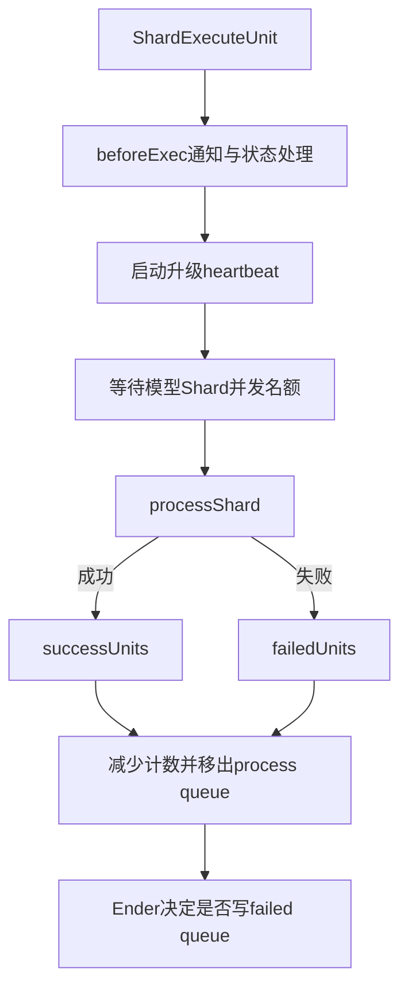

# Shard 执行主流程

## 1. 执行单元

Scheduler 从 Redis 队列领取元素后，`StarterExec` 将其还原为 `ShardExecuteUnit`。一个执行单元至少包含：

- 模型服务名；
- Redis 队列原始值与 queue key；
- Shard 输入、输出和元数据的 OSS Key；
- 入队时间等恢复信息。

Executor 以 Shard 为调度边界，以 JSONL 中的一行为模型请求边界。

## 2. Execute 外层流程



每个 Shard 使用一个 goroutine 执行。开始前不断尝试增加该模型的 Shard 计数，直到不超过 `max_execute_shard`；执行结束后严格按顺序：

1. 减少运行中 Shard 计数；
2. 若来自 process queue，则从队列移除；
3. 停止升级 heartbeat；
4. 由 Ender 处理失败重入队。

这里的 Shard Counter 是进程内计数，而 Redis claim 解决的是多实例不重复领取。

## 3. processShard 业务流程

```text
读取 Shard Metadata
  → 提交前检查账号冻结
  → Metadata.status = processing
  → Task pending → running（ExecuteOnce）
  → 下载和解析 Shard JSONL
  → 等待模型存在 Ready KSN
  → 将每条请求提交到模型 WorkPool
  → 等待全部请求结束
  → 更新 Shard Metadata
  → 投递消息结果、保存 Shard 结果和失败请求
  → 汇总整个 Task 进度
```

### 3.1 Task 只调度一次

第一个开始执行的 Shard 通过 `EventSchedule` 把 Task 从 pending 推到 running，并写 `running_at`。外层使用以 Task ID 为键的 Redis `ExecuteOnceWithRetry`，减少多个 Shard/实例重复更新和重复通知。

### 3.2 Shard 成功与失败

请求处理没有返回 Shard 级错误时：

- 统计成功/失败请求数；
- 更新 Shard Metadata 为 completed；
- 异步发送逐请求消息结果；
- 把分片结果上传到确定性 OSS Key；
- 异步保存失败请求文件。

出现下载、模型解析、Ready 检查或账号冻结等 Shard 级错误时：

- Metadata 标为 failed；
- 账号冻结会写固定错误原因；
- 最后仍调用 Task 汇总逻辑。

`Risk`：代码先将 Metadata 标为 completed，再上传分片结果。若结果上传最终失败，会尝试把 Metadata 改回 failed，但两次 OSS 写之间不是事务。

## 4. Shard 数据如何加载

`processShardData` 从 OSS 流式下载 Shard，用 `bufio.Scanner` 逐行解析，Scanner 单行上限为 10MB。随后构造：

```go
requests []indexedRequest
results  []BatchResponse // 长度与 requests 相同
failedReqs []BatchRequest
```

请求执行完后，`saveResults` 又把所有 Response 序列化到一个 `strings.Builder` 再上传。

因此执行阶段的空间复杂度近似为：

```text
O(单个Shard全部请求体 + 全部响应体 + 序列化结果)
```

不是 O(整个 20GB 文件)，但也不是严格 O(1)。分片大小同时决定内存、失败重做范围和调度开销。

## 5. 请求顺序

请求在 WorkPool 中并发完成，但 `results[index]` 按原始行号写入，保存 Shard 结果时顺序遍历该数组。因此：

- 单个 Shard 内结果保持输入行顺序；
- 最终合并再按 ShardIndex 顺序读取；
- 文件结果整体保持原始 JSONL 顺序。

逐请求 Kafka 消息按完成时间异步发送，不承诺与输入相同的到达顺序，消费端应以 request ID/custom ID 关联。

## 6. 内存与吞吐的约束关系

设：

- `L`：单 Shard 行数；
- `Breq`、`Bresp`：平均请求、响应大小；
- `Cs`：单进程同时执行的 Shard 数；
- `Cr`：模型请求 WorkPool 容量。

执行侧内存可粗略估计为：

```text
Memory ≈ Cs × L × (Breq + Bresp + object overhead)
```

`Cr` 主要影响吞吐和 Gateway 压力，`Cs` 同时影响并行 Shard 常驻内存。两者必须联合配置，不能只调大请求并发。

## 7. 可观测性

主要指标覆盖：

- 开始/结束 Shard 数；
- Shard 执行失败原因；
- 每请求最终成功/失败；
- 单次模型请求耗时；
- 含重试的总请求耗时；
- OSS 上传失败；
- 每任务完成请求数。

日志关键字段应至少保留 `taskID`、`shardQueueKey`、模型名、request ID 和 attempt。

## 8. 面试表达

> Scheduler 领取的是 Shard，Executor 内部再按模型维度的 WorkPool 并发执行每行请求。结果数组按输入索引回填，所以即使请求乱序完成，文件输出仍保持原顺序。大文件不会整体加载进内存，但执行阶段仍以单 Shard 为内存边界，所以动态分片和 Shard/Request 两级并发要一起设计。

## 9. 源码定位

- `scheduler/executor/executor.go: Execute`
- `scheduler/executor/executor.go: processShard`
- `scheduler/executor/executor.go: processShardData`
- `scheduler/executor/starter.go`
- `scheduler/executor/ender.go`
- `scheduler/executor/concurrency_controler.go`

