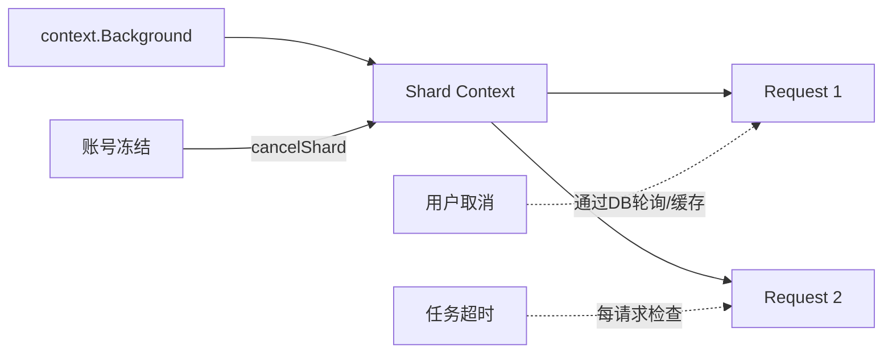

# 超时、取消与账号冻结

## 1. 三种终止来源

| 来源 | 判断依据 | 目标状态 |
| --- | --- | --- |
| completion window 超时 | `created_at + completion_window < now` | expired |
| 用户取消 | Task 为 stopping/stopped | stopped |
| 欠费冻结 | Billing 资源状态被冻结 | failed |

三者都会阻止后续模型请求，但检测时机、状态更新与通知路径不同。

## 2. Task 状态缓存

Executor 创建容量 10000、TTL 60 秒的 LRU TaskStatusCache。每条请求开始时通过缓存判断：

- 是否过期；
- 是否正在取消。

这样避免每个请求都查询 MySQL，但意味着取消状态可能最多延迟一个缓存 TTL 被看到。部分超时确认路径会主动 invalidate，取消 API 与 Executor 之间当前没有统一的缓存失效广播。

## 3. 超时处理

`ShouldAbort` 先按缓存中的 Task 计算：

```text
expiredAt = createdAt + completionWindow
```

若看起来超时，Executor 不直接写 expired，而是调用 DB 条件更新 `ExpireBatchTaskIfTimedOut` 再确认，使用 singleflight 合并同 Task 的并发确认。

可能结果：

- 条件成立：Task 原子进入 expired，发送终态通知；
- DB 最新状态仍为 init/pending/running 但实际未超时：刷新缓存并继续；
- 已 stopping/stopped：取消优先，不改 expired；
- 已 expired：按终态停止；
- DB 操作失败：当前请求记录确认失败错误。

这一步用于避免 60 秒旧缓存把已经延期或状态变化的任务误判为超时。

## 4. 取消处理

请求看到 stopping/stopped 后：

- 当前结果写 `task is canceling`；
- 通过 Task 级 ExecuteOnce 把 Task 更新为 stopped 并写 `stopped_at`；
- 发送终态通知；
- 不再上报本请求实时进度。

`Risk`：当前取消 API 的实际实现可能直接把 Task 写为 stopped，而设计状态机是 running/pending → stopping → stopped。两条路径并存，语义需要统一。

`Risk`：`taskIsCancelled` 是按值传给每个 `funcCall` 的局部 bool，一个请求将其设为 true 不会广播给其他请求；真正的跨请求停止依赖 DB/缓存状态，而不是共享 context。

## 5. 账号冻结的三道门禁

### 5.1 Shard 提交前

读取 Metadata 后先查 Billing。若已冻结：

- Shard 直接 failed；
- 写固定失败原因；
- 发送冻结通知；
- 汇总 Task 状态；
- 不加载 Shard 数据、不调用模型。

### 5.2 每个请求 attempt 前

长任务可能在运行中欠费，因此每次 attempt 前再检查。发现冻结后：

- `accountFrozen` 原子标记为 true；
- 取消共享 Shard context；
- 当前请求失败并进入 failedReqs；
- 其他请求在下一次 context/attempt 检查时退出；
- 整个 `processShardData` 返回 `errAccountFrozen`，Shard failed。

### 5.3 周期扫描

服务还启动 AccountFreezeMonitor，在 Redis 全局锁保护下扫描 active Task（pending/running），按账号和计费模型查冻结状态，并用：

```sql
UPDATE batch_task
SET status='failed', ...
WHERE id=? AND status IN ('pending','running')
```

原子终止任务。扫描器避免只有“请求开始时检查”造成无请求/长期等待任务不能及时失败。

## 6. Billing 检查降载

Checker 对 `(customerID, billingModelID)` 做：

- 30 秒本地缓存；
- RWMutex 并发保护；
- singleflight 合并相同资源的并发查询。

若 Billing 调用失败，执行路径记录错误后按“未冻结”继续，是 fail-open 策略。它优先保证推理可用性，但可能在 Billing 故障窗口继续消耗资源；是否合适取决于财务风险等级。

## 7. 通知去重

冻结通知支持按客户/项目聚合，并借助 Redis：

- pending Task ID 集合；
- 延迟发送锁；
- 已发送去重 key。

Executor 与 Monitor 都可能发现同一冻结事件，通知层必须幂等，避免短信/KIM 风暴。

## 8. Context 传播现状



账号冻结有主动 context 广播；用户取消和 Task deadline 主要依赖请求边界检查。更完整的实现应为每 Task 建立 deadline/cancel context，并让 Ready 等待、重试退避、Gateway、OSS 都沿链路传播。

## 9. 竞态与优先级

终态可能并发竞争，例如超时与用户取消同时发生。理想规则是所有更新带旧状态条件并明确优先级：

```text
用户主动取消 vs 超时 vs 账号冻结
```

当前代码部分路径使用状态事件，部分直接 Updates；应统一通过状态机/CAS，并检查 RowsAffected，才能确定最终由哪个事件获胜。

## 10. 面试表达

> 高频请求不能每条都查 MySQL 和 Billing，所以 Task 状态用 60 秒 LRU，账号冻结用 30 秒缓存加 singleflight；超时因为不能容忍旧缓存误判，会再走一次 DB 条件确认。账号冻结还设计了提交前、每 attempt 前和周期扫描三道门禁。当前可以进一步改进的是统一 Task context，让取消和 deadline 能主动打断 Ready 等待与退避，而不只在请求边界被动发现。

## 11. 源码定位

- `scheduler/executor/status_helper.go`
- `pkg/cache/task_status_cache.go`
- `scheduler/executor/executor.go: funcCall`
- `internal/service/accountfreeze/checker.go`
- `internal/service/account_freeze_monitor.go`
- `internal/service/accountfreezenotify/notifier.go`
- `internal/client/store/` 超时条件更新
