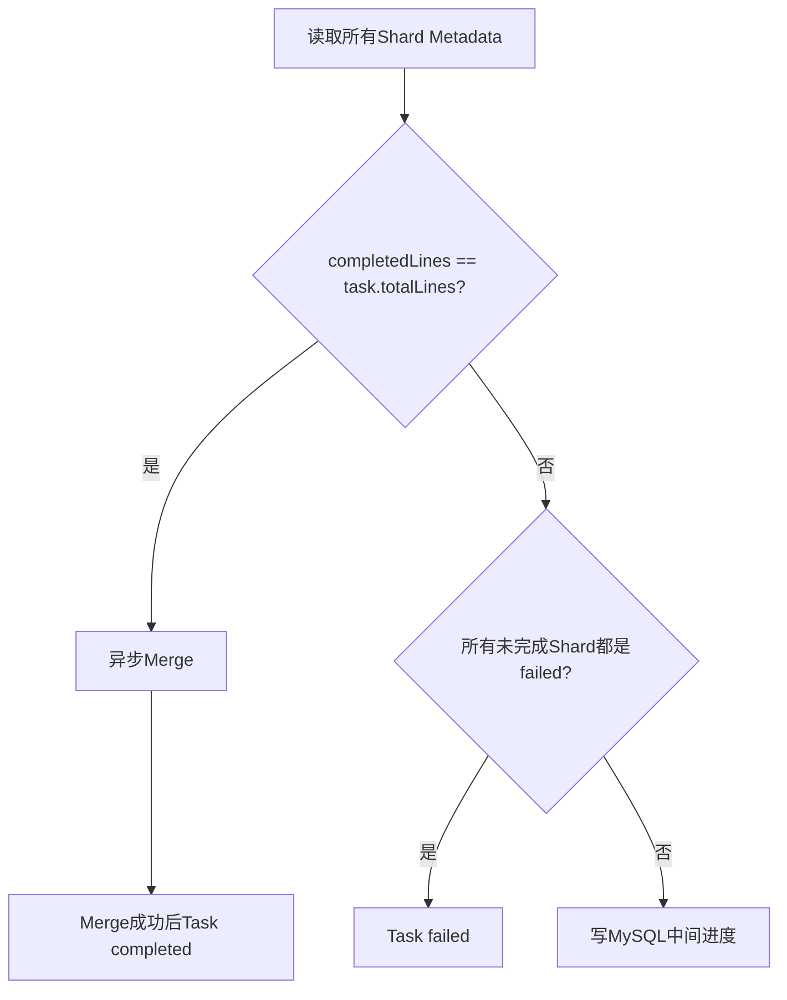

# Shard 汇总与 Task 完成判定

## 1. Shard Metadata 是汇总依据

请求全部结束后，Executor 遍历 `results` 得到：

```text
success_count = response.Error为空的数量
failed_count  = response.Error非空的数量
status        = completed
completed_at  = now
```

这些字段覆盖写回对应 Shard Metadata。单条请求失败仍可使 Shard completed。

Shard 基础设施失败则写 status=failed；账号冻结还会写 error_message 和 completed_at。

## 2. 每个 Shard 结束后的 Task 汇总

`updateTaskProgress(taskID)` 每次都：

1. 下载 Task Metadata；
2. 根据其中的 Shard 列表逐个下载全部 Shard Metadata；
3. 累加 success_count、failed_count；
4. 统计 completed Shard 的 total_lines；
5. 判定 Task 是否成功、失败或继续运行。



## 3. 三种判定

### 3.1 成功候选

所有 completed Shard 的 `TotalLines` 之和等于 Task `TotalLines`，开始异步输出最终结果文件。

注意此时 Task 尚未 completed；只有 Merge 成功并写入 output_file、计数和 completed_at 后，才触发 `RUN_COMPLETE`。

### 3.2 失败

如果没有 processing/pending Shard，且至少存在 failed Shard，触发 `FAIL`，Task 进入 failed并发送终态通知。

### 3.3 仍在执行

其他情况通过 `PROGRESS` 更新 MySQL success_count/failed_count，状态保持 running。

## 4. 复杂度问题

假设 Task 有 `S` 个 Shard，每完成一个 Shard 都读取 `S` 份 Metadata，则全任务约有：

```text
S × S = O(S²)
```

次 OSS Metadata 读取；并发结束的多个 Shard 还会重复扫描。

当大文件被切成很多小 Shard 时，这会成为控制面放大。更优方案：

- MySQL/Redis 原子累计 completed_shards、counts；
- 或由 Metadata 事件进入单消费者 reducer；
- 最终完成前再全量校验一次 OSS，兼顾效率与正确性。

## 5. 并发完成竞态

多个最后完成的 Shard 可能同时看到“全部 completed”，各自启动 Merge goroutine。

当前 `outputLock` 只是一把进程内全局 mutex：

- 同一进程内串行；
- 不同 Task 也被无谓串行；
- 不同服务副本之间完全不互斥。

确定性 output key 让重复 Merge 最终覆盖同一对象，但仍浪费 IO，而且 Task 状态更新可能竞争。应改成 `merge:{taskID}` Redis 分布式锁或 DB `running → merging` CAS。

## 6. 顺序与通知边界

成功候选路径先发送 Task Finish Notice，再异步 Merge；真正终态 KIM 通知在 `RUN_COMPLETE` 成功后发送。

因此不同通知通道对“Finish”的语义可能不一致：一个表示所有请求结束，一个表示结果文件已经可用。对外协议应区分：

```text
COMPUTE_FINISHED
RESULT_READY
```

或者只在 output object 与 DB completed 都成功后发唯一完成事件。

## 7. Merge 失败现状

`outputTaskResultFileAndUpdateStatus` 在 Merge 失败时只：

- 记录错误日志；
- 上报 `batch_task_merge_failed` 指标；
- return。

没有将 Task 置 failed，也没有自动重试/独立恢复队列。此时所有 Shard 都 completed，但 Task 可能长期停在 running。

这是优先级很高的 Reconciler 场景：检测“全部 Shard completed + Task 非终态”，重试 Merge；若超过上限再转 failed。

## 8. Metadata 写入一致性

Shard Metadata 是对象整体覆盖，没有 version/ETag CAS。升级恢复或重复执行时，较晚的旧执行可能覆盖较新的状态。可改进为：

- 数据库 Shard 表 + version；
- S3 `If-Match` 条件写；
- 只允许单调状态转换；
- Metadata 中增加 attempt/revision，Reducer 只接收最新 attempt。

## 9. 面试表达

> Task 完成不是看 Redis 队列空，而是以 Task Metadata 中的 Shard 清单为基准，全量读取 Shard Metadata 汇总。这样数据结果和状态来源一致，但每个 Shard 都全扫一次会形成 O(S²) OSS 请求，而且最后多个 Shard可能并发触发 Merge。当前可用确定性 Key 缓解结果冲突，演进上应增加 per-task 分布式 Merge 锁和增量 Reducer/Reconciler。

## 10. 源码定位

- `scheduler/executor/executor.go: completeShardWithOutput`
- `scheduler/executor/executor.go: setShardStatus`
- `scheduler/executor/executor.go: updateTaskProgress`
- `scheduler/executor/executor.go: outputTaskResultFileAndUpdateStatus`
- `internal/models/s3_metadata.go`
