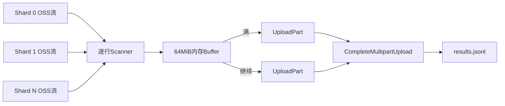

# S3 Multipart 流式结果合并

## 1. 要解决的问题

旧式合并通常会把所有 Shard 结果下载到内存/本地文件，再一次上传。对于 20GB 输入对应的大体量输出，会带来：

- 内存峰值随总结果增长；
- 临时磁盘容量与 IO 压力；
- 单次上传失败后从头重传；
- Pod ephemeral storage 不稳定。

当前实现顺序下载 Shard 结果，将每行直接写入 64MiB Multipart buffer，满一个 Part 就上传。

## 2. 数据流



合并不需要把所有结果或一个完整 Shard 结果常驻内存。

## 3. 合并前校验

`loadCompletedShardMetadataForMerge` 按 Task Metadata 的 Shard 顺序读取 Metadata，只把 status=completed 的 Shard 加入列表，并累计：

```text
total_lines
success_count
failed_count
```

文件模式正常情况下只有全部 Shard completed 才会触发 Merge，因此顺序与输入分片顺序一致。

## 4. 逐行写入

每个 Shard Result 使用 Scanner 逐行读取：

- 单行最大 24MiB；
- 跳过空白行；
- 写出原行；
- 若没有换行则补 `\n`。

最终文件顺序为 `(ShardIndex, LineIndex)`，与动态分片前的原 JSONL 顺序一致。

## 5. Multipart Writer

关键参数：

```text
partSize = 64 MiB
maxParts = 10000
```

理论可覆盖约：

```text
64 MiB × 10000 ≈ 625 GiB
```

的合并对象，实际还受 S3 服务限制和单行上限约束。

内存复杂度近似：

```text
O(64MiB buffer + 当前JSONL行 + SDK/网络缓冲)
```

与最终结果总大小无关。

## 6. 小文件优化

Multipart Upload 只有在第一次 flush 时才初始化。如果全部结果小于 64MiB，`Close` 直接调用普通 `UploadWithSize`，避免小对象也创建 Multipart 会话。

如果已经初始化：

1. flush 最后一个不足 64MiB 的 Part；
2. 按 PartNumber/ETag 调用 Complete；
3. 成功后标记 completed。

## 7. 重试策略

| 操作 | 最大尝试 | 间隔 |
| --- | --- | --- |
| 普通小文件 Upload | 3 | 2 秒 |
| Initiate Multipart | 3 | 2 秒 |
| UploadPart | 3 | 2 秒 |
| Complete Multipart | 3 | 2 秒 |

任一步最终失败时调用 Abort；Abort 本身失败会记录日志，S3 生命周期规则还应清理遗留会话。

## 8. Complete 响应不确定性

分布式系统中可能出现：S3 已经完成对象，但 Complete 响应在网络上丢失。客户端重试后收到错误，如果直接 Abort/判失败，会把实际成功误判为失败。

初始化 Multipart 时给对象写元数据：

```text
task_id
total_lines
success_count
failed_count
merge_time
```

Complete 重试仍失败后，代码 HEAD/GetMetadata 最终对象；所有期望 metadata 都匹配，则判定已成功。

这是对“远端已提交、本地未知”的不确定结果做幂等确认，比盲目重试更稳健。

## 9. 为什么 64MiB

Part 太小：Part 数多、请求开销高、容易触及 10000 上限；Part 太大：内存峰值高、失败重传代价大。64MiB 是吞吐、内存和 Part 数之间的工程折中。

对于 20GB 结果，约为：

```text
20 GiB / 64 MiB = 320 Parts
```

数量在合理范围内。

## 10. 并发与幂等边界

- output key 是确定性的，重做会覆盖同一路径；
- `outputLock` 是进程级全局锁，不是 per-task、也不是分布式；
- metadata 的 `merge_time` 每次不同，两个并发 Merge 的 Complete 错误确认不会把另一次对象误认成自己的成功；
- 但跨副本并发仍会产生两套 Multipart 会话和重复 IO。

建议用 `merge:{taskID}` 分布式锁，并在 Task 增加 merging 状态/merge attempt。

## 11. 仍然存在的非流式环节

这项重构解决的是最终结果合并内存随总量增长的问题。完整链路仍有：

- 输入文件做校验计数和分片两遍下载；
- 分片创建时一个 Shard 在内存中缓冲；
- 执行时一个 Shard 的 requests/results 在内存；
- `saveResults` 用 strings.Builder 组装整个 Shard 输出。

因此准确表达是“实现输入流式读取与最终 Multipart 流式合并，把内存边界从整任务降到单 Shard/固定 Part”，不要说“整个链路 O(1) 内存”。

## 12. `Experience Result`：20GB 单文件

源码可以证明支持流式读取、动态分片、64MiB Multipart 和固定内存合并机制；“支持 20GB 单文件处理”来自项目压测/线上实践，应标为 `Experience Result`。

建议保留的证据口径：

- 输入/输出大小与请求行数；
- Shard 数、每 Shard 行数；
- Pod 内存峰值和临时磁盘；
- 总耗时与 OSS 吞吐；
- 网络中断、Part 失败和实例重启测试结果。

## 13. 面试表达

> 大任务稳定性的核心不是把 20GB 内容搬到本地再合并，而是让数据一路按边界流动：输入流式扫描后动态切 Shard，最终结果按 ShardIndex 顺序读取，只保留 64MiB Part buffer，满了就 UploadPart。Complete 响应丢失时再用对象 metadata 确认远端是否实际成功。这样最终合并内存与结果总量解耦，20GB 是我们压测和实际运行验证过的能力。

## 14. 源码定位

- `scheduler/executor/executor.go: multipartMergeWriter`
- `scheduler/executor/executor.go: MergeShardOutputs`
- `scheduler/executor/executor.go: loadCompletedShardMetadataForMerge`
- `scheduler/executor/executor.go: mergeShardToWriter`
- `services/oss/s3_multipart.go`
- `pkg/utils/oss_file_utils.go`
