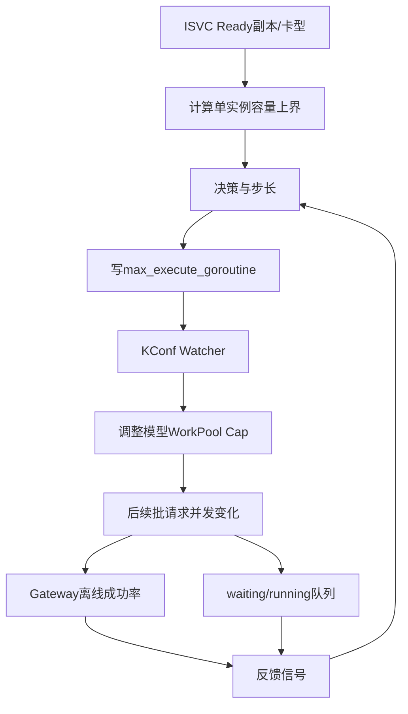

# 并发自动探测：问题与控制闭环

## 1. 静态并发为什么不够

批量推理追求吞吐，但模型可承载并发随以下因素变化：

- Ready 副本数量伸缩；
- GPU 卡型和单卡能力；
- 模型结构、上下文长度与输出长度；
- KV Cache 占用和调度策略；
- 同资源池其他流量；
- Gateway/Engine 瞬时健康状态。

固定低并发会造成 GPU/KV Cache 利用不足，固定高并发会积压队列、触发 429/529/5xx 和任务超时。人工配置也跟不上副本与负载变化。

## 2. 系统控制目标

自动探测需要同时满足：

1. 安全：并发不超过 Ready 容量推导的上界；
2. 效率：健康且队列轻时持续提高并发；
3. 稳定：成功率下降或队列过载时快速回退；
4. 收敛：信号处于中间区间时减小步长或保持；
5. 多实例一致：同一周期只有一个 Batch 实例采样/写配置；
6. 可解释：每次变更能说明上界、信号、决策和前后值。

## 3. 两层控制



- 前馈容量层：Ready replicas × 单副本并发，给出硬上界；
- 反馈探测层：成功率和排队压力决定在上界以内如何移动。

只有容量层会随副本变化直接跳目标，容易在模型实际承载低于理论值时过载；只有反馈层又可能探索到明显超出资源能力。两者组合更稳健。

## 4. 三个时间尺度

默认配置：

| 维度 | 默认值 | 作用 |
| --- | --- | --- |
| 指标采样间隔 | 30 秒 | 跟踪负载变化 |
| 滑动窗口 | 600 秒 | 平滑短时抖动 |
| 调谐间隔 | 300 秒 | 给新并发足够观测时间 |

窗口内约有 20 个 Scaler 采样点。调谐间隔小于窗口，连续决策会共享一部分历史样本，变化更平滑，但也会带来反馈滞后。

## 5. 启用门槛

全局需要：

```text
model_concurrency_tuning.auto_tuner_enabled = true
```

单模型还需要：

```text
auto_reconcile_enabled = true
per_instance_concurrency != nil
```

反馈 AutoTuner 进一步要求该模型存在 pending/running Batch Task。没有活跃任务时保持当前并发，不制造空载探测。

若活跃任务 DB 查询失败，代码选择 fail-open：继续调谐，并记录 warning；这是可用性优先的策略。

## 6. public/private 模型差异

- public 模型：只把符合离线池条件的 Ready KSN 纳入容量与采样；
- private 模型：允许 online 等非离线池，但仍要求 Runtime KSN 有效且 Ready。

私有模型通过 `private_model_instances` 识别，public 模型通过 `model_instances` 映射；BatchTask 的 model 字段存模型实例 ID，需要先反查到 ModelServiceName 才能做活跃任务门禁。

## 7. 多实例协调

服务每个副本都会启动定时器，但使用 Redis 全局锁：

```text
采样锁: batch-inference:model-concurrency-metrics-sample
调谐锁: batch-inference:model-concurrency-reconcile
```

采样锁 TTL 为采样间隔的 80%，至少 1 秒；默认 30 秒间隔时 TTL 为 24 秒。调谐锁 TTL 默认等于 300 秒，所有实例每 30 秒尝试一次。

`Risk`：全局定时器只依赖锁 TTL，不做 owner token 和安全释放；任务运行超过 TTL 时可能有第二实例进入。当前 Reconcile 通常应远小于 5 分钟，但最好使用带 fencing token 的锁或把 KConf revision 作为 CAS。

## 8. 一轮 Reconcile

```text
拉取全部 ISVC Runtime
  → 读取当前模型 KConf
  → 过滤开启自动调谐的模型
  → 计算每个 KSN 单副本能力和 Ready Capacity
  → 计算 raw upper bound
  → 读取各 KSN 滑动窗口指标
  → 排除缺少必要指标的 KSN
  → 按有效 KSN Capacity 重算 upper bound
  → 聚合信号并计算 target
  → 批量写回 KConf
  → 保存本轮 last result
```

只有 KConf 写回成功后才保存 last result，避免控制器状态宣称已执行但实际配置未生效。

## 9. 手动控制与自动控制

手动 API 和 Reconciler 都走 `ApplyModelConfigUpdates`，共享：

- 参数校验；
- 配置克隆与批量更新；
- KConf 写回；
- 指标和审计日志。

这避免两套写配置代码产生不同校验规则。仍需定义人工覆盖策略，例如 emergency override 是否临时关闭 `auto_reconcile_enabled`，否则下一轮自动调谐可能覆盖人工值。

## 10. 面试表达

> 我把自动并发设计成前馈加反馈的闭环：先按 Ready 副本和卡型推导单实例硬上界，再在上界内用离线 Gateway 成功率与 waiting/running 队列比做快探、慢探、保持或回退。结果写 KConf，经 Watcher 热更新模型 WorkPool，新的运行数据再进入下一轮窗口。采样与调谐都有 Redis 全局锁，保证多副本只有一个控制器生效。

## 11. 源码定位

- `internal/service/modelconcurrency/model_concurrency_reconciler.go`
- `internal/service/modelconcurrency/model_concurrency_autotuner_metrics.go`
- `internal/service/modelconcurrency/model_concurrency_signal.go`
- `internal/service/service.go` 启动与定时器
- `scheduler/timer.go`

