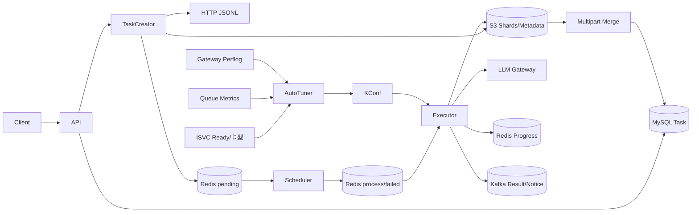

# 项目总结与不同长度讲法

## 1. 一句话定位

Batch Inference 是一个面向大规模离线 LLM 请求的批处理平台：用户提交 JSONL，系统把文件流式切成可调度 Shard，经 Redis 多实例调度并发调用模型 Gateway，持续汇总请求进度，最终以 S3 JSONL 或 Kafka 消息交付；同时用 Ready 容量、Gateway 成功率和模型队列负载闭环调节每模型并发。

## 2. 30秒版本

> 我负责批量推理平台后端核心链路和性能优化。平台接收 JSONL 批任务，流式下载并动态分片到 S3，通过 Redis 的 pending/process/failed 队列做多实例 Shard调度，Executor再按模型WorkPool并发调用Gateway，最后按Shard顺序用S3 Multipart流式合并。我的两项重点工作，一是重构大文件链路，把内存边界从整任务降到单Shard和64MiB Part，支持20GB单文件；二是做模型并发自动探测，用Ready容量做上界、Gateway成功率和waiting/running做反馈，灰度中容量失败率12.1%降到1.8%，KV Cache平均利用率37%提升到71%。

## 3. 2分钟版本

> 这个平台解决的是离线LLM请求规模大、单任务耗时长、模型容量动态变化的问题。运行形态是多副本单体编排服务，一个进程里同时有API、TaskCreator、Scheduler、Executor和AutoTuner。
>
> 请求创建后先落MySQL，TaskCreator通过HTTP流式扫描JSONL，第一遍校验和计数，第二遍按动态行数切Shard，为每条请求生成稳定ID，把Shard数据和Metadata写S3，再进入模型维度Redis pending队列。Scheduler用Lua把元素原子搬到process队列，Executor有Shard并发和请求WorkPool两级控制，调用OpenAI-compatible Gateway；429、529和500到505做指数退避。实例升级时process heartbeat过期会恢复Shard，所以执行语义是at-least-once。
>
> 请求完成后用Redis Set按requestID去重形成实时进度；Shard结果按输入索引保存，最终按ShardIndex读取，用64MiB S3 Multipart Part边读边传，Complete响应不确定时用对象metadata确认远端是否已经提交。
>
> 我重点做了大文件链路重构和并发自动调谐。自动调谐先用ReadyReplicas×卡型单副本能力计算硬上界，再按10分钟Gateway成功率和waiting/running队列比每5分钟做快探、慢探、保持或回退，写KConf热更新WorkPool。核心模型灰度期间，容量相关失败率从12.1%降到1.8%，KV Cache从37%提升到71%。

## 4. 架构图

## 5. 核心技术决策

| 问题 | 决策 | 取舍 |
| --- | --- | --- |
| 大文件内存 | 流式扫描+Shard+Multipart | 输入为精确计数下载两遍；执行仍以Shard为内存边界 |
| 多实例领取 | Redis Lua pending→process | 自建ACK/heartbeat复杂，语义at-least-once |
| 并发隔离 | 每模型Shard/Request两级限制 | 配置和内存估算更复杂 |
| 实时进度 | Redis Set+snapshot | O(request count)内存，终态回MySQL |
| 结果顺序 | index回填+ShardIndex合并 | 需要保留整Shard results数组 |
| 动态容量 | Ready上界+反馈探测 | 参数需灰度，观测缺失时保守排除 |
| 配置生效 | KConf Watcher+WorkPool热更新 | 有传播/轮询延迟，需并发安全 |

## 6. 项目结果

`Experience Result`：

- 支持20GB单JSONL文件处理；
- 高峰容量相关失败率12.1%→1.8%，绝对下降10.3个百分点、相对约85.1%；
- KV Cache平均利用率37%→71%，提升34个百分点、相对约91.9%。

## 7. 你的职责口径

### 可以作为“我负责”的重点

- JSONL任务处理链路重构；
- 流式下载、网络中断分类和分片重试；
- 动态分片与S3对象布局；
- S3 Multipart流式结果合并；
- 模型并发自动探测/调谐；
- Gateway成功率、队列信号、容量上界和KConf闭环；
- 灰度、指标与效果分析。

### 作为“我熟悉并参与关键链路协作”

- Batch API和状态机；
- Redis调度/升级恢复；
- Gateway请求执行和重试；
- 实时进度与消息交付；
- 欠费冻结、通知和运维排障。

具体措辞必须按真实提交、评审和上线责任调整。

## 8. 最有深度的复盘

> 当前系统已经把大文件主风险从整文件内存转成了可控边界，但还有三处值得继续做：Task创建不是durable，Merge失败缺少Reconciler，Shard完成汇总会产生O(S²) OSS读。我会优先补create outbox、merging状态+分布式锁和增量Reducer，让系统从“故障可恢复”进一步变成“状态能自动收敛”。

