# Batch Inference 项目手册（全文合并版）

> 本文件由模块化 Markdown 机械合并，用于离线保存和全文搜索。事实源是同目录 README、QUICK_REFERENCE 及 00-10 子目录；修改模块文档后重新运行 build_full_handbook.sh。

---

来源：`README.md`

## Batch Inference 项目手册

这套手册用于在无法访问源码时，仍能完整理解 batch-inference 的架构、关键链路、实现逻辑、故障语义、性能取舍和项目经历表达。

它不是源码目录说明，而是以两条闭环组织内容：

1. 任务执行闭环：创建任务 → 流式读取 JSONL → 动态分片 → Redis 调度 → 并发推理 → 进度统计 → 结果合并与交付。
2. 容量控制闭环：采集 Ready 容量与运行指标 → 生成调谐信号 → 调整 KConf → 动态修改执行并发 → 继续观测效果。

## 文档快照

| 项目 | 值 |
| --- | --- |
| Git 分支 | `master` |
| Git Commit | `09ca42d0e4fc3fabbbd088e61823ace0b8154710` |
| Commit 时间 | 2026-08-04T07:10:11Z |
| 手册开始整理日期 | 2026-08-17 |
| 代码语言 | Go 1.23 |
| 主要组件 | Gin、GORM、Redis、S3、Kafka、KConf、ants、OpenAI-compatible Gateway |

本文档不保存任何 Token、AccessKey、SecretKey 或内部鉴权值。

## 实现状态标识

手册会严格区分以下状态：

| 标识 | 含义 |
| --- | --- |
| `Implemented` | 已接入当前启动链路的实现 |
| `Designed` | 有设计文档，但当前代码快照尚未接入 |
| `Legacy` | 历史实现或未装配代码 |
| `Risk` | 从实现中识别出的边界、一致性或运维风险 |
| `Inference` | 根据入口、构建脚本和调用关系得出的部署推断 |
| `Experience Result` | 来自项目实践的线上结果，不是源码可证明的数据 |

## 三种阅读方式

### 快速复习

阅读 [QUICK_REFERENCE.md](./QUICK_REFERENCE.md)，用于面试前快速回忆系统主线、关键公式和高频问题。

### 按链路深入

推荐顺序：

1. [系统介绍](./00-overview/01-system-introduction.md)
2. [运行时架构](./00-overview/02-runtime-architecture.md)
3. [端到端链路](./00-overview/03-end-to-end-flows.md)
4. [任务状态机](./01-domain-model/03-task-state-machine.md)
5. `02-task-ingestion/`：大文件接入与动态分片
6. `03-scheduling/`：Redis 调度与两级并发
7. `04-execution/`：模型请求执行
8. `05-progress-and-results/`：实时进度与结果合并
9. `06-concurrency-autotuner/`：并发自动探测闭环
10. `07-reliability/`：一致性、幂等和故障恢复
11. `10-experience-and-interview/`：项目总结和面试材料

### 全文检索

最终合并版本位于 `FULL_HANDBOOK.md`。模块化 Markdown 是事实源，合并文档用于离线保存和全文搜索。

本次整理的链接、敏感信息扫描和测试边界见 [VERIFICATION.md](./VERIFICATION.md)。

## 问题导航

| 想回答的问题 | 推荐文档 |
| --- | --- |
| 系统整体是怎么运行的？ | `00-overview/02-runtime-architecture.md` |
| 一条任务从提交到完成经历什么？ | `00-overview/03-end-to-end-flows.md` |
| 为什么能支持 20GB JSONL？ | `02-task-ingestion/02-jsonl-streaming-download.md`、`04-dynamic-sharding-and-oss-layout.md` |
| 网络断流为什么可能表现成 JSON 错误？ | `02-task-ingestion/03-jsonl-validation-and-error-classification.md` |
| 多实例如何避免领取同一个 Shard？ | `03-scheduling/02-shard-claim-and-dispatch.md` |
| Shard 并发与请求并发有什么区别？ | `03-scheduling/03-two-level-concurrency-control.md` |
| 实例升级时正在执行的 Shard 怎么恢复？ | `03-scheduling/04-failed-retry-and-upgrade-recovery.md` |
| 请求如何调用模型网关？ | `04-execution/02-request-execution-and-gateway.md` |
| 哪些错误会重试？ | `04-execution/03-retry-backoff-and-error-handling.md` |
| 实时进度为什么放 Redis？ | `05-progress-and-results/01-realtime-progress.md` |
| S3 Multipart 合并如何控制内存？ | `05-progress-and-results/04-s3-multipart-streaming-merge.md` |
| 并发自动探测的公式是什么？ | `06-concurrency-autotuner/03-capacity-upper-bound.md` |
| 12.1% → 1.8% 和 37% → 71% 怎么讲？ | `06-concurrency-autotuner/06-gray-release-results-and-analysis.md` |
| MySQL、Redis、OSS 谁是事实源？ | `01-domain-model/04-data-ownership.md` |
| 任务卡住时怎么排查？ | `07-reliability/03-failure-recovery-matrix.md` |
| 面试时如何介绍项目？ | `10-experience-and-interview/01-project-summary.md` |

## 内容边界

当前镜像入口只启动 `apiserver`，但 `apiserver` 内部同时启动 API、TaskCreator、Scheduler、Executor、自动调谐和监控任务。因此本手册把当前运行形态描述为“多副本单体式编排服务”。仓库中独立 `scheduler` 二进制、`pkg/taskprocessor`、`pkg/statemanager` 和空的 TaskReconciler 会作为未装配或遗留实现单独说明。

私有模型二阶段“任务窗口资源池调度”属于 `Designed`，不会与当前实现混写。

## 项目经历中的确定成果

以下内容来自项目实践，必须出现在项目总结中：

- 重构 JSONL 任务处理链路，实现流式下载、动态分片和 S3 Multipart 流式结果合并，支持 20GB 单文件处理。
- 开发模型并发自动探测机制，基于网关成功率、队列负载等信号形成闭环自动调谐。
- 核心离线模型灰度期间，容量相关失败率从 12.1% 降至 1.8%。
- KV Cache 平均利用率从 37% 提升至 71%。

这些结果在手册中标记为 `Experience Result`，并与可由源码验证的实现机制分开描述。

---

来源：`QUICK_REFERENCE.md`

## Batch Inference 快速复习

## 1. 一句话

JSONL批任务经流式校验/动态分片进入S3和Redis模型队列，Executor按Shard/Request两级并发调用LLM Gateway，Redis提供实时进度，最终用S3 Multipart有序合并；AutoTuner按Ready容量上界和成功率/队列反馈热调模型WorkPool。

## 2. 两条主闭环

```text
任务闭环
API → MySQL init → HTTP JSONL校验/计数 → 二次下载分片
→ S3 data/meta → Redis pending → Lua claim process
→ Executor/Gateway → Redis progress + S3 result
→ 全Shard汇总 → Multipart results.jsonl → MySQL completed
```

```text
容量闭环
ISVC Ready/卡型 → 物理上界
Gateway 2xx/429/5xx + Scaler waiting/running → 决策
→ KConf max_execute_goroutine → Watcher → WorkPool cap
→ 新运行指标
```

## 3. 运行时真相

- 镜像只启动apiserver；
- apiserver进程内同时启动API、TaskCreator、Scheduler、Executor、AutoTuner、监控；
- 多副本单体编排，不是README意义上的独立Manager/Scheduler微服务；
- 独立scheduler、TaskProcessorV2、Statemanager、TaskReconciler是历史/未装配。

## 4. 数据归属

| 系统 | 角色 |
| --- | --- |
| MySQL | Task持久状态、计数、input/output定位 |
| Redis | pending/process/failed、锁、heartbeat、缓存、实时进度、调谐窗口 |
| S3 | Shard输入/Metadata/结果、失败请求、最终JSONL |
| Kafka | Task通知、逐请求结果、Gateway perflog |
| KConf | 每模型Shard/Request并发和单副本容量 |

## 5. 20GB链路

```text
pass1：流式validate+count
pass2：流式assign requestID+按行切Shard
execute：一个Shard requests/results驻内存
merge：按Shard顺序扫描，64MiB buffer满即UploadPart
```

动态公式：

```text
lines = N <= maxShards×minLines ? minLines : ceil(N/maxShards)
```

但 `max_line_per_shard>0` 会直接覆盖公式。

准确空间边界：接入O(Shard)，执行O(Shard requests+responses)，最终合并O(64MiB+当前行)，不是全链路O(1)。

Multipart：64MiB/Part，最多10000；小于64MiB直接Put；Complete错误后用task/count/merge_time metadata确认远端是否已完成。

## 6. Redis调度

```text
{model}_pending_queue
{model}_process_queue
{model}_failed_queue
upgrade@{queueValue}
```

Lua原子 pending LPOP → process RPUSH + heartbeat。明确Shard失败进failed延迟重试；实例退出时heartbeat过期后孤儿恢复。语义at-least-once。

## 7. 两级并发

- `max_execute_shard`：单进程每模型同时驻留/执行Shard；
- `max_execute_goroutine`：单进程每模型请求WorkPool；
- Runtime对<=0分别回退5和10，0不能暂停；
- Controller map当前无显式锁，有data race风险。

## 8. Gateway执行

- OpenAI-compatible Chat Completions；
- body.model被运行时ModelServiceName覆盖；
- stream请求在服务端聚合为完整结果，不实时回用户token；
- 固定 `Sheddable` 调度优先级；
- Ready等待5/10/20/40/60秒，首次用Background可能无限等待；
- 可重试：429、529、500-505；
- backoff=min(base×2^attempt,max)，无jitter、sleep不响应cancel。

## 9. 进度与结果

实时进度：done/failed Set按稳定requestID去重，Lua写snapshot；终态先closed再删集合，API终态回MySQL。

Task完成：每Shard结束全扫所有Metadata，成功行数覆盖总行数后Merge；存在failed且无在途则Task failed。

主要问题：全扫是O(S²)；多个最后Shard可能重复Merge；outputLock仅进程内；Merge失败只打点、Task可能卡running。

文件结果有序；Kafka消息无序且可能丢/重。Message模式最终文件当前只合并第一Shard。

## 10. AutoTuner公式

```text
perReplica = floor(baseline × cardRatio)
ksnCapacity = readyReplicas × perReplica
upperBound = clamp(ceil(ΣeffectiveCapacity × safety / batchInstances), 1, max)
```

默认信号：

```text
success < .990 bad; > .995 good; else ok
queue waiting/running > 1 bad; < .4 good; else ok
```

决策：

```text
任一bad → rollback -10% upperBound
good+good → fast +5%
good+ok / ok+good → slow +2%
其他 → hold
missing → 排除KSN及其capacity
```

多KSN优先级：rollback > hold > slow > fast。

默认30秒采样、10分钟窗口、5分钟调节、Gateway最小100请求；只统计Sheddable离线流量，2xx成功、429/5xx失败，其他4xx排除。

## 11. 简历结果

`Experience Result`：

- 20GB单文件；
- 容量相关失败率12.1%→1.8%，下降10.3个百分点/约85.1%；
- KV Cache平均利用率37%→71%，+34个百分点/约91.9%；
- KV Cache当前是效果指标，不是控制器输入。

## 12. 最重要风险

1. DB创建后TaskCreator只在本地goroutine，可能永久init；
2. Merge失败无状态补偿，可能永久running；
3. 状态更新未统一检查RowsAffected，FAIL/RUN_COMPLETE无条件；
4. OSS Metadata last-write-wins，无attempt/CAS；
5. Shard恢复可能重复Gateway调用和计费；
6. Kafka无outbox，可能丢/重；
7. 部分Shard入队后失败可能继续执行；
8. 完整Config/运维链接存在敏感信息泄漏风险。

优先改进：create outbox → merging状态+per-task分布式锁/重试 → Task Reconciler → 增量Reducer → 有界Shard pipeline → Kafka outbox。

## 13. 三句边界

> 20GB依赖流式接入和固定Part合并，但执行仍以单Shard为内存边界。

> 调度和恢复是at-least-once，稳定ID/确定性Key缓解重复，但不等于端到端exactly-once。

> 私有模型任务窗口是Designed；当前线上运行形态和已实现AutoTuner必须与它分开讲。

## 14. 面试前阅读

1. `10-experience-and-interview/01-project-summary.md`
2. `02-large-file-chain-star.md`
3. `03-autotuner-star.md`
4. `04-interview-question-bank.md`
5. `07-reliability/03-failure-recovery-matrix.md`

---

来源：`VERIFICATION.md`

## 手册验证记录

## 1. 文档快照

```text
branch: master
commit: 09ca42d0e4fc3fabbbd088e61823ace0b8154710
commit time: 2026-08-04T07:10:11Z
verification date: 2026-08-17
```

## 2. 文档检查

- 模块化Markdown、快速复习和全文版均已生成；
- 相对Markdown链接检查：0个断链；
- 手册内敏感值模式扫描：未发现实际凭证或预签名URL；
- `FULL_HANDBOOK.md` 由 `build_full_handbook.sh` 机械生成；
- 未修改业务代码；
- 仓库原有的两个未跟踪docs文件保持不变。

## 3. Go测试结果

执行：

```text
go test ./...
```

全仓未通过。失败分为：

1. stale example：示例引用已不存在的OSS构造函数；
2. stale MQ test：测试使用了已变化的TaskMessage字段/类型；
3. integration environment：MySQL、KConf、modelcache测试依赖公司运行环境/配置；
4. sandbox restriction：Gateway Redis聚合测试需要本地监听端口，当前沙箱拒绝bind。

核心链路在全量输出中通过的包包括：

```text
manager
scheduler/executor
internal/service/modelconcurrency
internal/service/modelconcurrency/tests
internal/scaler
internal/isvc
internal/models/db
internal/service/apiserver/api_batch
internal/service/accountfreeze
internal/config
```

该记录不代表线上环境验证，也不应掩盖全仓测试基线本身需要修复。

## 4. 安全检查发现

仓库已有代码/运维文档中存在敏感信息治理风险，例如完整配置日志、真实凭证样例或预签名结果链接。本手册没有复制这些值。

建议按组织安全流程：

- 对仍可能有效的凭证/链接失效或轮换；
- 清理Git历史和运维文档中的敏感值；
- 日志改为字段白名单和脱敏输出；
- CI加入secret scanning；
- 测试fixture只用无效占位符。

## 5. 事实一致性抽查

已针对源码重新核对：

- 当前容器/服务启动链路；
- JSONL两遍读取、Scanner上限和分片覆盖逻辑；
- Redis三队列和Lua claim；
- 429/529/500-505请求重试；
- 实时进度Lua与终态closed；
- 64MiB Multipart和10000 Part上限；
- AutoTuner 30s/600s/300s时间尺度；
- .990/.995、.4/1.0阈值及5%/2%/10%步长；
- Ready Capacity、卡型比例、有效KSN排除与KConf写回。

线上KConf可能与仓库示例不同，运行参数必须以目标环境为准。


---

来源：`00-overview/01-system-introduction.md`

## 系统介绍

## 1. 系统定位

Batch Inference 是一个面向大规模离线模型请求的任务编排与执行平台。用户提交 JSONL 数据集和目标模型实例后，平台负责完成：

- 数据集读取和格式校验；
- 大任务切分为可调度 Shard；
- 按模型进行排队和并发控制；
- 调用 OpenAI-compatible 模型网关执行每条请求；
- 记录实时进度和失败请求；
- 合并 Shard 结果并以文件或消息方式交付；
- 根据模型运行容量和质量指标自动调整并发。

它解决的不是单次在线推理请求，而是“如何在小时级完成窗口内，稳定、高吞吐地执行大量可延迟请求”。

## 2. 核心设计目标

### 2.1 大文件稳定性

输入可能达到数十 GB，不能把完整 JSONL 文件或最终结果一次性放入内存。系统通过流式 HTTP Reader、按 Shard 缓冲和 S3 Multipart 合并，将内存使用从“与整个任务文件大小相关”降低为“与单个 Shard 或 Multipart Part 大小相关”。

### 2.2 多模型隔离

不同模型的吞吐能力差异很大，因此队列和并发控制都以 `model_service_name` 为隔离维度：

- 每模型独立 pending/process/failed 队列；
- 每模型独立最大运行 Shard 数；
- 每模型独立请求 Worker Pool；
- 每模型独立并发调谐状态。

### 2.3 多实例并发执行

服务可以部署多个实例。普通 Shard 领取通过 Redis Lua 原子迁移保证单次 claim；需要全局单写的周期任务通过 Redis `SET NX` 锁选主执行。

### 2.4 可恢复性

系统通过 process queue、Shard heartbeat、failed queue、OSS Shard 元数据和任务状态机组合实现恢复。它不是采用现成 MQ 的消费 ACK，而是在 Redis List 之上构建自己的领取、在途和恢复语义。

### 2.5 容量自适应

模型 Ready 副本数、卡型、单副本能力只给出容量上界；真实可用并发还受排队和失败率影响。因此系统同时使用：

- 静态/半静态容量模型；
- 网关请求成功率；
- waiting/running queue 负载比；
- 探测、保持和回滚策略。

最终把并发调整结果写回 KConf，并动态修改运行时 Worker Pool。

## 3. 两条闭环

### 3.1 任务执行闭环

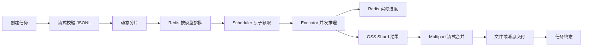

### 3.2 容量控制闭环

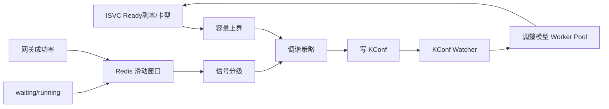

## 4. 技术组成

| 层次 | 技术 | 用途 |
| --- | --- | --- |
| HTTP API | Gin | 创建、查询、取消、删除任务和模型配置管理 |
| 持久化 | MySQL + GORM | BatchTask 主记录和状态 |
| 协调 | Redis Sentinel | 队列、锁、缓存、进度、调谐窗口 |
| 对象存储 | S3-compatible OSS | Shard 数据、元数据、结果文件 |
| 消息 | Kafka | 状态通知、逐条结果、Gateway 指标 |
| 动态配置 | KConf | 模型并发和调谐相关配置 |
| 并发池 | ants | 每模型请求级 Worker Pool |
| 模型调用 | OpenAI-compatible SDK | Chat Completion 流式/非流式调用 |
| 资源观测 | ISVC + Scaler | Ready 副本、卡型和引擎运行指标 |

## 5. 系统边界

平台负责：

- Batch 任务编排；
- 输入数据处理；
- 调度与并发；
- 模型网关请求；
- 结果交付；
- 并发配置闭环。

平台不负责：

- 模型本身的推理实现；
- GPU Pod 的直接调度；
- 用户输入文件的长期源站存储；
- Kafka 下游业务消费；
- 计费系统和账号状态本身。

这些能力由 LLM Gateway、ISVC、Scaler、Billing、OSS、Kafka 等外部系统提供。

## 6. 当前运行形态

`Inference`：仓库虽然包含 `apiserver` 和 `scheduler` 两个命令入口，但容器 entrypoint 只启动 `apiserver`；而统一 `Service.Start()` 会启动任务创建、调度执行、自动调谐和监控循环。因此当前快照更接近：

> 多副本单体式 Batch 编排服务，通过共享 MySQL、Redis、OSS 和 KConf 协调。

这与 README 中“Manager 与 Scheduler 独立服务”的描述不完全一致，后续文档以实际装配和启动路径为准。

---

来源：`00-overview/02-runtime-architecture.md`

## 运行时架构

## 1. 实际进程边界

### 1.1 容器入口

当前容器入口执行：

```text
/work/apiserver -c ${KCONF}
```

`apiserver` 启动前显式初始化 Redis，然后构建统一 `Service`。该 Service 并不只提供 HTTP API，还会同时启动 Scheduler、Executor、自动调谐、账号冻结扫描和指标采集。

### 1.2 Service 启动内容

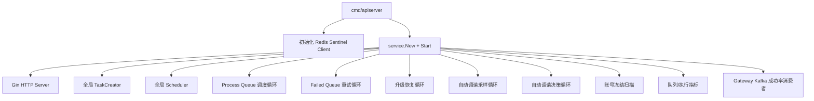

这意味着每个服务副本都具备完整的 API 和执行能力。

## 2. 多实例协调方式

不同后台循环采用两种模式。

### 2.1 所有实例都可执行

普通 Process/Failed Queue Scheduler 在所有实例运行。它们依赖 Redis 队列的原子操作竞争 Shard，因此不需要全局 Leader。

典型操作：

```text
LPOP model_pending_queue
RPUSH model_process_queue
SET upgrade@shard TTL
```

三条命令在一个 Lua 脚本中执行。

### 2.2 每个周期只允许一个实例执行

以下任务通过 Redis `SET NX` 周期锁实现全局单写：

- 丝滑升级恢复扫描；
- 自动调谐指标采样；
- 自动调谐决策与 KConf 更新；
- 账号冻结扫描。

锁带 TTL。实例退出后不需要主动交接，TTL 到期后其他实例可以接管。

## 3. 外部依赖

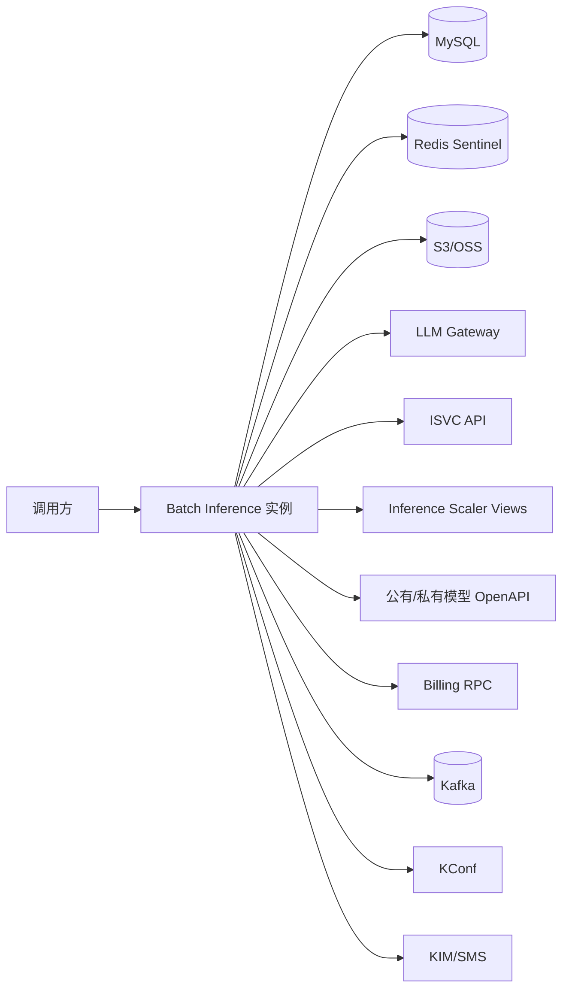

| 依赖 | 主要用途 | 失败影响 |
| --- | --- | --- |
| MySQL | BatchTask 持久化和状态机 | 无法创建/查询任务，终态无法提交 |
| Redis | 队列、锁、缓存、实时进度 | 无法调度，部分读取降级，后台单写失效 |
| OSS | Shard 与结果数据 | 分片、执行、汇总链路阻断 |
| LLM Gateway | 实际模型推理 | 请求重试或失败 |
| ISVC | Ready 副本与运行时信息 | Ready 检查等待，调谐暂停 |
| Scaler | queue 和引擎指标 | 自动调谐采样缺失 |
| KConf | 动态模型并发配置 | 新模型无法调度，调谐结果无法生效 |
| Kafka | 状态通知、逐条结果、Gateway 指标 | 核心文件链路可继续，但消息交付或调谐信号受损 |
| Billing | 欠费/冻结判断 | 当前执行侧选择记录错误并继续，扫描能力受损 |

## 4. HTTP 路由

主要业务路由挂在 `/v1`：

| Method | Path | 作用 |
| --- | --- | --- |
| POST | `/v1/batches` | 创建任务 |
| GET | `/v1/batches?batch_ids=...` | 批量查询任务 |
| GET | `/v1/batches/:batch_id` | 查询单个任务 |
| POST | `/v1/batches/:batch_id/timeout` | 延长完成窗口 |
| POST | `/v1/batches/:batch_id/cancel` | 取消任务 |
| DELETE | `/v1/batches/:batch_id` | 删除任务记录 |
| POST | `/v1/models/config` | 更新模型执行配置 |
| GET | `/v1/models/:model_name/config` | 查询模型配置 |
| GET | `/v1/models/config` | 查询全部模型配置 |

另有 `/health`、`/healthz`、`/readyz`、`/metrics` 和可选 pprof 路由。

## 5. 关键共享单例

当前实现使用若干进程内全局对象：

- `manager.TaskManager`：TaskCreator；
- `scheduler.TaskScheduler`：Scheduler；
- `executor.ExecuteCoreController`：模型 Worker Pool 与 Shard 并发配置；
- `statistics.MCounter`：执行器、模型 Shard 和 Worker 运行计数；
- `globalOnceTaskExec`：基于 Redis 的一次性事件执行器。

这些对象在 `Service.Start()` 初始化后供后台循环和 API 使用。

## 6. 独立 scheduler 二进制的状态

`Legacy/Unwired`：仓库中存在 `cmd/scheduler`，但它同样调用统一 Service，且没有像 `cmd/apiserver` 一样显式初始化 Redis。容器入口也未启动它。因此不能把它描述为当前线上独立部署的 Scheduler 服务。

## 7. 架构优点与代价

### 优点

- 部署简单，一个实例具备完整处理能力；
- 依赖共享存储即可横向扩容；
- API 和执行侧复用模型、存储和配置客户端；
- Redis 原子 claim 能让所有副本共同消费。

### 代价

- API 与重 CPU/IO 后台任务共享进程资源；
- API 本地 goroutine 创建 Shard，缺少持久化消费边界；
- 部分进程内锁不能天然覆盖多副本；
- 各副本都启动多个 Timer，必须依赖 Redis 锁避免重复单写；
- 独立 Scheduler 的代码入口容易让维护者误判部署架构。

## 8. 源码定位

| 内容 | 文件/函数 |
| --- | --- |
| 容器入口 | `scripts/entrypoint.sh` |
| API 主入口 | `cmd/apiserver/main.go` |
| 未装配 Scheduler 入口 | `cmd/scheduler/main.go` |
| 统一服务启动 | `internal/service/service.go: Service.Start` |
| 依赖上下文 | `internal/proxy/context.go: NewContext` |
| 全局周期锁 | `scheduler/timer.go: GlobalScheduledTaskSafely` |

---

来源：`00-overview/03-end-to-end-flows.md`

## 端到端链路

## 1. 文件模式任务

### 1.1 正常时序

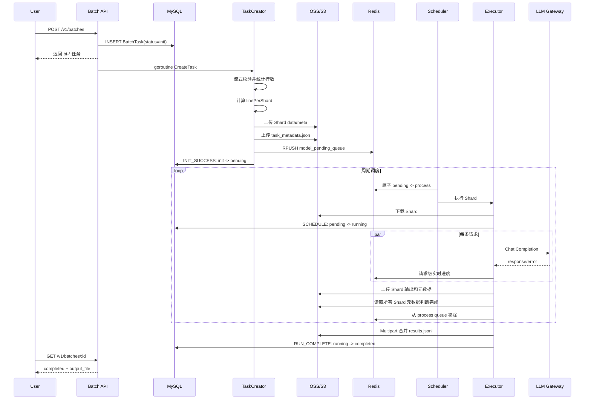

### 1.2 关键状态

```text
API 创建成功       Task=init
全部分片入队成功   Task=pending, Shard=pending
首个分片开始执行   Task=running, Shard=processing
单分片完成         Shard=completed
全部分片完成并合并 Task=completed
```

## 2. Message 模式任务

Message 模式的输入处理和执行与文件模式一致，区别在结果交付：

1. 创建分片时把用户 `result_topic` 和 `tag` 保存到 Redis，并设置 168 小时 TTL。
2. 每个 Shard 得到结果后，异步把每条 `BatchResponse` 封装为 `TaskReqResult`。
3. 消息先发送到平台配置的 `task_req_result_topic`，消息体携带真正的业务 `result_topic` 和 `tag`。
4. 下游转发/消费链路不在本仓库内。
5. 任务仍会维护 OSS Shard 输出和 MySQL 终态；当前 merge 对 Message 类型只取有限 Shard，不能把它理解为与文件模式完全相同的最终文件语义。

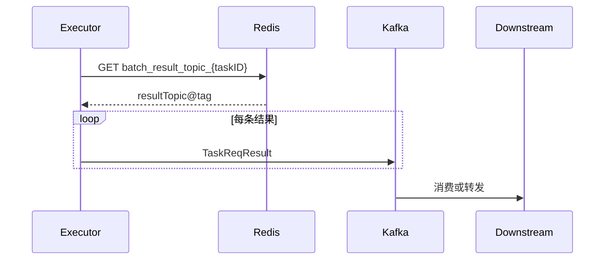

## 3. 创建失败链路

```text
下载失败 / JSONL 非法 / Shard 上传失败 / 入队失败
    → TaskCreator 返回错误
    → INIT_FAIL
    → Task=failed
    → errors 字段记录 taskID -> error message
    → 可选发送终态 KIM 通知
```

传输中断型错误可以按配置重跑完整 Shard 创建；确定的 JSON 格式错误不重试。

## 4. Request 失败链路

```text
请求执行
  → 检查任务超时/取消/账号冻结
  → 检查 Ready KSN
  → 调用 Gateway
  → 429 / 529 / 5xx: 指数退避重试
  → 不可重试错误或耗尽重试
  → 写 BatchResponse.error
  → 将原请求写入 failed request 文件
  → 实时失败计数 +1
```

单条 Request 失败不等于 Shard 执行失败。只要 Executor 能生成包含成功或错误的结果数组并写入 Shard 输出，该 Shard 可以进入 `completed`，其 `FailedCount` 大于零。

## 5. Shard 执行失败与恢复

Shard 级基础设施错误，例如无法下载 Shard、无法写元数据、processShardData 返回错误，会使执行单元进入 failed queue：

```text
pending --原子领取--> process
process --执行失败--> 从 process 移除 + 写入 failed
failed --到达重试时间--> 再次执行
failed --超过最大重试窗口--> 丢弃队列项
```

Shard 元数据状态和 Task 进度决定任务最终是否失败。

## 6. 取消与超时

### 6.1 取消

当前取消 API 直接把任务更新为 `stopped`，并设置 `stopping_at`、`stopped_at`。正在执行的请求在下一次状态检查时把 `stopping` 或 `stopped` 视为取消，返回错误结果并停止继续执行。

`Risk`：状态机设计表达的是 `running → stopping → stopped`，API 实现却直接写 `stopped`。手册后续会把“设计语义”和“当前实现”分开说明。

### 6.2 超时

每条请求执行前根据：

```text
deadline = task.created_at + completion_window
```

判断是否到期。命中后通过数据库条件更新再次确认，避免 timeout 配置刚被延长时使用旧缓存错误过期任务。

## 7. 自动并发调谐时序

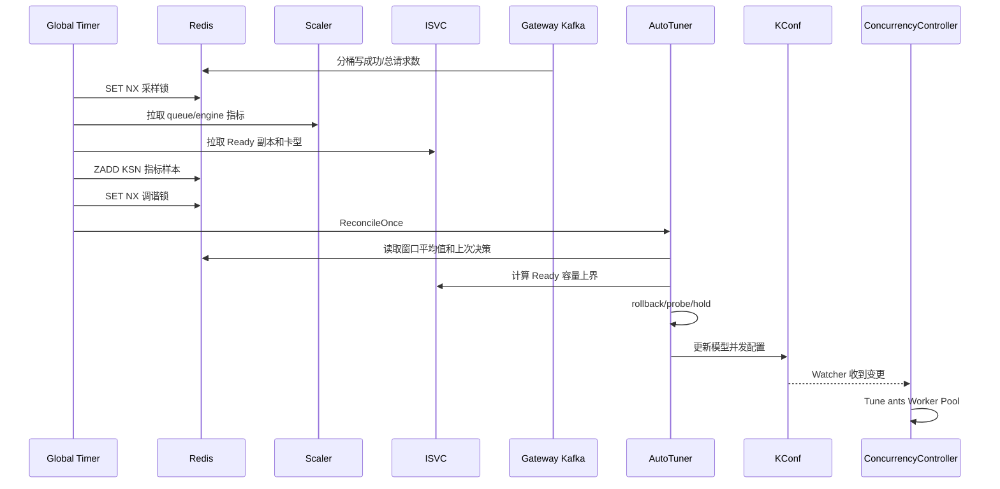

## 8. 源码定位

| 链路 | 文件/函数 |
| --- | --- |
| 创建 Batch | `internal/service/apiserver/api_batch/api_batch.go: CreateBatch` |
| 创建和切分 Shard | `manager/task_creator.go: CreateTask/createShardsOnce` |
| 原子领取 | `scheduler/queue/queue_controller.go: MoveShardBetweenQueuesAndSetElement` |
| 调度入口 | `scheduler/scheduler.go: ScheduleExecutor` |
| Shard 执行 | `scheduler/executor/executor.go: processShard` |
| Request 执行 | `scheduler/executor/executor.go: funcCall/handleRequest` |
| 进度与完成判断 | `scheduler/executor/executor.go: updateTaskProgress` |
| Multipart 合并 | `scheduler/executor/executor.go: MergeShardOutputs` |
| 自动调谐 | `internal/service/modelconcurrency/model_concurrency_reconciler.go` |

---

来源：`00-overview/04-component-and-code-map.md`

## 组件与代码地图

本文用于在有源码时定位实现，也用于在没有源码时确认模块边界。当前主链路从 `cmd/apiserver` 和 `internal/service/Service.Start` 开始，而不是从目录名称推断。

## 1. 当前装配的核心组件

| 组件 | 职责 | 关键入口 | 状态 |
| --- | --- | --- | --- |
| API Server | Batch 和模型配置 HTTP API | `cmd/apiserver/main.go` | Implemented |
| Service Bootstrap | 初始化依赖、HTTP、Timer 和后台循环 | `internal/service/service.go` | Implemented |
| Proxy Context | Store、Kafka、S3、Gin 依赖容器 | `internal/proxy/context.go` | Implemented |
| Batch API | 创建、查询、超时、取消、删除 | `internal/service/apiserver/api_batch` | Implemented |
| TaskCreator | 下载、校验、分片、上传、入队 | `manager/task_creator.go` | Implemented |
| Dataset Reader | HTTP 超时、断流状态和完整性识别 | `manager/processor_http_downloader.go` | Implemented |
| Redis Queue | pending/process/failed 队列 | `scheduler/queue` | Implemented |
| Scheduler | Starter → Execute → Ender | `scheduler/scheduler.go` | Implemented |
| Executor | Shard 与 Request 执行 | `scheduler/executor/executor.go` | Implemented |
| ConcurrencyController | 每模型 Worker Pool 和 Shard 上限 | `scheduler/executor/concurrency_controler.go` | Implemented |
| OSS Service | S3 Put/Get/List/Multipart | `services/oss` | Implemented |
| MySQL Store | BatchTask CRUD 与状态转换 | `internal/client/store/msql` | Implemented |
| Redis Progress | 请求级实时完成/失败计数 | `services/redis/batch_progress.go` | Implemented |
| Model Cache | 模型 OpenAPI 查询与五分钟缓存 | `internal/service/modelcache` | Implemented |
| ISVC Client | Ready 副本、卡型、Pool | `internal/isvc/ready.go` | Implemented |
| Scaler Client | waiting/running 和成功率指标 | `internal/scaler/views.go` | Implemented |
| Auto Tuner | 指标窗口、信号、容量和 KConf 闭环 | `internal/service/modelconcurrency` | Implemented |
| Gateway Metrics | Kafka perflog 成功率聚合 | `internal/service/gatewaymetrics` | Implemented |
| Account Freeze | 执行前和周期性冻结检查 | `internal/service/accountfreeze` 等 | Implemented |
| Notice | Kafka 任务状态、KIM、SMS | `pkg/notice` | Implemented |

## 2. 关键目录关系

```text
cmd/apiserver
  └── internal/service
      ├── internal/proxy
      │   ├── internal/client/store/msql
      │   ├── services/mq
      │   └── services/oss
      ├── manager/TaskCreator
      ├── scheduler/Scheduler
      │   ├── scheduler/queue
      │   ├── scheduler/executor
      │   └── scheduler/statistics
      ├── internal/service/modelconcurrency
      ├── internal/service/gatewaymetrics
      └── internal/service/accountfreeze
```

## 3. 核心调用关系

### 3.1 任务创建

```text
Batch.CreateBatch
  → Store.GetModelInstanceByModelInstanceIdAndScope
  → Store.CreateBatchTask
  → goroutine TaskCreator.CreateTask
      → validateDataset
      → executeDatasetSharding
          → createShardsOnce
          → uploadShard/uploadTaskMetadata
          → enqueueShards
      → UpdateBatchTaskByIdWithEvent(INIT_SUCCESS/INIT_FAIL)
```

### 3.2 Shard 调度与执行

```text
Service Timer
  → Scheduler.ScheduleExecutor
      → Executor.StarterExec
          → FindIdleShardTask
          → pending 原子迁移到 process
      → Executor.Execute
          → processShard
              → processShardData
                  → WorkPool.Submit(funcCall)
                      → handleRequest
      → Executor.EnderExec
          → 失败项加入 failed queue
```

### 3.3 结果完成

```text
processShard
  → completeShardWithOutput
  → saveResults
  → reportBatchProgress
  → updateTaskProgress
      → 读取 task_metadata
      → 读取所有 shard metadata
      → 未完成: PROGRESS
      → 全部失败终结: FAIL
      → 全部有结果: outputTaskResultFileAndUpdateStatus
          → MergeShardOutputs
          → RUN_COMPLETE
```

### 3.4 自动调谐

```text
SampleAutoTunerMetricsOnce
  → Scaler.ListModelViews
  → ISVC.FetchRuntimeInfoMap
  → 筛选 active task model
  → Redis ZSET 写入 KSN 样本

ReconcileOnce
  → ISVC Ready 容量
  → averageAutoTunerMetrics
  → Gateway success rate 覆盖引擎成功率
  → EvaluateConcurrencySignal
  → AggregateAutoTuneDecision
  → ApplyModelConfigUpdates
  → KConf Watcher
  → ConcurrencyController.Update
```

## 4. 遗留和未装配代码

| 模块 | 状态 | 说明 |
| --- | --- | --- |
| `cmd/scheduler` | Legacy/Unwired | 存在入口，但容器未启动，且缺少显式 Redis 初始化 |
| `pkg/taskprocessor` | Legacy | Kafka 驱动的旧分片处理器，当前没有启动调用 |
| `pkg/statemanager` | Legacy | 文件主体被注释，不参与当前状态更新 |
| `pkg/controller/taskreconciler` | Stub | 只有 Timer 和 TODO，没有恢复逻辑 |
| `services/oss/batch_inference_service.go` | Legacy | 旧的 BatchInferenceOSS 代码被注释 |
| 私有模型任务窗口调度 | Designed | 有阶段二设计文档，尚未进入当前执行 gate |

## 5. 阅读代码的推荐顺序

1. `scripts/entrypoint.sh`
2. `cmd/apiserver/main.go`
3. `internal/service/service.go`
4. `internal/service/apiserver/api_batch/api_batch.go`
5. `manager/task_creator.go`
6. `scheduler/queue/*`
7. `scheduler/executor/starter.go`
8. `scheduler/executor/executor.go`
9. `internal/client/store/msql/store_batch_task.go`
10. `internal/service/modelconcurrency/*`

如果只想理解业务主链路，暂时跳过测试、生成的 protobuf 和 Legacy 模块。

---

来源：`01-domain-model/01-core-concepts-and-glossary.md`

## 核心概念与术语

## 1. 任务层级

```text
BatchTask
  ├── TaskMetadata
  │   ├── ShardMetadata[0]
  │   │   ├── BatchRequest[0]
  │   │   ├── BatchRequest[1]
  │   │   └── ...
  │   ├── ShardMetadata[1]
  │   └── ...
  └── Final Result / Message Results
```

| 术语 | 含义 |
| --- | --- |
| Batch/BatchTask | 用户提交的一次批量推理作业，也是 API 和 MySQL 中的主实体 |
| Task | 代码中有时与 Batch 同义，例如 TaskCreator、TaskID |
| Dataset | 用户通过 URL 提供的 JSONL 输入文件 |
| BatchRequest | JSONL 中的一行模型请求 |
| Shard | 为调度和执行而切分的一段连续 JSONL 请求 |
| BatchResponse | 单个 BatchRequest 的成功响应或错误结果 |
| TaskMetadata | 保存任务包含哪些 Shard、总行数和结果交付方式的 OSS JSON |
| ShardMetadata | 保存单 Shard 范围、模型信息、状态和计数的 OSS JSON |

## 2. 模型标识

模型相关字段最容易混淆。

| 字段 | 来源 | 作用 |
| --- | --- | --- |
| `BatchTask.ModelName` | 创建请求中的 `model` | 实际保存的是模型实例 ID，用于任务记录和后续关联 |
| `TaskMessage.ModelID` | 创建请求中的 `model` | 执行时重新获取模型实例信息 |
| `ModelServiceName` | model_instances/private_model_instances | Redis 队列名、并发池、Gateway 请求实际模型名 |
| `ModelName` | Header `X-Ks-Model-Name` | 透传给 Gateway 的展示/业务模型名 |
| `BillingModelID` | model instance 关联的模型 ID | Billing 资源冻结检查 |
| `ModelScope` | `public` 或 `private` | 决定模型元数据查询路径和 Ready Pool 过滤规则 |
| `ModelProjectID` | 私有模型实例所属项目 | 私有模型 OpenAPI 查询所需上下文 |

### 2.1 为什么需要区分

- 用户提交的是模型实例，不一定等于底层运行服务名。
- 模型服务可能迁移或更新，Executor 每次重试前会重新解析运行时 `model_service_name`。
- 计费通常按模型产品 ID，不按 KSN 或服务名。
- 私有模型查询需要项目隔离，公有模型不需要。

## 3. KSN、ISVC 和 Pool

| 术语 | 含义 |
| --- | --- |
| ISVC | InferenceService 运行实例描述，提供 Ready 副本、卡型、标签等信息 |
| KSN | 可定位某组模型推理运行时的服务标识；KConf 为每个 KSN 配置单副本并发 |
| Pool | 推理资源池，例如 `offline`；公有 Batch 模型默认只考虑离线池 |
| Ready Replicas | 当前可接收请求的副本数 |
| Device Type | X40/X50/X60 等卡型，用于从基准并发推导单副本能力 |

私有模型通过 `model_scope=private` 显式隔离，因此 Ready 检查和自动调谐允许使用非 offline Pool；公有模型保留 offline-only 约束。

## 4. 两类并发

### 4.1 Shard 并发

`max_execute_shard` 控制一个模型同时有多少个 Shard 处于执行阶段。它限制：

- 同时占用的 Shard 内存；
- 同时进行的 OSS 下载/上传；
- 单模型任务间并行度；
- process queue 中活跃任务数量。

### 4.2 Request 并发

`max_execute_goroutine` 控制一个模型同时有多少条请求进入 Gateway。它对应模型专属 ants Worker Pool 的容量。

一个 Shard 可以包含数千条 Request，因此：

```text
Shard 并发 != 请求并发
```

## 5. 调度队列术语

| 队列 | 含义 |
| --- | --- |
| pending queue | 已完成分片，尚未被执行器领取 |
| process queue | 已被领取，正在执行或等待故障恢复 |
| failed queue | Shard 级执行失败，等待延迟重试 |

队列元素不是仅保存 ShardID，而是拼接：

```text
modelName#shardDatasetKey#shardMetadataKey#shardOutputKey#joinTimestamp
```

## 6. 结果交付术语

| 类型 | 含义 |
| --- | --- |
| File Provide | 所有 Shard 结果合并为 `tasks/{taskID}/output/results.jsonl` |
| Message Provide | 每条结果封装后写 Kafka，消息中携带用户结果 Topic 和 Tag |
| Failed Request File | 保存最终失败请求原文，用于排查或重放 |

## 7. 自动调谐术语

| 术语 | 含义 |
| --- | --- |
| Baseline Concurrency | 基准卡型或模型的单副本并发基线 |
| KSN Concurrency | 某个 KSN 单 Ready 副本的并发能力 |
| Ready Capacity | Ready 副本数 × 单副本能力 |
| Upper Bound | 按 Ready Capacity、服务实例数和全局上限计算的单实例安全上界 |
| Queue Load Ratio | waiting queue / running queue |
| Probe Fast | 指标良好时按上界的较大步长增并发 |
| Probe Slow | 指标基本良好时按较小步长增并发 |
| Rollback | 成功率或排队恶化时降低并发 |
| Hold | 当前信号不支持调整，保持并发 |

## 8. 常见歧义

### Task failed 与 Request failed

- Request failed：一条输入得到错误结果，通常不会让 Shard 基础设施执行失败。
- Shard failed：Shard 下载、解析、元数据或执行流程本身失败。
- Task failed：初始化失败，或所有 Shard 结束时仍存在无法完成的 Shard 等任务级失败。
- Task completed 可以包含部分 Request failed；最终计数通过 `success_count` 和 `failed_count` 表达。

### Pending 状态与 pending queue

- Task `pending`：分片初始化已经完成，任务等待/正在逐步调度。
- Shard pending queue：具体 Shard 尚未被领取。
- 一个 Task 已经 `running` 时，其剩余 Shard 仍可能位于 pending queue。

---

来源：`01-domain-model/02-task-and-shard-models.md`

## Task 与 Shard 数据模型

## 1. BatchTask

BatchTask 是 MySQL 中的任务主记录。简化结构如下：

```go
type BatchTask struct {
    ID               string
    CreatedAt        int64
    UpdatedAt        int64
    DeletedAt        int64

    Endpoint         string
    ProjectID        string
    Model            string
    CompletionWindow int

    InputFile        JSON
    OutputFile       JSON
    ErrorFile        JSON
    Metadata         JSON
    Errors           JSON

    Status           string
    RunningAt        int64
    ExpiredAt        int64
    CompletedAt      int64
    FailedAt         int64
    StoppingAt       int64
    StoppedAt        int64

    TotalCount       int
    SuccessCount     int
    FailedCount      int
}
```

### 1.1 ID 与默认值

- ID 自动生成为 `bt-{uuid}`。
- 创建状态固定为 `init`。
- `created_at`、`updated_at` 使用 Unix 秒。
- API 响应中的 `request_counts` 不是数据库列，而是查询后从计数字段构造。

### 1.2 Metadata

当前创建链路至少保存：

```json
{
  "description": "用户描述",
  "customer_id": "账号或 API Key ID",
  "billing_model_id": "计费模型 ID"
}
```

账号冻结扫描依赖 `customer_id` 和 `billing_model_id`。

### 1.3 InputFile/OutputFile

输入示例：

```json
{
  "type": "url",
  "info": {
    "bucket": "",
    "key": "",
    "url": "https://.../dataset.jsonl"
  }
}
```

完成后的输出指向平台 OSS：

```json
{
  "type": "s3",
  "info": {
    "bucket": "<configured-bucket>",
    "key": "tasks/{taskID}/output/results.jsonl"
  }
}
```

## 2. BatchRequest 与 BatchResponse

### 2.1 输入行

```json
{
  "id": "创建分片时由平台生成",
  "custom_id": "用户提供的关联 ID",
  "url": "/v1/chat/completions",
  "body": {
    "model": "原始模型字段会在执行时覆盖",
    "messages": []
  }
}
```

平台在创建 Shard 时把 `id` 更新为 `batch-{uuid}`。`custom_id` 用于用户关联输入输出。

### 2.2 输出行

成功：

```json
{
  "id": "batch-uuid",
  "custom_id": "user-id",
  "response": {
    "id": "user-id",
    "body": {}
  }
}
```

失败：

```json
{
  "id": "batch-uuid",
  "custom_id": "user-id",
  "error": "Failed after N attempts: ..."
}
```

每条输入最终都应对应一个 BatchResponse，成功或失败都可写入最终结果。

## 3. ShardMetadata

Shard 元数据保存在 OSS，而不是当前主链路的 MySQL 表中。

```go
type ShardMetadata struct {
    ShardID      string
    TaskID       string
    ShardIndex   int
    StartLine    int64
    EndLine      int64
    TotalLines   int64
    FileSize     int64
    ObjectKey    string

    Status       ShardStatus
    SuccessCount int64
    FailedCount  int64
    ProcessedAt  time.Time
    CompletedAt  time.Time
    ErrorMessage string

    ModelID          string
    BillingModelID   string
    ModelScope       string
    ModelProjectID   string
    ModelServiceName string
    ProjectID        string
    CustomerID       string
    APIKey           string
    TaskName         string
}
```

### 3.1 Shard ID

格式：

```text
{taskID}_{shardIndex:04d}
```

### 3.2 行号范围

当前实现使用闭区间：

```text
TotalLines = EndLine - StartLine + 1
```

第一个 Shard 从 0 开始。

### 3.3 状态

```text
pending → processing → completed
                     ↘ failed
```

Shard 完成后，`SuccessCount + FailedCount` 应等于 `TotalLines`。

## 4. TaskMetadata

```go
type TaskMetadata struct {
    TaskID      string
    TotalLines  int64
    TotalShards int
    Shards      []*ShardMetadata

    ProvideType string
    ResultTopic string
    Tag         string

    CreatedAt   time.Time
    UpdatedAt   time.Time
}
```

它的主要用途是：

- 枚举任务所有 Shard；
- 汇总任务进度；
- 按 ShardIndex 合并结果；
- 判断 File/Message 交付方式；
- 保留用户结果 Topic 和 Tag。

TaskMetadata 中嵌入的是创建时的 ShardMetadata 快照。执行完成状态需要重新下载每个独立的 `shard_*_meta.json`，不能只读取 TaskMetadata 内嵌状态。

## 5. TaskMessage

API 向 TaskCreator 传递进程内消息：

```go
type TaskMessage struct {
    TaskID, TaskName, DatasetURL string
    ProjectID, CustomerID, APIKey string
    ModelID, BillingModelID string
    ModelScope, ModelProjectID string
    ModelName, ModelServiceName string
    ProvideMethod, ResultTopic, Tag string
}
```

虽然结构名为 Message，当前创建主链路并没有把它持久化到 Kafka，而是直接作为 goroutine 参数传给 TaskCreator。

## 6. TaskReqResult

Message 模式逐条结果结构：

```go
type TaskReqResult struct {
    TaskID           string
    Time             int64
    ModelServiceName string
    Tag              string
    ResultTopic      string
    BatchResponse    BatchResponse
}
```

平台 Kafka Topic 和用户业务 ResultTopic 是两个概念：前者是系统投递入口，后者作为字段交给下游路由。

## 7. 计数关系

理想不变量：

```text
Task.TotalCount
  = Σ Shard.TotalLines
  = Task.SuccessCount + Task.FailedCount

Shard.TotalLines
  = Shard.SuccessCount + Shard.FailedCount
```

运行过程中 MySQL 终态计数、OSS Shard 元数据和 Redis 实时进度可能短暂不一致，读取策略见 `04-data-ownership.md`。

---

来源：`01-domain-model/03-task-state-machine.md`

## Task 状态机

## 1. 状态定义

| 状态 | 含义 | 是否终态 |
| --- | --- | --- |
| `init` | MySQL 记录已创建，数据集尚未完成分片 | 否 |
| `pending` | 分片创建完成，至少部分 Shard 在等待调度 | 否 |
| `running` | 已有 Shard 被调度执行 | 否 |
| `stopping` | 设计上的停止中状态 | 否 |
| `stopped` | 用户取消后停止 | 是 |
| `completed` | 任务结果已经完成并提交 | 是 |
| `failed` | 初始化或任务级执行失败 | 是 |
| `expired` | 超过 completion window | 是 |
| `deleted` | 逻辑上的删除状态 | 是 |

当前删除 Store 实际调用 GORM Delete；是否能观察到 `deleted` 状态取决于表和删除方式，主 API 没有通过 `DELETE` 事件进行状态转换。

## 2. 设计状态图

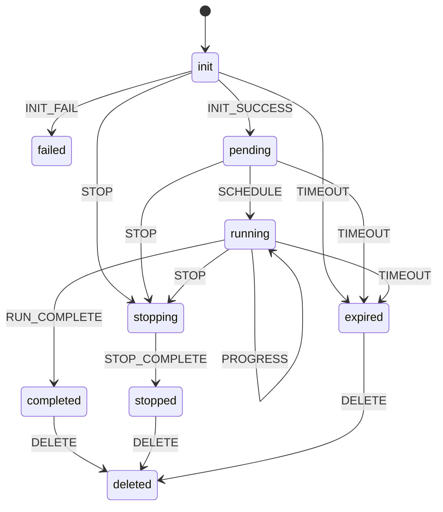

## 3. 事件与写入方

| 事件 | 常见写入方 | 附加字段 |
| --- | --- | --- |
| `INIT_SUCCESS` | TaskCreator | `total_count` |
| `INIT_FAIL` | TaskCreator | `failed_at`、`errors` |
| `SCHEDULE` | Executor 首个 Shard | `running_at` |
| `PROGRESS` | Executor | `success_count`、`failed_count` |
| `RUN_COMPLETE` | Result Merger | output_file、计数、`completed_at` |
| `FAIL` | Executor/任务汇总 | 任务失败 |
| `TIMEOUT` | Executor 条件更新 | `expired_at` |
| `STOP/STOP_COMPLETE` | 设计事件 | 当前取消 API 没按这两步执行 |

## 4. 状态转换实现

Store 更新事件时执行：

```text
1. 从 MySQL 查询当前 BatchTask。
2. 在内存中根据 event 计算 nextStatus。
3. 使用 WHERE id=? AND status=oldStatus 更新。
4. 删除 Redis Task Cache。
5. 如果进入终态，关闭并清理 Redis 实时进度。
```

这是乐观并发控制思路：只有状态仍等于读取值时才能成功写入。

`Risk`：当前实现只检查 GORM `Error`，没有统一检查 `RowsAffected`；在并发竞争导致条件未命中但数据库未返回 Error 时，调用方可能把未落库的转换视为成功。查询也没有使用同一个事务句柄。面试中应把它作为可改进点，而不是描述成已经完全解决的严格 CAS。

## 5. 特殊转换

代码对两个事件做了特殊处理：

- `FAIL`：无条件把状态设为 failed；
- `RUN_COMPLETE`：无条件把状态设为 completed。

这有利于最终汇总重试，但也意味着它们可以覆盖理论上的终态。若 failed Shard 后续重试成功，存在 failed → completed 的实现可能性。

改进方向是明确允许的来源状态，例如：

```text
RUN_COMPLETE only if status = running
FAIL only if status in (init, pending, running)
```

## 6. 当前取消语义

取消接口当前直接执行：

```text
status = stopped
stopping_at = now
stopped_at = now
```

Executor 把 `stopping` 和 `stopped` 都视为取消。因此功能能生效，但绕过了状态机的 `STOP → STOP_COMPLETE` 两阶段语义。

可能的后果：

- 无法区分“正在等待存量请求退出”和“已经全部停止”；
- API 返回 stopped 时仍可能有短时间在途请求；
- 状态机文档和实现不一致。

## 7. 超时语义

Deadline：

```text
deadline = created_at + completion_window
```

执行请求前先通过任务缓存判断是否到期。命中后再调用数据库条件更新：

```sql
UPDATE batch_task
SET status='expired', expired_at=now
WHERE id=?
  AND status IN ('init','pending','running')
  AND created_at + completion_window <= now;
```

二次确认用于处理 completion window 被 API 延长、但 Executor 本地缓存仍是旧值的情况。

## 8. 查询时的状态与进度

非终态任务查询时：

1. 读取 MySQL/Redis Task Cache 得到状态和总数；
2. 读取 Redis 实时进度 Snapshot；
3. 用 Snapshot 覆盖响应中的 completed/failed；
4. 不把实时值立即写回 MySQL。

终态任务直接使用 MySQL 固化计数，Redis 进度会被关闭和删除。

## 9. 面试问题

### 为什么需要状态机而不是任意更新 status？

状态机限制非法转换，并让 running/completed 等状态与对应时间戳和业务事件绑定。多实例下还可以用旧状态作为乐观锁条件。

### 为什么超时需要数据库二次确认？

Executor 使用缓存提高每条请求的检查效率，但 timeout 可以在线延长。缓存判断只用于发现候选超时，最终过期必须用数据库最新 `completion_window` 条件更新确认。

### completed 是否表示所有请求成功？

不表示。completed 表示任务处理和结果生成完成，可以同时包含成功和失败的 BatchResponse；具体看 success_count 和 failed_count。

---

来源：`01-domain-model/04-data-ownership.md`

## 数据归属与一致性

## 1. 为什么数据分布在三个系统

Batch 推理同时包含：

- 需要事务和长期查询的任务状态；
- 高频、短生命周期的调度与实时进度；
- 可能达到数十 GB 的数据和结果。

单一存储不适合同时承担这些职责，因此采用：

```text
MySQL：控制面持久状态
Redis：运行时协调与实时视图
OSS：大对象数据面与 Shard 元数据
```

## 2. 数据归属表

| 数据 | 权威存储 | 辅助存储/缓存 | 写入方 | 读取方 |
| --- | --- | --- | --- | --- |
| BatchTask 基本信息 | MySQL | Redis Task Cache | API | API、Executor、监控 |
| Task 终态和最终计数 | MySQL | 无 | TaskCreator/Executor | API、通知 |
| 输入源 URL | MySQL InputFile | TaskMessage | API | TaskCreator |
| Shard 数据 | OSS | 无 | TaskCreator | Executor |
| Shard 元数据与状态 | OSS | TaskMetadata 创建快照 | TaskCreator/Executor | Executor/Result Merger |
| 任务 Shard 列表 | OSS TaskMetadata | 无 | TaskCreator | Executor |
| pending/process/failed 队列 | Redis | 无 | Creator/Scheduler/Ender | Scheduler |
| Shard heartbeat | Redis | 无 | Scheduler/Executor | Upgrade Scanner |
| Request 实时进度 | Redis | API 响应临时合并 | Executor | API |
| Shard 结果文件 | OSS | 可选 Kafka 逐条消息 | Executor | Result Merger/下游 |
| 最终结果文件 | OSS | MySQL OutputFile 地址 | Result Merger | 用户/API |
| Message 结果路由 | Redis | TaskMetadata | TaskCreator | Executor |
| 模型执行配置 | KConf | 进程内 Global Config | API/Reconciler | Scheduler/Executor |
| 自动调谐样本 | Redis ZSET | 进程内 fallback | Sampler | Reconciler |

## 3. MySQL

### 3.1 适合保存的内容

- 用户可查询的 Task 生命周期；
- 创建时间、完成窗口和终态时间；
- 输入、输出和错误文件地址；
- 总数、成功数、失败数；
- 项目、模型实例和用户 Metadata。

### 3.2 不保存 Shard 主状态的原因

当前主链路没有为每个 Shard 写 MySQL 表，避免大量 Shard 状态更新增加数据库压力。代价是任务汇总需要读取多个 OSS 元数据对象，事务一致性较弱。

## 4. Redis

### 4.1 队列

Redis List 提供快速原子 claim。process queue 同时承担在途记录和故障恢复索引。

### 4.2 Task Cache

Task 查询采用 cache-aside：

```text
GET Redis Cache
  → 命中：反序列化 BatchTask
  → 未命中：查 MySQL，并异步写缓存，TTL 1 分钟
```

状态更新后异步删除缓存。

### 4.3 实时进度

使用 Set 按 requestID 去重，Hash 保存查询快照。终态时设置 closed key 并删除工作集合，避免迟到请求重新生成进度。

### 4.4 分布式锁和 Once

- Timer 全局锁：确保周期内单实例执行；
- TaskExecutor：确保某 Task 的 running notice、SCHEDULE、stopped 更新只成功执行一次；
- heartbeat：识别升级/宕机遗留的 process Shard。

## 5. OSS

### 5.1 数据对象

OSS 保存：

- `shard_*_data.jsonl`：分片输入；
- `shard_*_meta.json`：分片元数据；
- Shard 输出；
- 失败请求；
- `task_metadata.json`；
- 最终 `results.jsonl`。

### 5.2 Shard 状态更新

Executor 更新状态时采用：

```text
GET shard metadata
→ JSON Unmarshal
→ 修改 status/count/time/error
→ PUT 覆盖 metadata object
```

没有对象版本 CAS。若两个实例同时执行同一 Shard，存在后写覆盖风险；系统主要依赖 Redis claim 和 heartbeat 降低重复执行概率。

## 6. 一致性时间线

正常执行中允许短暂差异：

```text
Request 完成
  → Redis 实时进度立即更新
  → Shard 完成后 OSS 计数更新
  → Task 汇总时 MySQL 计数更新
```

因此读取优先级是：

- 非终态 API：MySQL Task + Redis 实时进度；
- Shard 完成判断：OSS ShardMetadata；
- 终态 API：MySQL 固化值；
- 最终结果内容：OSS Result Object。

## 7. 关键不一致场景

| 场景 | 可能状态 | 当前处理 |
| --- | --- | --- |
| Request 完成后进程退出 | Redis 已计数，Shard 结果可能未写 | Shard 重试；requestID 去重能减少进度重复 |
| Shard 输出已写，Metadata 未完成 | 结果对象存在，Shard 仍 processing/failed | process/failed 恢复可能重新执行 |
| Merge 完成但 DB 未更新 | OSS 有 results，Task 仍 running | 后续完成判断可能再次 merge |
| DB 进入终态后迟到请求上报 | Task completed，Redis 收到旧进度 | closed key 阻止重新累计 |
| KConf 已写，实例尚未刷新 | 配置中心新值、Worker Pool 旧值 | 定期刷新后最终一致 |

## 8. 当前风险与改进方向

### 8.1 Task 创建可靠投递

当前 MySQL 创建后使用本地 goroutine 执行 TaskCreator。进程在入队前退出时，任务可能停留在 init。可引入：

- Transactional Outbox；
- 持久化 Task Creation Queue；
- 真正实现 TaskReconciler 扫描超时 init 任务。

### 8.2 任务进度汇总复杂度

每个 Shard 完成后都读取任务的全部 Shard Metadata。S 个 Shard 最坏约产生 O(S²) 次元数据读取。可改为 Redis/DB 原子 Shard 完成计数，并在计数达到 S 时触发一次 merge。

### 8.3 Merge 多实例幂等

当前 `outputLock` 是进程内锁。多副本可能同时判断完成并合并。可增加：

- Redis `merge:{taskID}` 分布式锁；
- MySQL `running → merging → completed` CAS；
- 结果对象 metadata 幂等检查；
- merge generation/version。

### 8.4 Shard Metadata CAS

可使用 S3 ETag/If-Match 或将 Shard 主状态迁移到具备条件更新能力的数据库，防止并发覆盖。

## 9. 面试表达

可以这样概括数据架构：

> 我们按照数据访问特征拆分存储：MySQL 保存任务级权威状态，Redis 承担高频调度、分布式锁和实时进度，OSS 保存大文件、Shard 元数据及最终结果。运行态采用最终一致性，通过 requestID 去重、状态条件更新、process queue 和终态 closed marker 控制重复与迟到写入。

---

来源：`02-task-ingestion/01-batch-api-and-task-creation.md`

## Batch API 与任务创建

## 1. 模块目标

任务接入层把一个外部 HTTP 请求转换为：

1. 可查询的 MySQL BatchTask；
2. 包含模型、账号和数据集上下文的 TaskMessage；
3. 后台 TaskCreator 分片任务。

API 成功只表示“任务主记录已经创建”，不表示输入文件已经校验或 Shard 已经入队。

## 2. 创建请求

核心请求结构：

```json
{
  "completion_window": 86400,
  "input_file": {
    "type": "url",
    "info": {
      "bucket": "",
      "key": "",
      "url": "https://source/dataset.jsonl"
    }
  },
  "project_id": "project",
  "customer_id": "customer",
  "endpoint": "/v1/chat/completions",
  "model": "model-instance-id",
  "model_scope": "public",
  "provide_method": "file",
  "result_topic": "",
  "tag": "",
  "metadata": {
    "description": "batch description"
  }
}
```

### 2.1 重要 Header

| Header | 用途 |
| --- | --- |
| `X-Ks-Wq-Api-Key-Id` | 默认账号 ID、Executor Gateway Header、User ID |
| `X-Ks-Wq-Project-Id` | 默认项目 ID |
| `X-Ks-Wq-Workload-Name` | TaskName，透传给 Gateway |
| `X-Ks-Model-Name` | 业务模型名，透传给 Gateway |
| `X-Ks-Extra-Attr1` | 额外属性透传 |

如果 Body 未提供 `project_id` 或 `customer_id`，会分别回退到项目 Header 和 API Key ID。

## 3. 模型实例解析

`model` 必填。`model_scope` 可为空、`public` 或 `private`。

查询规则：

```text
scope=public
  → model_instances

scope=private
  → private_model_instances

scope为空
  → 先查 public
  → public 不存在再查 private
```

返回结果至少需要：

- `model_service_name`：调度队列和实际运行模型；
- `model_id`：Billing 使用；
- `model_scope`：执行时模型查询分支；
- `model_project_id`：私有模型必填。

私有模型实例缺少 `model_project_id` 时，创建请求直接失败。

## 4. MySQL 任务创建

API 构造 BatchTask：

```text
InputFile        = 原始 input_file JSON
ProjectId        = 请求或 Header 项目
Endpoint         = 请求 endpoint
ModelName        = 请求 model（模型实例 ID）
Metadata         = description/customer_id/billing_model_id
CompletionWindow = 用户完成窗口
```

GORM `BeforeCreate` 自动生成：

```text
ID        = bt-{uuid}
Status    = init
CreatedAt = now Unix seconds
UpdatedAt = now Unix seconds
```

## 5. TaskCreator 启动

数据库创建成功后：

```go
go TaskCreator.CreateTask(TaskMessage{...})
```

TaskMessage 携带：

- TaskID 和数据集 URL；
- 项目、账号、API Key；
- 模型实例 ID、Billing 模型 ID；
- 模型作用域、私有项目 ID；
- ModelServiceName；
- 文件或消息结果交付信息。

API 随后立即返回创建的 BatchTask，通常状态仍是 `init`。

## 6. 初始化结果

### 成功

TaskCreator 完成校验、分片、元数据上传和全部 Shard 入队后：

```text
INIT_SUCCESS
status      init → pending
total_count = JSONL 总行数
```

### 失败

任何初始化阶段错误：

```text
INIT_FAIL
status    init → failed
failed_at = now
errors    = {taskID: errorMessage}
```

## 7. 其他 Batch API

### 7.1 查询

- 单任务查询优先读 Redis Task Cache，未命中查 MySQL。
- 非终态任务再读取 Redis 实时进度，覆盖响应的 completed/failed。
- 批量查询最多支持 20 个 batch ID。

### 7.2 延长 Completion Window

只允许：

- 当前状态为 init/pending/running；
- 新窗口大于旧窗口；
- 新值在 int32 正数范围。

API 先把新 Deadline 写入短 TTL 乐观缓存，再用数据库条件更新，最后刷新正常缓存。

### 7.3 取消

当前实现直接写 `stopped`，并设置 stopping/stopped 时间。Executor 后续状态检查会终止剩余请求。

### 7.4 删除

调用 GORM Delete 删除 BatchTask，并清理 Task Cache 和实时进度。API 没有通过状态机的 DELETE 事件转为 `deleted`。

## 8. 可靠性边界

### 8.1 本地 goroutine 不具备持久化语义

风险窗口：

```text
MySQL INSERT 成功
→ API 返回成功
→ 进程退出
→ TaskCreator 未完成/未启动
```

结果可能是任务长期停在 `init`。仓库中 TaskReconciler 只有 TODO，尚未自动修复。

### 8.2 API 重试与幂等

当前创建 API 没有显式 client idempotency key。客户端超时后重试可能创建多个 BatchTask。可以演进为：

- 接收用户幂等键并建唯一索引；
- Transactional Outbox；
- 持久化 TaskCreate MQ；
- Reconciler 扫描长时间 init 任务。

## 9. 面试问题

### 为什么先创建数据库任务，再异步分片？

大文件校验和分片耗时可能达到分钟级，不能阻塞 HTTP 请求。先返回 TaskID 可以让调用方异步轮询。但异步边界需要持久化或补偿机制，当前本地 goroutine 是可改进点。

### 为什么创建阶段要查询模型实例？

调度队列和并发池以 model_service_name 为维度，Billing 又需要模型产品 ID；用户输入的 model instance ID 无法直接满足后续执行和治理需求。

## 10. 源码定位

| 内容 | 文件/函数 |
| --- | --- |
| 路由 | `internal/service/apiserver/api_batch/api.go` |
| 创建任务 | `api_batch.go: CreateBatch` |
| 查询/取消/超时 | `api_batch.go` 对应 Handler |
| BatchTask Hook | `internal/models/db/batch_task.go` |
| 公私模型查询 | `internal/client/store/msql/store_model_instances.go` |
| TaskCreator | `manager/task_creator.go: CreateTask` |

---

来源：`02-task-ingestion/02-jsonl-streaming-download.md`

## JSONL 流式下载

## 1. 要解决的问题

输入文件可能达到 20GB。简单实现通常有三类风险：

1. `io.ReadAll` 导致内存与文件大小线性增长；
2. HTTP 建连成功但 Body 中途长时间无数据，任务永久挂住；
3. TCP/代理中断后得到 EOF 或残缺行，被误判为用户 JSON 错误。

当前实现返回一个流式 `io.ReadCloser`，Scanner 一边读取一边处理，不保留完整文件。

## 2. HTTP 客户端

下载过程先尝试 HEAD，再执行 GET。

### 2.1 HEAD

HEAD 用于记录：

- HTTP Status；
- Content-Length；
- ETag；
- Last-Modified。

HEAD 失败不是致命错误，系统继续 GET，兼容不支持 HEAD 或签名 URL 对 HEAD 有限制的源站。

### 2.2 GET

GET 必须返回 HTTP 200，否则关闭 Body 并返回错误。

客户端关闭自动透明压缩：`DisableCompression=true`，同时请求 Header 设置了 `Accept-Encoding`。由于 Go Transport 在 DisableCompression 下不会自动解压，若源站真的返回 gzip Body，Scanner 可能读到压缩字节。当前生产源应返回未压缩 JSONL；这是需要在接入契约中明确的边界。

## 3. 三类超时

| 超时 | 默认值 | 解决的问题 |
| --- | --- | --- |
| Connect Timeout | 10s | TCP 建连不可达 |
| Response Header Timeout | 30s | 已连接但服务迟迟不返回 Header |
| Read Idle Timeout | 120s | Body 读取过程中长时间没有任何字节 |

此外 TLS Handshake Timeout 为 10s，连接 KeepAlive 30s。

这些超时可由配置覆盖：

```yaml
dataset_connect_timeout_seconds: 10
dataset_response_header_timeout_seconds: 30
dataset_read_idle_timeout_seconds: 120
```

## 4. datasetHTTPReadCloser

包装 Reader 维护以下状态：

```go
type datasetReadState struct {
    BytesRead     int64
    ContentLength int64
    TimedOut      bool
    LastErr       error
}
```

### 4.1 Read 流程

```text
Read(p):
  在读取前重置 idle timer
  调用底层 Body.Read
  如果 n > 0:
      原子累加 bytesRead
      再次重置 idle timer
  如果 err != nil:
      停止 timer
      如果是 idle timeout:
          包装为明确的 read idle timeout
      非 EOF 错误保存为 lastErr
  返回 n, err
```

### 4.2 Idle Timer

Timer 到期后：

```text
timedOut = true
lastErr = dataset read idle timeout
close underlying response body
```

关闭 Body 用来打断正在阻塞的 Read。

状态字段使用 Mutex 和 Atomic 保护，避免 Timer goroutine 与 Scanner goroutine产生数据竞争。

## 5. 完整性检查

Scanner 返回 EOF 不一定代表完整读取。扫描结束后执行：

```text
如果 LastErr == nil
且没有超时
且 ContentLength 未知或 BytesRead >= ContentLength
    → 完整
否则
    → incomplete body / stream interrupted
```

这种检查能识别“底层连接提前关闭但上层只看到文件结束”的情况。

## 6. 内存模型

流式下载本身的内存主要包括：

- Scanner Buffer：初始约 1MiB，最大由 `max_jsonl_line_bytes` 控制，默认 10MiB；
- 当前行字节；
- 创建分片时的当前 Shard Buffer；
- HTTP Transport 缓冲。

因此：

```text
下载内存 O(maxLineSize)
分片阶段总内存 O(currentShardBytes)
而不是 O(totalDatasetBytes)
```

“支持 20GB 文件”指总文件不驻留内存，不表示内存完全与配置无关。单行上限和单 Shard 行数仍需要合理配置。

## 7. 当前会下载两遍

TaskCreator 当前流程：

```text
第一次 GET：校验全部 JSONL + 统计行数
→ 计算动态分片大小
第二次 GET：再次读取 + 创建并上传 Shard
```

优点：

- 能精确控制 Shard 数量；
- 在写任何 Shard 前确认整个数据集 JSON 格式有效；
- 分片公式可以使用准确总行数。

代价：

- 20GB 输入可能产生约 40GB 源站读取流量；
- 总预处理耗时接近两次完整扫描；
- 如果 URL 内容在两次 GET 之间变化，验证对象和分片对象可能不同。

可以通过 ETag/Last-Modified 一致性检查缓解内容变化；当前代码只记录这些 Header，没有跨两遍强校验。

## 8. 可演进方案

### 方案 A：先落原始文件到平台 OSS

```text
源站单次流式下载 → 平台 OSS 原始对象
→ 对稳定对象扫描和分片
```

仍需要读取两次，但只向源站下载一次，并获得稳定数据版本。

### 方案 B：固定最大行数单遍分片

不提前统计行数，按 `max_line_per_shard` 单遍切分。网络和预处理更省，但无法严格控制 `max_shard_number`。

### 方案 C：预估 + 末端调整

根据 Content-Length 和采样平均行大小预估分片，复杂度更高，也可能产生不均匀 Shard。

## 9. 监控与日志

建议重点观察：

- HEAD/GET status；
- content_length 和 bytes_read；
- connect/header/read-idle timeout；
- ETag/Last-Modified；
- validation 与 create_shards 两阶段耗时；
- 中断分类和重试次数；
- 单行最大字节数；
- 单 Shard 实际字节数。

## 10. 面试表达

> 大文件链路没有设置一个覆盖整个下载过程的短总超时，而是把建连、响应头和读空闲分别控制。Body Reader 记录已读取字节与 Content-Length，并在长时间无数据时主动关闭底层连接。这样既允许 20GB 文件长时间持续传输，也能识别中途断流和静默截断。

## 11. 源码定位

- `manager/processor_http_downloader.go`
- `downloadFromHTTPWithProgress`
- `datasetHTTPReadCloser.Read`
- `datasetHTTPReadCloser.datasetReadState`
- `manager/validation.go`
- `manager/dataset_error.go`

---

来源：`02-task-ingestion/03-jsonl-validation-and-error-classification.md`

## JSONL 校验与错误分类

## 1. 输入契约

数据集必须是 JSON Lines：

- 一行对应一个请求；
- 每行必须是 JSON Object；
- 不允许空行；
- 单行字节数不能超过 `max_jsonl_line_bytes`，默认 10MiB。

基础行校验：

```text
trim spaces
if empty: error
if first byte != '{' or last byte != '}': error
json.Unmarshal into map[string]interface{}
```

随后创建 Shard 时还会反序列化为 BatchRequest，并给请求生成平台 ID。

## 2. 为什么错误分类困难

假设网络在一行 JSON 中间断开：

```json
{"custom_id":"1","body":{"messages":[...
```

Scanner 可能把残缺字节作为最后一个 token 返回。JSON 校验看到的是“缺少右大括号”，但真实原因可能是传输中断而不是用户文件格式错误。

错误分类关系到是否重试：

- 确定的数据格式错误：重试不会改变结果；
- 网络中断：重新下载可能成功。

## 3. 校验阶段

第一次扫描只做完整数据集验证和计数：

```text
dataCount = 0
for Scanner.Scan():
    line = Scanner.Bytes()
    validateJSONObject(line)
    dataCount++

check Scanner.Err()
check ContentLength/BytesRead completeness
return dataCount
```

## 4. JSON 失败分类算法

某行校验失败后，系统不会立即返回 JSON 错误，而会额外调用一次 `scanner.Scan()`。

### 4.1 下一行存在

```text
当前行 JSON 非法
且下一行存在
→ 文件确实包含非法 JSON 行
→ 返回 json format error
```

因为传输已经越过当前行并读到下一行，当前行不是因 EOF 截断。

### 4.2 Scanner 报 token too long

如果额外 Scan 或正常扫描返回 `token too long`：

```text
→ JSONL 单行超过 max_jsonl_line_bytes
→ 确定的数据格式/规格错误
→ 不按传输中断重试
```

### 4.3 Scanner 返回其他错误

结合 Reader 状态分类：

| Reader 状态 | 分类 |
| --- | --- |
| `TimedOut=true` | `read_idle_timeout` |
| `LastErr=io.ErrUnexpectedEOF` | `unexpected_eof` |
| `LastErr!=nil` | `read_error` |
| `BytesRead < ContentLength` | `unexpected_eof_before_content_length` |
| 无明确状态 | fallback scanner error |

这类错误包装成 `datasetStreamInterruptedError`，允许创建 Shard 时重试。

### 4.4 到达 EOF

如果当前错误行后没有下一行，也没有 Scanner error：

- Reader 有 LastErr/TimedOut/未读满 Content-Length：传输中断；
- Reader 完整读取：最后一行本身就是非法 JSON。

## 5. 普通 Scanner 失败

没有先发生 JSON 校验错误，但扫描器最终返回错误时：

- token too long → 格式/规格错误；
- 其他错误 → 结合 Reader 状态归类为传输中断。

错误信息保留：

- 已扫描行数；
- 预计错误行号；
- 当前 ShardIndex；
- 当前 Shard 已累计行数；
- bytes_read、content_length、remaining_bytes；
- 是否 timeout；
- 原始 Scanner error。

## 6. 扫描成功后的完整性检查

即使 `Scanner.Err()==nil`，仍执行：

```text
if LastErr != nil
or TimedOut
or ContentLength >= 0 and BytesRead < ContentLength
    → datasetStreamInterruptedError
```

这是为了覆盖静默的提前 EOF。

## 7. 重试策略

创建 Shard 的重试只针对：

```text
isDatasetStreamInterruptedError(err) == true
```

默认：

```text
maxAttempts = 3
retryDelay = 5 seconds
```

明确 JSON 格式错误、上传失败或其他逻辑错误不会进入这段传输重试。

注意：每次重试会从头重新下载和重建本轮 Shard。已成功上传的同名 Shard 对象会被覆盖，但如果新一轮比上一轮产生更少 Shard，旧的多余对象可能残留；最终 TaskMetadata 只引用本轮结果。

## 8. 日志中的数据保护

非法行日志不会输出整行，而是记录：

- 原始/Trim 后字节数；
- 首尾字节；
- 前 256 字节预览；
- 后 256 字节预览。

这能辅助判断截断或编码问题，但请求体可能包含用户数据，生产日志仍应按数据安全要求脱敏和限制访问。

## 9. 典型案例

### 文件第 100 行确实非法，第 101 行存在

```text
classify = json_format_error
retry = false
Task = failed
```

### 文件最后一行在网络传输中被截断

```text
JSON parse failed
next line = false
bytes_read < content_length
classify = stream_read_interrupted
retry = true
```

### 单行超过 10MiB

```text
Scanner error contains token too long
classify = line_too_long/json_format_error
retry = false
```

### 源站长时间不发送任何 Body 字节

```text
idle timer closes response body
TimedOut = true
classify = read_idle_timeout
retry = true
```

## 10. 面试表达

> 大文件链路里一个重要问题是“网络截断会伪装成 JSON 格式错误”。我们在 JSON 失败后继续探测下一行，并结合 Scanner error、Read Idle Timeout、已读字节和 Content-Length 分类。只有传输中断才重试，确定的脏数据立即失败，避免无效重试放大源站和 OSS 压力。

## 11. 源码定位

- `manager/validation.go`
- `manager/dataset_error.go`
- `manager/task_creator.go: runCreateShardsWithRetry`
- `manager/processor_http_downloader.go: datasetHTTPReadCloser`

---

来源：`02-task-ingestion/04-dynamic-sharding-and-oss-layout.md`

## 动态分片与 OSS 布局

## 1. 分片目标

分片同时服务于四个目标：

1. 避免单任务文件整体进入内存；
2. 允许多个 Shard 并行执行；
3. 限制单个失败单元的重试成本；
4. 避免小文件产生过多 Shard 和调度开销。

## 2. 分片大小计算

第一次校验得到总行数 `N` 后：

```text
if N <= maxShardNumber × minShardSize:
    linePerShard = minShardSize
else:
    linePerShard = ceil(N / maxShardNumber)
```

等价理解：

- 小任务每个 Shard 至少有 `minShardSize` 行；
- 大任务通过增大 Shard 行数，把 Shard 数控制在 `maxShardNumber` 左右。

### 2.1 当前配置覆盖语义

如果 `max_line_per_shard > 0`，当前代码直接执行：

```text
linePerShard = max_line_per_shard
```

字段名看起来像“上限”，但实现是“固定覆盖值”。因此不能把当前行为描述成 `min(calculated, maxLinePerShard)`。

代码快照中的示例配置：

```yaml
min_shard_size: 20
max_shard_number: 100
max_line_per_shard: 5000
```

在该配置下实际每个完整 Shard 使用 5000 行，动态公式会被覆盖。

## 3. 分片创建流程

```text
currentShard = bytes.Buffer
currentLines = 0
totalLines = 0
shardIndex = 0
startLine = 0

for each JSONL line:
    validate JSON object
    unmarshal BatchRequest
    request.ID = "batch-" + UUID
    marshal request
    append line + '\n' to currentShard
    currentLines++
    totalLines++

    if currentLines >= linePerShard:
        upload shard data
        upload shard metadata
        append metadata to shard list
        reset buffer/counters

upload final non-empty shard
upload task metadata
enqueue all shards
```

## 4. 内存边界

当前输入侧不是每行直接 Multipart 上传，而是一个 Shard 使用 `bytes.Buffer` 累积后 `PutObject`。

内存上界近似：

```text
currentShardBytes
≈ linePerShard × averageSerializedLineBytes
```

极端理论值还受 `max_jsonl_line_bytes` 影响：如果允许 5000 行且每行接近 10MiB，单 Shard 内存会不可接受。因此生产配置必须结合实际平均/高分位行大小，而不是只看行数。

可以演进为：

- 按字节和行数双阈值切分；
- Shard 自身也使用 Multipart 或 Pipe 流式上传；
- 统计 P95/P99 行大小动态设置行数。

## 5. OSS 对象布局

```text
tasks/{taskID}/
├── task_metadata.json
├── shards/
│   ├── shard_0000_data.jsonl
│   ├── shard_0000_meta.json
│   ├── shard_0001_data.jsonl
│   ├── shard_0001_meta.json
│   └── ...
└── output/
    ├── results.jsonl
    ├── shards/
    │   ├── shard_0000_data.jsonl
    │   └── ...
    └── failed/
        ├── shard_0000_failed_reqs.jsonl
        └── ...
```

### 5.1 Key 规则

| 对象 | Key |
| --- | --- |
| Shard 输入 | `tasks/{taskID}/shards/shard_{index:04d}_data.jsonl` |
| Shard 元数据 | `tasks/{taskID}/shards/shard_{index:04d}_meta.json` |
| Task 元数据 | `tasks/{taskID}/task_metadata.json` |
| Shard 输出 | `tasks/{taskID}/output/shards/shard_{index:04d}_data.jsonl` |
| 失败请求 | `tasks/{taskID}/output/failed/shard_{index:04d}_failed_reqs.jsonl` |
| 最终结果 | `tasks/{taskID}/output/results.jsonl` |

## 6. 元数据写入顺序

单 Shard：

```text
上传 shard data
→ 上传 shard metadata
→ 将 metadata 加入内存 shard list
```

全部 Shard：

```text
上传 task_metadata
→ 依次将 Shard 加入 pending queue
→ 发送 pending notice
→ MySQL Task init → pending
```

`Risk`：入队不是一个全局事务。若部分 Shard 入队成功、后续 Shard 入队失败，TaskCreator 会把 Task 标记 failed，但已经入队的 Shard 仍可能被 Executor 领取。Executor 当前不会把 failed Task 作为通用 abort 条件，只特殊处理 expired/stopped，因此可能继续产生无效执行。改进时应增加 Task 状态 gate 或批量入队原子化。

## 7. Shard 队列值

每个 pending 元素：

```text
{modelServiceName}
#{shardDatasetKey}
#{shardMetadataKey}
#{shardOutputKey}
#{joinUnixTimestamp}
```

示意：

```text
model-a#tasks/bt-1/shards/shard_0000_data.jsonl#tasks/bt-1/shards/shard_0000_meta.json#tasks/bt-1/output/shards/shard_0000_data.jsonl#1720000000
```

加入时间用于 failed queue 延迟重试和最大重试窗口判断。载荷采用 `#` 拼接，依赖模型名和 OSS Key 不包含 `#`。

## 8. Message 结果路由

如果：

```text
provide_method == "message"
且 result_topic 非空
```

TaskCreator 写入：

```text
key   = batch_result_topic_{taskID}
value = {resultTopic}@{tag}
TTL   = 168 hours
```

随后 TaskMetadata 也保存 ProvideType、ResultTopic 和 Tag。

## 9. 分片校验不变量

创建结束后计算：

```text
Σ shard.TotalLines == totalLines
```

当前不一致时只记录日志，不阻止任务继续。更严格实现应把它作为初始化失败，避免最终计数永远无法完成。

## 10. 性能取舍

| Shard 较小 | Shard 较大 |
| --- | --- |
| 并行度高 | 调度和元数据对象少 |
| 单次失败重试成本低 | 顺序扫描和上传更高效 |
| Redis/OSS 操作数量多 | 单 Shard 内存更高 |
| 最终完成汇总元数据读取多 | 长尾 Shard 更明显 |

实际调优应联合考虑：平均行大小、单请求延迟、目标并发、OSS QPS、任务完成窗口和失败概率。

## 11. 面试表达

> 动态分片不是单纯按固定文件大小切割。系统先流式统计总行数，根据最小 Shard 大小和最大 Shard 数计算目标行数，再按配置覆盖。分片时内存只保存当前 Shard，并把数据、Shard 元数据和 Task 元数据写入 OSS。这样可以在控制调度对象数量的同时，把 20GB 总文件的内存占用限制在单 Shard 范围。

## 12. 源码定位

- `manager/task_creator.go: executeDatasetSharding`
- `manager/task_creator.go: getShardSize`
- `manager/task_creator.go: createShardsOnce`
- `manager/task_creator.go: uploadShard`
- `pkg/utils/oss_file_utils.go`
- `internal/models/s3_metadata.go`

---

来源：`03-scheduling/01-redis-queue-model.md`

## Redis 队列模型

## 1. 为什么按模型建队列

不同模型的吞吐、资源规模和请求时延不同。如果所有 Shard 共用一个全局队列：

- 慢模型可能占满执行器；
- 无法按模型配置最大 Shard 和请求并发；
- 新模型或缩容模型难以单独停流；
- 自动调谐结果无法直接作用到队列消费。

因此队列以 `model_service_name` 为一级分区。

## 2. 三类队列

```text
{modelName}_pending_queue
{modelName}_process_queue
{modelName}_failed_queue
```

| 队列 | 进入条件 | 离开条件 | 主要作用 |
| --- | --- | --- | --- |
| pending | TaskCreator 完成 Shard | Scheduler claim | 等待首次执行 |
| process | 从 pending 原子迁移 | Executor 执行结束 | 记录在途 Shard，支持宕机恢复 |
| failed | Shard 执行单元返回错误 | 达到重试时间后 LPOP | 延迟重试 |

## 3. 队列元素

```text
modelName#shardDatasetKey#shardMetadataKey#shardOutputKey#joinTimestamp
```

字段：

| 字段 | 用途 |
| --- | --- |
| modelName | 选择模型 Worker Pool、失败队列和指标标签 |
| shardDatasetKey | 下载输入 JSONL |
| shardMetadataKey | 读取/覆盖 Shard 状态 |
| shardOutputKey | 保存结果和解析 TaskID |
| joinTimestamp | 判断失败重试延迟和最大容忍时间 |

`joinTimestamp` 在首次加入 pending 时生成，失败重入队时不会刷新。因此最大失败窗口是相对首次入队时间，而不是相对最近一次失败。

## 4. 基础操作

### 4.1 入队

```text
RPUSH queue shardValue
```

入队带固定三次重试，每次失败后等待两秒。

### 4.2 普通出队

```text
LPOP queue
```

Redis Nil 被转换为空字符串，表示队列为空。

### 4.3 队列间迁移

普通 process 调度不是先 LPOP 再单独 RPUSH，而是一个 Lua 脚本完成：

```lua
local element = redis.call('LPOP', pending)
if element then
    redis.call('RPUSH', process, element)
    redis.call('SET', 'upgrade@' .. element, '1', 'EX', heartbeatTTL)
    return element
end
return nil
```

它保证不会出现：

```text
已经从 pending 删除
但进程在写 process 前退出
导致 Shard 永久丢失
```

## 5. Redis List 上构建 ACK 语义

Redis List 没有 Kafka/RabbitMQ 的消费 ACK。系统自行实现：

```text
pending  = 未领取
process  = 已领取但未 ACK
LREM process = ACK/执行结束
upgrade heartbeat = 消费者仍存活
```

成功或失败执行结束后，Executor 都会从 process queue 移除原元素；失败项再由 Ender 写入 failed queue。

## 6. 多实例语义

所有服务副本都运行 Scheduler，但 Lua claim 对单个 Redis 实例是原子的，因此一个 pending 元素只能被一个副本迁移。

这解决的是“领取唯一性”，并不等于严格 exactly-once：

- 实例可能在 Gateway 成功后、写结果前退出；
- heartbeat 过期后另一个实例会重新执行 Shard；
- OSS 元数据更新没有 CAS；
- 下游模型请求不一定具备业务幂等。

系统整体更接近：

```text
Shard at-least-once execution
+ request/result ID 去重与状态保护
```

## 7. 队列发现

Scheduler 不扫描 Redis Key，而是从 KConf 的 `model_config.models` 获取模型名列表，然后拼接队列名。

影响：

- 未进入 KConf 的模型即使有 pending queue，也不会被调度；
- 从 KConf 移除模型后，其剩余队列可能滞留；
- Go map 转 slice 的顺序不稳定，当前模型遍历不代表稳定优先级。

因此私有模型二阶段资源池调度设计明确提出：不能用当前 map 遍历顺序表达行业优先级。

## 8. 队列指标

服务周期记录每模型：

- pending queue length；
- process queue length；
- failed queue length；
- running Worker 数；
- running Shard 数。

这些指标用于告警、排障和容量调谐，但自动调谐使用的 waiting/running queue 主要来自推理 Scaler，而不是 Batch Redis 队列长度。

## 9. 当前风险

### 9.1 载荷编码

载荷使用 `#` 拼接，没有结构版本和转义。模型名或 Key 包含 `#` 时解析失败。更稳妥的方案是 JSON/MessagePack 或 Redis Hash + 只在 List 保存 ShardID。

### 9.2 无队列级死信记录

failed 元素超过最大重试窗口后会被丢弃并记录指标，但没有独立 Dead Letter Queue 供人工回放。

### 9.3 process queue 扫描

升级恢复通过 `LRANGE 0 -1` 读取整个 process queue。大队列可能带来 Redis 和网络开销。

## 10. 面试表达

> 调度采用每模型三队列。领取时通过 Lua 把 Shard 从 pending 原子迁移到 process，并写 heartbeat；process 相当于自建的未 ACK 队列。正常结束后 LREM，Shard 级失败再进入 failed queue。这样支持多个服务副本并发消费和实例宕机恢复，但语义仍然是 at-least-once，需要结果幂等配合。

## 11. 源码定位

- `scheduler/queue/base_queue.go`
- `scheduler/queue/pending_queue.go`
- `scheduler/queue/process_queue.go`
- `scheduler/queue/failed_queue.go`
- `scheduler/queue/queue_controller.go`
- `scheduler/queue/helper.go`

---

来源：`03-scheduling/02-shard-claim-and-dispatch.md`

## Shard 领取与调度

## 1. 调度入口

Service 按 `scheduler_interval` 周期调用：

```text
Scheduler.ScheduleExecutor(ProcessQueueType, ProcessType)
```

一次完整调度分三段：

```text
StarterExec → Execute → EnderExec
```

| 阶段 | 作用 |
| --- | --- |
| Starter | 从 Redis 找到本轮可执行 Shard，构建执行单元 |
| Execute | 并行执行所有 Shard |
| Ender | 将 Shard 级失败项加入 failed queue |

## 2. Starter 调度算法

简化伪代码：

```text
models = KConf configured model list
selected = map[model][]shard

repeat at most 5 rounds:
    before = selected.total

    for model in models:
        if currentRunningShard(model) + selected(model)
             >= modelMaxExecuteShard:
            continue

        if selected(model) >= maxExecuteShardNumPerRound:
            continue

        shard = getShardFromQueue(model, queueType)
        if shard exists:
            selected.add(model, shard)

    if selected.total == before:
        break

parse each selected queue value into ShardExecuteUnit
return units
```

### 2.1 为什么最多五轮

每一轮对每个模型最多领取一个 Shard，最多五轮让多个模型近似轮询，避免单模型一次吞掉所有本轮额度。实际公平性仍受 KConf map 遍历顺序和各模型队列状态影响。

### 2.2 两个 Shard 上限

- `max_execute_shard_num`：单个 Scheduler 本轮从某模型新增的步长上限；
- `model.max_execute_shard`：模型在当前服务实例内同时活跃的 Shard 上限。

模型上限计算：

```text
runningShardCounter(model) + selectedThisRound(model)
    <= modelMaxExecuteShard
```

## 3. 不同队列的领取方式

### 3.1 Process 调度

```text
pending --Lua atomic move--> process
同时创建 upgrade heartbeat
```

### 3.2 Failed 调度

```text
LPOP failed
→ 检查 joinTimestamp
→ 未到 retry interval：重新 RPUSH failed
→ 到达 retry interval：执行
→ 超过 max retry interval：丢弃
```

### 3.3 PendingQueueType

代码保留直接从 pending `LPOP` 的调度方式，但对应 Timer 在当前 `Service.Start()` 被注释，主链路不使用。

## 4. ShardExecuteUnit

Starter 把字符串转换为：

```go
type ShardExecuteUnit struct {
    modelName        string
    queueKey         string
    shardDatasetKey  string
    shardMetadataKey string
    shardOutputKey   string
    joinTimestamp    int64
    err              error
}
```

Executor 不需要查询 Shard 数据库表；所有执行输入都由该单元和 OSS Metadata 提供。

## 5. Execute 调度

对每个 ShardExecuteUnit 启动 goroutine：

```text
发送 running notice（task 级 once）
启动 upgrade heartbeat
等待获取模型 Shard Counter 配额
processShard(unit)
记录 success/failed unit
释放 Shard Counter
从 process queue LREM
停止 heartbeat
```

本轮 Scheduler 会 `WaitGroup.Wait()` 等待所有已选 Shard 结束，之后才执行 Ender。由于外层 Timer 每个周期又启动新 goroutine，不同调度轮次仍可能并行，真正的 Shard 上限由共享 Counter 控制。

## 6. Ender

Ender 校验：

```text
needExecuteUnits == successUnits + failedUnits
```

失败项：

```text
if now - joinTimestamp <= failedMaxRetryInterval:
    RPUSH model_failed_queue
else:
    记录最终失败日志，不再入队
```

## 7. 多实例并发

### 7.1 Claim 是全局的

pending → process 使用 Redis 原子脚本，所以跨实例不会同时 claim 同一个 pending 元素。

### 7.2 Counter 是进程内的

Shard Counter 和 Worker Pool 都在单个服务进程内。因此：

```text
全局最大 Shard 数
≈ 单实例 max_execute_shard × 服务实例数
```

它不是 Redis 全局并发令牌。

自动调谐计算 Request 并发上界时会除以 `service_instance_num`，用于把集群容量分摊到每个 Batch 实例；Shard 并发没有同样的自动分摊公式。

## 8. 空队列行为

Lua 没取到元素时返回 nil，封装层把它转换为 `no elements in source queue` 错误；Starter 忽略错误并继续其他模型。空队列是正常状态，不应作为告警错误。

## 9. 公平性与优先级

当前没有任务级优先级、租户权重或 Deadline 排序：

- 同一模型内是 Redis List FIFO；
- 不同模型之间近似每轮各取一个；
- 模型遍历顺序来自 Go map，不稳定；
- completion window 只用于超时，不参与调度排序。

若需要 EDF、行业优先级或资源池独占，需要在 Starter claim 前增加显式候选过滤/排序，不能依赖 map 顺序。

## 10. 面试问题

### 为什么 Scheduler 不做全局 Leader？

普通消费只需要每个 Shard 的原子 claim，多实例共同调度能直接扩展吞吐。只有更新 KConf、扫描账号冻结等全局单写任务才需要周期锁。

### 为什么有本轮步长和运行上限两个配置？

运行上限控制稳定态资源，单轮步长控制突发领取速度，避免一个 Scheduler Tick 瞬间将大量 Shard 移入 process。

## 11. 源码定位

- `internal/service/service.go` Scheduler Timer
- `scheduler/scheduler.go: ScheduleExecutor`
- `scheduler/executor/starter.go`
- `scheduler/executor/execute_unit.go`
- `scheduler/executor/ender.go`
- `scheduler/statistics`

---

来源：`03-scheduling/03-two-level-concurrency-control.md`

## 两级并发控制

## 1. 为什么需要两级并发

如果只限制请求 goroutine：

- 可能同时打开过多 Shard 文件；
- 每个 Shard 都持有结果数组和 Buffer；
- OSS 并发与进度汇总压力不可控。

如果只限制 Shard 数：

- 单 Shard 内数千条请求可能同时打向 Gateway；
- 无法精细匹配模型容量。

因此采用：

```text
第一级：模型 Shard 并发
第二级：模型 Request 并发
```

## 2. 第一级：Shard 并发

配置：

```yaml
model_config:
  models:
    model-a:
      max_execute_shard: 5
```

运行时每模型维护原子 Counter：

```text
领取前：检查 running + selected < max
执行 goroutine 内：IncNumWithMaxNum(max)
执行结束：DecNumOnZero()
```

两次检查分别处理：

- Starter 批量选择阶段避免明显超领；
- 多轮 Timer 并发时由原子 Counter 做最终保护。

## 3. 第二级：Request 并发

配置：

```yaml
model_config:
  models:
    model-a:
      max_execute_goroutine: 100
```

每个模型创建一个阻塞式 ants Pool：

```text
poolMap[model] = ants.NewPool(maxExecuteGoroutine)
```

Shard 解析出全部请求后逐条：

```text
WaitGroup.Add(1)
pool.Submit(funcCall)
```

当 Pool 满时 Submit 阻塞，形成模型级背压。多个 Shard 共用同一个模型 Pool，因此并发不会按 Shard 倍增。

## 4. ConcurrencyController

```go
type ConcurrencyController struct {
    modelNameList []string
    poolMap       map[string]*WorkPool
    shardMap      map[string]int
}
```

职责：

- 保存当前 KConf 模型列表；
- 查找或创建模型 Worker Pool；
- 返回模型 Shard 上限；
- 动态 Tune 已有 Worker Pool；
- 输出每模型 Running Worker 数。

## 5. 动态配置生效

KConf 更新后：

```text
ModelExecuteWatcher.OnChange
→ 替换 GlobalModelExecuteConfig
→ 周期任务 UpdateConcurrencyController(models)
→ 更新 modelNameList
→ pool.CompareAndChangeCap(newWorkerNum)
→ shardMap[model] = newShardNum
```

ants `Tune` 不会中断已经运行的 goroutine；缩容主要影响后续 Submit。

## 6. 默认值

代码级默认：

```text
default max worker per model = 10
default max shard per model  = 5
```

全局 `WorkerConfig.MaxConcurrency` 属于兼容/旧配置路径，主要模型控制来自 KConf。

## 7. 配置为 0 的真实语义

`Risk`：模型配置 API 文档把 `max_execute_goroutine=0` 描述为暂停执行，但当前 `GetMaxModelConfigMap` 会把 `<=0` 转成默认 10；Shard `<=0` 转成默认 5。`UpdateConcurrencyController` 对已有 Shard 配置也只在 `inputNum > 0` 时更新。

因此当前快照中“设置 0 暂停模型”并不可靠，文档语义与运行实现不一致。真正停流应：

- 在调度候选层禁用模型；或
- 让 Pool/Shard Controller 显式支持 0；
- 同时处理已领取 Shard 和在途请求。

## 8. 容量口径

`max_execute_goroutine` 是单 Batch Inference 实例的模型请求并发，不是集群总并发。

```text
集群理论请求并发
≈ 单实例 max_execute_goroutine × Batch 实例数
```

自动调谐先计算模型集群 Ready Capacity，再除以 `service_instance_num` 得到单实例上限。

配置中的实例数必须与实际部署副本接近，否则：

- 配小：每实例目标偏高，集群过载；
- 配大：每实例目标偏低，资源利用率不足。

## 9. 内存和吞吐关系

近似关系：

```text
模型吞吐 ≈ requestConcurrency / averageRequestLatency
```

但并发提高还会影响：

- KV Cache 占用；
- waiting queue；
- 单请求延迟；
- 429/529/5xx；
- Batch 实例本身的 goroutine、结果数组和网络连接。

因此不能仅按 Ready 副本线性放大，并发自动调谐需要成功率和 queue ratio 反馈。

## 10. 线程安全边界

`Risk`：Controller 的 `modelNameList`、`poolMap`、`shardMap` 在周期更新和 Scheduler 读取间没有显式 Mutex。ants Pool 自身支持 Tune，但外层 map 并发读写可能产生 data race。可通过：

- RWMutex；
- immutable snapshot + atomic.Value；
- 单线程配置事件循环；

实现安全热更新。

## 11. 面试表达

> 系统用两级并发控制拆开“数据执行单元”和“模型请求容量”：max_execute_shard 限制同时活跃的 Shard 和 OSS/内存压力；max_execute_goroutine 对应每模型共享 Worker Pool，限制真正打到 Gateway 的请求数。所有同模型 Shard 共享请求池，KConf 变更后通过 ants Tune 动态生效。

## 12. 源码定位

- `scheduler/executor/concurrency_controler.go`
- `scheduler/statistics/single_model_counter.go`
- `pkg/utils/pool.go`
- `scheduler/executor/starter.go: meetMaxExecuteShardNum`
- `scheduler/executor/executor.go: processShardData`

---

来源：`03-scheduling/04-failed-retry-and-upgrade-recovery.md`

## Failed 重试与升级恢复

## 1. 两种恢复场景

系统区分：

1. Executor 明确返回 Shard 级失败：进入 failed queue 延迟重试；
2. 实例在执行中退出，没有机会返回失败：Shard 留在 process queue，由 heartbeat 过期后恢复。

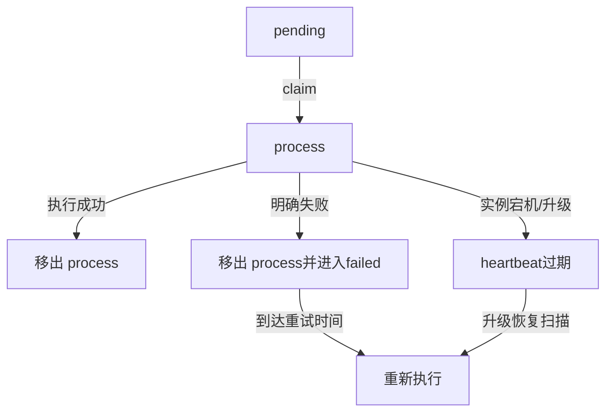

## 2. Failed Queue 重试

### 2.1 进入条件

`processShard` 返回非 nil 时，Execute 把 ShardExecuteUnit 放入 failedUnits。执行 goroutine仍会先：

- 减少 Shard Counter；
- 从 process queue 移除；
- 停止 heartbeat。

Ender 再把原始 queueValue 写入 `{model}_failed_queue`。

### 2.2 重试间隔

Failed Scheduler 按 `failed_scheduler_interval` 运行。取出元素后计算：

```text
elapsed = now - joinTimestamp
```

- `elapsed < failed_task_retry_interval`：放回 failed queue；
- 达到间隔：本轮执行；
- `elapsed > failed_max_retry_interval`：丢弃，不再重试。

代码快照示例配置：

```yaml
failed_scheduler_interval: 28800
failed_task_retry_interval: 25200
failed_max_retry_interval: 82800
```

分别约为 8 小时、7 小时、23 小时。实际线上值由 KConf/启动配置决定。

### 2.3 重试计数

队列元素没有显式 retryCount；重试边界完全按首次 joinTimestamp 的时间窗口控制。因此无法直接回答“这个 Shard 已重试几次”，只能结合日志/指标推断。

## 3. Upgrade Heartbeat

claim Shard 时写：

```text
upgrade@{fullQueueValue} = 1
TTL = 360 seconds
```

执行期间后台 goroutine按 `mark_update_minutes` 续期，把 TTL 设置为 `mark_live_minutes`。

正常结束后停止续期，但当前删除 heartbeat 的调用被注释；Key 依靠 TTL 自动过期。

## 4. 孤儿 Shard 扫描

开启 `open_silky_upgrade` 后，全局周期任务扫描每模型 process queue：

```text
for shard in LRANGE process_queue 0 -1:
    if runningShard >= modelShardLimit:
        skip
    if selected >= maxExecuteShardNum:
        break
    if upgrade@shard exists:
        skip
    if now - joinTimestamp < 300s:
        skip
    select shard for recovery execution
```

扫描由 Redis 全局 Timer 锁控制，避免多个实例同时恢复同一批孤儿 Shard。

## 5. 为什么需要 300 秒保护期

新领取 Shard 的 heartbeat 创建、执行 goroutine启动和续期存在时间窗口。立即把“暂时看不到 heartbeat”认定为孤儿会导致重复执行。300 秒用于给正常实例足够时间建立守护状态。

该值是代码常量，和 heartbeat TTL、更新周期必须协调：

```text
保护期 < 首次 heartbeat TTL
更新周期 < live TTL
```

否则可能误恢复或恢复过慢。

## 6. 恢复语义

升级恢复不会把 process 元素重新搬队列，而是直接构造 ShardExecuteUnit 执行。执行结束仍会 LREM 原 process 元素。

它无法知道前一个实例在退出前已经完成到哪一步，所以可能重复：

- 模型 Gateway 请求；
- Shard 结果写入；
- Kafka Message 结果投递；
- OSS Metadata 更新。

因此它提供的是可用性优先的 at-least-once 恢复。

## 7. Task/Request 层保护

重复执行的缓解机制：

- 每条 BatchRequest 有稳定平台 ID；
- Redis 实时进度用 requestID Set 去重；
- Task running notice 和 SCHEDULE 使用 Redis ExecuteOnce；
- Shard 输出使用确定性 OSS Key，重复写覆盖同名对象；
- Task 状态更新带旧状态条件；
- 终态关闭实时进度。

不足：

- Gateway 调用本身可能重复产生推理与计费；
- Kafka 逐条结果没有这里可见的消费端幂等保障；
- OSS Shard 元数据没有 ETag CAS；
- 最终 merge 仅进程内锁。

## 8. 最大窗口后的处理

超过 failed_max_retry_interval 后：

- 记录 `time_out_shard_in_fail_queue` 指标；
- 不再把队列元素放回；
- 没有独立 DLQ；
- Shard Metadata 应保留 failed 状态，任务汇总后可进入 failed。

如果 Metadata 或进度未正确更新，可能留下 running/pending Task，需要 Reconciler 扫描兜底；当前 TaskReconciler 尚未实现。

## 9. 改进方向

### 9.1 Redis Streams/MQ

使用具备 consumer group、pending entries、claim 和 delivery count 的队列，减少自建 ACK/heartbeat 复杂度。

### 9.2 显式 Attempt

队列载荷增加：

```text
attempt
lastError
lastAttemptAt
nextRetryAt
```

支持指数退避、最大次数和人工诊断。

### 9.3 Task Reconciler

周期扫描：

- 长时间 init；
- DB running 但没有 pending/process/failed Shard；
- process heartbeat 过期；
- 所有 Shard 已完成但 Task 未终态；
- OSS 已有最终结果但 DB 未 completed。

## 10. 面试表达

> 明确的 Shard 失败进入 failed queue，按首次入队时间控制延迟和最大重试窗口；实例宕机则依赖 process queue 中的在途记录和 Redis heartbeat。heartbeat 过期后，全局单实例扫描器会重新执行孤儿 Shard。该机制保障可恢复性，但语义是 at-least-once，因此还需要 requestID 去重、确定性 OSS Key 和状态条件更新配合。

## 11. 源码定位

- `scheduler/executor/ender.go`
- `scheduler/executor/starter.go: FindLostShardInUpgrade`
- `scheduler/executor/starter.go: FindIdleShardTask`
- `scheduler/executor/upgrade/handler.go`
- `scheduler/queue/queue_controller.go`
- `internal/config/config.go` retry/upgrade 配置

---

来源：`04-execution/01-shard-execution-flow.md`

## Shard 执行主流程

## 1. 执行单元

Scheduler 从 Redis 队列领取元素后，`StarterExec` 将其还原为 `ShardExecuteUnit`。一个执行单元至少包含：

- 模型服务名；
- Redis 队列原始值与 queue key；
- Shard 输入、输出和元数据的 OSS Key；
- 入队时间等恢复信息。

Executor 以 Shard 为调度边界，以 JSONL 中的一行为模型请求边界。

## 2. Execute 外层流程

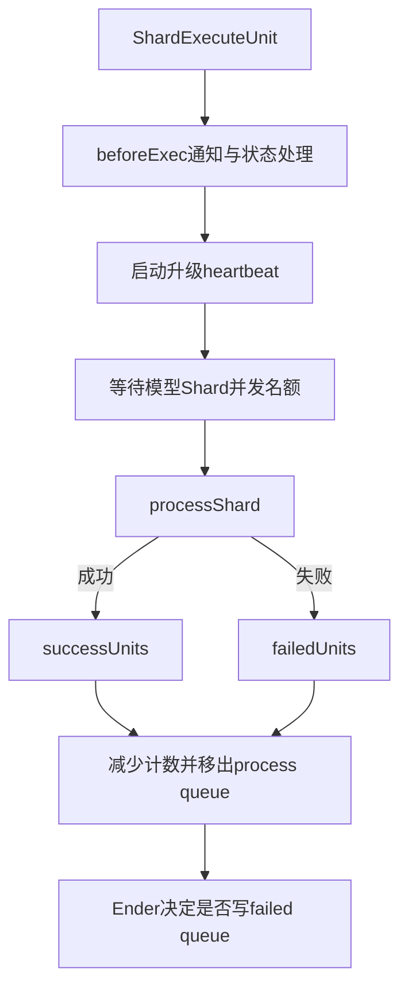

每个 Shard 使用一个 goroutine 执行。开始前不断尝试增加该模型的 Shard 计数，直到不超过 `max_execute_shard`；执行结束后严格按顺序：

1. 减少运行中 Shard 计数；
2. 若来自 process queue，则从队列移除；
3. 停止升级 heartbeat；
4. 由 Ender 处理失败重入队。

这里的 Shard Counter 是进程内计数，而 Redis claim 解决的是多实例不重复领取。

## 3. processShard 业务流程

```text
读取 Shard Metadata
  → 提交前检查账号冻结
  → Metadata.status = processing
  → Task pending → running（ExecuteOnce）
  → 下载和解析 Shard JSONL
  → 等待模型存在 Ready KSN
  → 将每条请求提交到模型 WorkPool
  → 等待全部请求结束
  → 更新 Shard Metadata
  → 投递消息结果、保存 Shard 结果和失败请求
  → 汇总整个 Task 进度
```

### 3.1 Task 只调度一次

第一个开始执行的 Shard 通过 `EventSchedule` 把 Task 从 pending 推到 running，并写 `running_at`。外层使用以 Task ID 为键的 Redis `ExecuteOnceWithRetry`，减少多个 Shard/实例重复更新和重复通知。

### 3.2 Shard 成功与失败

请求处理没有返回 Shard 级错误时：

- 统计成功/失败请求数；
- 更新 Shard Metadata 为 completed；
- 异步发送逐请求消息结果；
- 把分片结果上传到确定性 OSS Key；
- 异步保存失败请求文件。

出现下载、模型解析、Ready 检查或账号冻结等 Shard 级错误时：

- Metadata 标为 failed；
- 账号冻结会写固定错误原因；
- 最后仍调用 Task 汇总逻辑。

`Risk`：代码先将 Metadata 标为 completed，再上传分片结果。若结果上传最终失败，会尝试把 Metadata 改回 failed，但两次 OSS 写之间不是事务。

## 4. Shard 数据如何加载

`processShardData` 从 OSS 流式下载 Shard，用 `bufio.Scanner` 逐行解析，Scanner 单行上限为 10MB。随后构造：

```go
requests []indexedRequest
results  []BatchResponse // 长度与 requests 相同
failedReqs []BatchRequest
```

请求执行完后，`saveResults` 又把所有 Response 序列化到一个 `strings.Builder` 再上传。

因此执行阶段的空间复杂度近似为：

```text
O(单个Shard全部请求体 + 全部响应体 + 序列化结果)
```

不是 O(整个 20GB 文件)，但也不是严格 O(1)。分片大小同时决定内存、失败重做范围和调度开销。

## 5. 请求顺序

请求在 WorkPool 中并发完成，但 `results[index]` 按原始行号写入，保存 Shard 结果时顺序遍历该数组。因此：

- 单个 Shard 内结果保持输入行顺序；
- 最终合并再按 ShardIndex 顺序读取；
- 文件结果整体保持原始 JSONL 顺序。

逐请求 Kafka 消息按完成时间异步发送，不承诺与输入相同的到达顺序，消费端应以 request ID/custom ID 关联。

## 6. 内存与吞吐的约束关系

设：

- `L`：单 Shard 行数；
- `Breq`、`Bresp`：平均请求、响应大小；
- `Cs`：单进程同时执行的 Shard 数；
- `Cr`：模型请求 WorkPool 容量。

执行侧内存可粗略估计为：

```text
Memory ≈ Cs × L × (Breq + Bresp + object overhead)
```

`Cr` 主要影响吞吐和 Gateway 压力，`Cs` 同时影响并行 Shard 常驻内存。两者必须联合配置，不能只调大请求并发。

## 7. 可观测性

主要指标覆盖：

- 开始/结束 Shard 数；
- Shard 执行失败原因；
- 每请求最终成功/失败；
- 单次模型请求耗时；
- 含重试的总请求耗时；
- OSS 上传失败；
- 每任务完成请求数。

日志关键字段应至少保留 `taskID`、`shardQueueKey`、模型名、request ID 和 attempt。

## 8. 面试表达

> Scheduler 领取的是 Shard，Executor 内部再按模型维度的 WorkPool 并发执行每行请求。结果数组按输入索引回填，所以即使请求乱序完成，文件输出仍保持原顺序。大文件不会整体加载进内存，但执行阶段仍以单 Shard 为内存边界，所以动态分片和 Shard/Request 两级并发要一起设计。

## 9. 源码定位

- `scheduler/executor/executor.go: Execute`
- `scheduler/executor/executor.go: processShard`
- `scheduler/executor/executor.go: processShardData`
- `scheduler/executor/starter.go`
- `scheduler/executor/ender.go`
- `scheduler/executor/concurrency_controler.go`


---

来源：`04-execution/02-request-execution-and-gateway.md`

## 请求执行与模型 Gateway

## 1. 单行 JSONL 的含义

每行被解析为 `BatchRequest`，核心字段包括：

```json
{
  "id": "平台请求ID",
  "custom_id": "业务关联ID",
  "method": "POST",
  "url": "/v1/chat/completions",
  "body": {
    "model": "提交时模型名",
    "messages": [],
    "stream": false
  }
}
```

当前执行实现最终走 OpenAI-compatible Chat Completions。`method`、`url` 是批任务协议的一部分，但实际调用路径在 `handleRequest` 中固定为 Chat Completions，不是任意 HTTP 代理。

## 2. 模型信息解析

Task Metadata 同时保留用户模型 ID、模型名、scope、project ID 和提交时服务名。执行前调用：

```text
GetModelInfoByScope(modelID, modelScope, modelProjectID)
```

模型缓存约 5 分钟，并区分 public/private 查询路径。拿到最新 `ModelServiceName` 后，会覆盖请求体中的 `model` 字段。

这解决了任务排队期间模型实例名发生变化的问题，但也意味着：同一任务跨越模型变更窗口时，不同请求理论上可能落到不同运行版本。若业务需要严格版本一致，应在 Task Metadata 固化 deployment revision。

## 3. Ready KSN 门禁

提交 Shard 前以及每次请求 attempt 前都会检查模型服务是否有 Ready 副本：

- 通过模型 KSN 配置和 ISVC Runtime 查询副本状态；
- public 模型只接受离线资源池；
- private 模型允许非离线资源池；
- 本地结果缓存 1 秒，并用 singleflight 合并并发探测；
- 无 Ready 或探测失败时按 5、10、20、40、60 秒等待，之后保持 60 秒上限。

若模型无法检查或已有 Ready 副本则继续执行。

`Risk`：Shard 级首次检查传入 `context.Background()`，没有独立最大等待截止时间；模型长期无 Ready 副本时可能一直等待。请求 attempt 级检查使用 Shard context，可在账号冻结时被取消，但任务取消并不会主动取消这个 context。

## 4. WorkPool 提交

所有请求提交到以 `shardMetaData.ModelServiceName` 为 key 的模型级 WorkPool：

```text
model A → pool(cap=N_A)
model B → pool(cap=N_B)
```

动态 KConf 更新会修改 pool cap；并发自动探测调整的正是这里的请求并发上限。若模型不存在配置，运行时回退为默认 10。

## 5. Gateway Client

每次请求构建 OpenAI Client，BaseURL 指向模型 Gateway，整请求超时由 `http_req_timeout_minutes` 控制。网络参数包括：

- TCP connect timeout：5 秒；
- TLS handshake timeout：15 秒；
- Expect-Continue timeout：1 秒；
- KeepAlive：30 秒；
- 总请求超时：配置分钟数。

调用携带的路由/归因信息包括项目、API Key ID、provider、scene、traffic platform/source、Task ID/名称、模型 ID/名称、request ID 和用户 ID。

此外固定携带：

```text
X-Ks-Wq-Request-Schedule-Priority: Sheddable
```

这表明批量流量属于可降级/可让渡优先级，便于在线高优流量和离线吞吐共用 Gateway 时做隔离。

## 6. 非流式请求

```text
Chat.Completions.New(ctx, params)
  → 成功：写入 results[index].Response.Body
  → 失败：识别错误是否可重试
```

输出封装为 BatchResponse，保留平台请求 ID 和 custom ID。

## 7. 流式请求

当 `body.stream=true`：

1. 建立 streaming Chat Completion；
2. 顺序消费所有 chunk；
3. 通过 `ChatCompletionAccumulator` 聚合；
4. 流结束后写成一个完整 ChatCompletion 结果。

这里“支持输入请求指定 stream”不等于“向批任务用户实时返回 token”。批任务仍要等请求完成后保存聚合结果。

## 8. 扩展字段解析

执行使用 `UnmarshalWithValidation` 把 JSON body 转成 SDK 参数，同时兼容扩展字段。最终仍会将模型服务名覆盖为运行时解析值，防止用户 body 绕过任务绑定的模型路由。

## 9. 请求结果语义

单条模型失败通常不会让整个 Shard 的 `processShardData` 返回错误，而是：

- 在对应 `results[index]` 写 Error；
- 记录到 failedReqs；
- 实时进度计入失败；
- Shard 本身在执行流程正常结束后可标 completed；
- Task 最终可能 completed，但带 `failed_count > 0`。

Shard failed 表示基础设施/执行流程无法完成该分片；Request failed 表示分片执行完成但某些业务请求失败，二者必须区分。

## 10. 风险与改进

- 每 attempt 重建 Client/Transport，连接池复用范围有限；可以按路由维度复用 Client。
- 模型缓存会带来短暂旧路由，应结合部署 revision 或强一致查询策略。
- Ready 等待需要 Task deadline/cancel context。
- 当前执行协议实际集中于 Chat Completions；若接口宣称通用 Batch endpoint，需要按 URL 分发不同 handler。
- 固定 Sheddable 优先级合理，但应让自动调谐指标只统计同一流量类别，避免在线流量污染信号。

## 11. 源码定位

- `scheduler/executor/executor.go: funcCall`
- `scheduler/executor/executor.go: handleRequest`
- `scheduler/executor/executor.go: waitForReadyKSNReplicasWithLog`
- `services/llm/openai.go`
- `internal/service/modelcache/modelcache.go`
- `internal/isvc/`


---

来源：`04-execution/03-retry-backoff-and-error-handling.md`

## 请求重试、退避与错误分层

## 1. 三层失败

| 层级 | 例子 | 处理方式 |
| --- | --- | --- |
| Task | 输入非法、账号冻结、最终合并失败 | Task 进入 failed/expired/stopped |
| Shard | OSS 下载失败、模型解析失败、Ready 探测异常 | Metadata failed，进入 Shard 恢复链路 |
| Request | 单次 Gateway 4xx/5xx、流中断 | 请求级重试或记录错误，其他请求继续 |

不要把“Request 有失败”直接等价为“Task failed”。Task 可以 completed，同时 success_count 与 failed_count 都大于 0。

## 2. 可重试状态码

Gateway 返回以下状态码时允许请求级重试：

```text
429 Too Many Requests
529 自定义过载/Watchdog超时
500、501、502、503、504、505
```

OpenAI SDK 错误能解析出 HTTP 状态且不在列表中时，不重试。其他无法识别为 `openai.Error` 的网络/流错误当前默认可重试。

这体现了错误分类原则：

- 容量不足和瞬时服务端故障可能恢复；
- 参数错误、鉴权错误等确定性 4xx 立即失败；
- 未知传输错误按瞬时故障处理。

## 3. 重试次数语义

主循环是：

```go
for attempt := 0; attempt < maxRetries; attempt++
```

因此配置字段 `MaxRetry` 在代码里实际表示“最多 attempt 总数”，而不是“首次请求之外再重试 N 次”。例如值为 3，最多调用 Gateway 3 次。

最终错误文本中的 `Failed after %d attempts` 使用零基 attempt，可能比人的自然语言次数少 1，是可改进的可观测性细节。

## 4. 指数退避

第 `attempt` 次失败后：

```text
backoff = min(baseDelay × 2^attempt, maxRetryDelay)
```

随后 `time.Sleep(backoff)` 再进入下一次 attempt。

优点是快速错误不会形成紧密重试风暴；上限避免等待无限增长。

`Risk`：退避没有 jitter，大量请求同时遇到 429/529 时可能同步醒来形成惊群；`time.Sleep` 也不响应 context 取消。建议使用 full jitter，并用 timer + select 监听 context。

## 5. 每次重试前重新确认什么

每个 attempt 开始前会依次：

1. 检查 Shard context 是否取消；
2. 检查账号是否冻结；
3. 重新获取模型信息；
4. 等待运行时模型服务存在 Ready KSN；
5. 调用 Gateway。

这种方式使长时间重试可以适应路由切换和副本恢复，但会增加模型元数据与 Ready 探测开销，本地缓存和 singleflight 用于抑制放大。

## 6. 错误如何落盘

请求最终失败时：

- `results[index]` 写入 ID、custom ID 和 Error；
- 原始 BatchRequest 加入 `failedReqs`；
- 结束时写 `{task}/{shard}/failed_requests.jsonl`；
- 结果 JSONL 本身也包含错误响应；
- Redis 实时进度失败数 +1；
- 打点 `request_final_counter{result=fail}`。

`failedReqs` 由多个 WorkPool goroutine 并发 append，使用进程级互斥锁保护。该锁是全局锁，不仅限于一个 Shard，吞吐极高时可以改成每 Shard 锁或 channel 汇聚。

## 7. 结果与状态失败的边界

| 情况 | Request 结果 | Shard 状态 | Task 可能结果 |
| --- | --- | --- | --- |
| 400 参数错误 | error | completed | completed + failed_count |
| 503 重试后成功 | success | completed | completed |
| 503 达最大 attempts | error | completed | completed + failed_count |
| OSS Shard 下载失败 | 无完整结果 | failed | failed |
| 账号冻结 | 当前/后续请求中止 | failed | failed |
| 最终 Merge 失败 | 分片结果已存在 | completed shards | Task failed |

## 8. Shard 重试与 Request 重试的关系

Request 重试发生在一次 Shard 执行内部；Shard failed queue/升级恢复会重新执行整个 Shard。因此一次请求的总 Gateway 调用次数理论上可能是：

```text
请求级 attempts × Shard 执行 attempts
```

当前没有端到端 exactly-once。调用 Gateway 前后如果实例崩溃，恢复实例无法判断推理是否已经成功，可能产生重复请求和重复计费。稳定 request ID 为下游幂等提供了条件，但是否真正去重要看 Gateway 契约。

## 9. 与并发自动调谐的联系

429、529、5xx 属于容量调谐重点关注的失败。单纯增加重试可能掩盖瞬时失败，却会：

- 增加总耗时；
- 放大 Gateway 压力；
- 降低任务窗口内完成率；
- 增加重复计费风险。

自动调谐通过降低并发从源头减少容量失败，重试则作为剩余瞬态故障的最后保护，两者职责不同。

## 10. 面试表达

> 我把错误分成 Request、Shard 和 Task 三层。429、529 以及 500到505 做请求级指数退避，确定性 4xx 直接失败；请求最终失败只记入 failed_count，不阻断同分片其他请求。基础设施错误才触发 Shard 恢复。由于 Shard 恢复可能重复调用 Gateway，当前语义是 at-least-once，稳定 request ID 和下游幂等是进一步保证 exactly-once effect 的关键。

## 11. 源码定位

- `scheduler/executor/executor.go: shouldRetryOpenAIStatusCode`
- `scheduler/executor/executor.go: funcCall`
- `scheduler/executor/executor.go: handleRequest`
- `scheduler/executor/executor.go: saveFailedReq`
- `internal/config/config.go: WorkerConfig`


---

来源：`04-execution/04-timeout-cancel-and-account-freeze.md`

## 超时、取消与账号冻结

## 1. 三种终止来源

| 来源 | 判断依据 | 目标状态 |
| --- | --- | --- |
| completion window 超时 | `created_at + completion_window < now` | expired |
| 用户取消 | Task 为 stopping/stopped | stopped |
| 欠费冻结 | Billing 资源状态被冻结 | failed |

三者都会阻止后续模型请求，但检测时机、状态更新与通知路径不同。

## 2. Task 状态缓存

Executor 创建容量 10000、TTL 60 秒的 LRU TaskStatusCache。每条请求开始时通过缓存判断：

- 是否过期；
- 是否正在取消。

这样避免每个请求都查询 MySQL，但意味着取消状态可能最多延迟一个缓存 TTL 被看到。部分超时确认路径会主动 invalidate，取消 API 与 Executor 之间当前没有统一的缓存失效广播。

## 3. 超时处理

`ShouldAbort` 先按缓存中的 Task 计算：

```text
expiredAt = createdAt + completionWindow
```

若看起来超时，Executor 不直接写 expired，而是调用 DB 条件更新 `ExpireBatchTaskIfTimedOut` 再确认，使用 singleflight 合并同 Task 的并发确认。

可能结果：

- 条件成立：Task 原子进入 expired，发送终态通知；
- DB 最新状态仍为 init/pending/running 但实际未超时：刷新缓存并继续；
- 已 stopping/stopped：取消优先，不改 expired；
- 已 expired：按终态停止；
- DB 操作失败：当前请求记录确认失败错误。

这一步用于避免 60 秒旧缓存把已经延期或状态变化的任务误判为超时。

## 4. 取消处理

请求看到 stopping/stopped 后：

- 当前结果写 `task is canceling`；
- 通过 Task 级 ExecuteOnce 把 Task 更新为 stopped 并写 `stopped_at`；
- 发送终态通知；
- 不再上报本请求实时进度。

`Risk`：当前取消 API 的实际实现可能直接把 Task 写为 stopped，而设计状态机是 running/pending → stopping → stopped。两条路径并存，语义需要统一。

`Risk`：`taskIsCancelled` 是按值传给每个 `funcCall` 的局部 bool，一个请求将其设为 true 不会广播给其他请求；真正的跨请求停止依赖 DB/缓存状态，而不是共享 context。

## 5. 账号冻结的三道门禁

### 5.1 Shard 提交前

读取 Metadata 后先查 Billing。若已冻结：

- Shard 直接 failed；
- 写固定失败原因；
- 发送冻结通知；
- 汇总 Task 状态；
- 不加载 Shard 数据、不调用模型。

### 5.2 每个请求 attempt 前

长任务可能在运行中欠费，因此每次 attempt 前再检查。发现冻结后：

- `accountFrozen` 原子标记为 true；
- 取消共享 Shard context；
- 当前请求失败并进入 failedReqs；
- 其他请求在下一次 context/attempt 检查时退出；
- 整个 `processShardData` 返回 `errAccountFrozen`，Shard failed。

### 5.3 周期扫描

服务还启动 AccountFreezeMonitor，在 Redis 全局锁保护下扫描 active Task（pending/running），按账号和计费模型查冻结状态，并用：

```sql
UPDATE batch_task
SET status='failed', ...
WHERE id=? AND status IN ('pending','running')
```

原子终止任务。扫描器避免只有“请求开始时检查”造成无请求/长期等待任务不能及时失败。

## 6. Billing 检查降载

Checker 对 `(customerID, billingModelID)` 做：

- 30 秒本地缓存；
- RWMutex 并发保护；
- singleflight 合并相同资源的并发查询。

若 Billing 调用失败，执行路径记录错误后按“未冻结”继续，是 fail-open 策略。它优先保证推理可用性，但可能在 Billing 故障窗口继续消耗资源；是否合适取决于财务风险等级。

## 7. 通知去重

冻结通知支持按客户/项目聚合，并借助 Redis：

- pending Task ID 集合；
- 延迟发送锁；
- 已发送去重 key。

Executor 与 Monitor 都可能发现同一冻结事件，通知层必须幂等，避免短信/KIM 风暴。

## 8. Context 传播现状

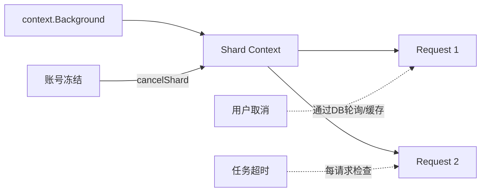

账号冻结有主动 context 广播；用户取消和 Task deadline 主要依赖请求边界检查。更完整的实现应为每 Task 建立 deadline/cancel context，并让 Ready 等待、重试退避、Gateway、OSS 都沿链路传播。

## 9. 竞态与优先级

终态可能并发竞争，例如超时与用户取消同时发生。理想规则是所有更新带旧状态条件并明确优先级：

```text
用户主动取消 vs 超时 vs 账号冻结
```

当前代码部分路径使用状态事件，部分直接 Updates；应统一通过状态机/CAS，并检查 RowsAffected，才能确定最终由哪个事件获胜。

## 10. 面试表达

> 高频请求不能每条都查 MySQL 和 Billing，所以 Task 状态用 60 秒 LRU，账号冻结用 30 秒缓存加 singleflight；超时因为不能容忍旧缓存误判，会再走一次 DB 条件确认。账号冻结还设计了提交前、每 attempt 前和周期扫描三道门禁。当前可以进一步改进的是统一 Task context，让取消和 deadline 能主动打断 Ready 等待与退避，而不只在请求边界被动发现。

## 11. 源码定位

- `scheduler/executor/status_helper.go`
- `pkg/cache/task_status_cache.go`
- `scheduler/executor/executor.go: funcCall`
- `internal/service/accountfreeze/checker.go`
- `internal/service/account_freeze_monitor.go`
- `internal/service/accountfreezenotify/notifier.go`
- `internal/client/store/` 超时条件更新

---

来源：`05-progress-and-results/01-realtime-progress.md`

## Redis 实时请求进度

## 1. 为什么需要第二套进度

MySQL 中的 success_count/failed_count 主要在 Shard 汇总时更新。一个大 Shard 可能运行很久，如果只看 MySQL，用户会长时间看到计数不变。

因此系统增加 Redis 请求级实时进度：每条请求完成即记录，查询 API 对非终态 Task 用 Redis snapshot 覆盖 MySQL 的 RequestCounts。

```text
执行请求 → Redis实时计数 → 查询API展示
Shard完成 → OSS元数据汇总 → MySQL持久计数
Task终态 → 删除实时结构 → 查询API只用MySQL
```

Redis 是实时视图，不是最终事实源；终态计数仍由 OSS Shard Metadata 汇总后写 MySQL。

## 2. Redis Key

每个 Task 使用四类 key：

```text
batch_progress:{taskID}:done      Set：已经结束的 requestID
batch_progress:{taskID}:failed    Set：最终失败的 requestID
batch_progress:{taskID}:snapshot  Hash：completed/failed/updated_at
batch_progress:{taskID}:closed    String：终态关闭标记
```

TTL 都是 7 天，单次 Redis 操作超时 500ms。

## 3. 原子更新算法

请求结束时执行 Lua：

```text
if closed exists:
    ignore late report

SADD done requestID
if failed:
    SADD failed requestID
else:
    SREM failed requestID

doneCount = SCARD(done)
failedCount = SCARD(failed)
completed = doneCount - failedCount
HSET snapshot completed failed updated_at
刷新TTL
```

Lua 保证去重、失败集合修正和 snapshot 更新原子完成。

## 4. 为什么用 Set 而不是 INCR

系统有 Shard 重试和升级孤儿恢复，语义是 at-least-once。同一请求可能多次完成。如果直接 INCR，会重复计数；用稳定 requestID 做 SADD，重复上报不会增加基数。

当同一 ID 先失败后重试成功时，`SREM failed` 可以把它修正为 completed。这要求 requestID 在所有 attempt 和 Shard 恢复中稳定。

请求响应没有 ID 时回退为：

```text
shard:{shardIndex}:line:{lineIndex}
```

该值也是确定性的，可覆盖重执行场景。

## 5. 上报时机

`funcCall` 使用 defer 上报最终 BatchResponse。以下情况有特殊处理：

- Response 为空：不上报；
- 真正确认 Task expired：关闭本次 report；
- 取消并成功转 stopped：关闭本次 report；
- 普通请求成功或失败：正常上报；
- Redis 超时/错误：只记录 warning，不让推理请求失败。

这是可观测性 fail-open：进度偶尔落后不应反过来破坏任务执行。

## 6. 查询路径

### 6.1 单 Task

查询 MySQL Task 后，若不是 completed/failed/stopped/expired/deleted，再读 Redis snapshot 覆盖：

```text
RequestCounts.Completed
RequestCounts.Failed
```

### 6.2 多 Task

批量查询最多 20 个 Task，并用 Redis Pipeline 一次读取多个 Hash，避免 N 次网络往返。

Redis 查询失败时保留 MySQL 值并记录 warning，不导致 API 失败。

## 7. 终态关闭协议

Task 进入终态后，Store 异步执行 Lua：

1. 写 `closed=1`，TTL 7 天；
2. 删除 done、failed、snapshot。

顺序非常重要：closed 阻止仍在飞行中的请求重新创建已删除的进度结构。终态查询不再应用 Redis snapshot，展示 MySQL 最终计数。

## 8. 一致性边界

- Redis 记录成功、进程随后崩溃、Shard Metadata 未完成：实时数可能短暂领先。
- Redis 上报失败：实时数可能落后，Shard 完成后 MySQL会纠正。
- 终态清理是异步的，但 API 已按状态忽略 Redis。
- 7 天内 closed 防晚到写；更晚的极端迟到写理论上可重建 key，但正常请求生命周期不应超过该窗口。

## 9. 空间复杂度

两个 Set 需要保存 requestID，空间复杂度为 O(任务请求数)。大任务百万级请求时要评估：

```text
内存 ≈ request count × (ID长度 + Redis Set对象开销)
```

若内存成为瓶颈，可以考虑位图/分片计数，但必须继续解决 at-least-once 去重和失败转成功的问题。

## 10. 面试表达

> MySQL 的进度按 Shard 落库，粒度太粗，所以我会把 Redis 定位成非终态的实时物化视图。每个完成请求用稳定 ID 写 Set，Lua 原子计算 snapshot，天然抵抗 Shard 重执行；Task 终态先写 closed 再删除集合，阻止晚到请求把进度重新建出来。查询失败时回退 MySQL，不影响主链路。

## 11. 源码定位

- `services/redis/batch_progress.go`
- `scheduler/executor/executor.go: reportBatchProgress`
- `internal/service/apiserver/api_batch/api_batch.go: applyRealtimeRequestCounts`
- `internal/client/store/msql/store_batch_task.go: clearTerminalBatchProgressCache`


---

来源：`05-progress-and-results/02-shard-summary-and-task-completion.md`

## Shard 汇总与 Task 完成判定

## 1. Shard Metadata 是汇总依据

请求全部结束后，Executor 遍历 `results` 得到：

```text
success_count = response.Error为空的数量
failed_count  = response.Error非空的数量
status        = completed
completed_at  = now
```

这些字段覆盖写回对应 Shard Metadata。单条请求失败仍可使 Shard completed。

Shard 基础设施失败则写 status=failed；账号冻结还会写 error_message 和 completed_at。

## 2. 每个 Shard 结束后的 Task 汇总

`updateTaskProgress(taskID)` 每次都：

1. 下载 Task Metadata；
2. 根据其中的 Shard 列表逐个下载全部 Shard Metadata；
3. 累加 success_count、failed_count；
4. 统计 completed Shard 的 total_lines；
5. 判定 Task 是否成功、失败或继续运行。

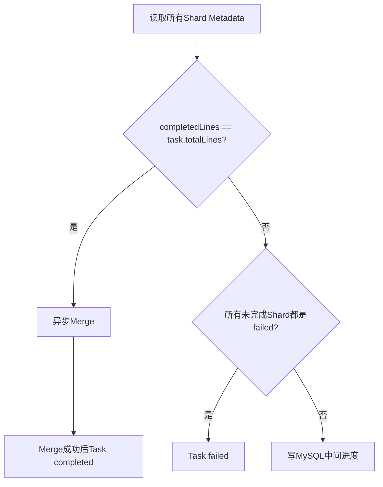

## 3. 三种判定

### 3.1 成功候选

所有 completed Shard 的 `TotalLines` 之和等于 Task `TotalLines`，开始异步输出最终结果文件。

注意此时 Task 尚未 completed；只有 Merge 成功并写入 output_file、计数和 completed_at 后，才触发 `RUN_COMPLETE`。

### 3.2 失败

如果没有 processing/pending Shard，且至少存在 failed Shard，触发 `FAIL`，Task 进入 failed并发送终态通知。

### 3.3 仍在执行

其他情况通过 `PROGRESS` 更新 MySQL success_count/failed_count，状态保持 running。

## 4. 复杂度问题

假设 Task 有 `S` 个 Shard，每完成一个 Shard 都读取 `S` 份 Metadata，则全任务约有：

```text
S × S = O(S²)
```

次 OSS Metadata 读取；并发结束的多个 Shard 还会重复扫描。

当大文件被切成很多小 Shard 时，这会成为控制面放大。更优方案：

- MySQL/Redis 原子累计 completed_shards、counts；
- 或由 Metadata 事件进入单消费者 reducer；
- 最终完成前再全量校验一次 OSS，兼顾效率与正确性。

## 5. 并发完成竞态

多个最后完成的 Shard 可能同时看到“全部 completed”，各自启动 Merge goroutine。

当前 `outputLock` 只是一把进程内全局 mutex：

- 同一进程内串行；
- 不同 Task 也被无谓串行；
- 不同服务副本之间完全不互斥。

确定性 output key 让重复 Merge 最终覆盖同一对象，但仍浪费 IO，而且 Task 状态更新可能竞争。应改成 `merge:{taskID}` Redis 分布式锁或 DB `running → merging` CAS。

## 6. 顺序与通知边界

成功候选路径先发送 Task Finish Notice，再异步 Merge；真正终态 KIM 通知在 `RUN_COMPLETE` 成功后发送。

因此不同通知通道对“Finish”的语义可能不一致：一个表示所有请求结束，一个表示结果文件已经可用。对外协议应区分：

```text
COMPUTE_FINISHED
RESULT_READY
```

或者只在 output object 与 DB completed 都成功后发唯一完成事件。

## 7. Merge 失败现状

`outputTaskResultFileAndUpdateStatus` 在 Merge 失败时只：

- 记录错误日志；
- 上报 `batch_task_merge_failed` 指标；
- return。

没有将 Task 置 failed，也没有自动重试/独立恢复队列。此时所有 Shard 都 completed，但 Task 可能长期停在 running。

这是优先级很高的 Reconciler 场景：检测“全部 Shard completed + Task 非终态”，重试 Merge；若超过上限再转 failed。

## 8. Metadata 写入一致性

Shard Metadata 是对象整体覆盖，没有 version/ETag CAS。升级恢复或重复执行时，较晚的旧执行可能覆盖较新的状态。可改进为：

- 数据库 Shard 表 + version；
- S3 `If-Match` 条件写；
- 只允许单调状态转换；
- Metadata 中增加 attempt/revision，Reducer 只接收最新 attempt。

## 9. 面试表达

> Task 完成不是看 Redis 队列空，而是以 Task Metadata 中的 Shard 清单为基准，全量读取 Shard Metadata 汇总。这样数据结果和状态来源一致，但每个 Shard 都全扫一次会形成 O(S²) OSS 请求，而且最后多个 Shard可能并发触发 Merge。当前可用确定性 Key 缓解结果冲突，演进上应增加 per-task 分布式 Merge 锁和增量 Reducer/Reconciler。

## 10. 源码定位

- `scheduler/executor/executor.go: completeShardWithOutput`
- `scheduler/executor/executor.go: setShardStatus`
- `scheduler/executor/executor.go: updateTaskProgress`
- `scheduler/executor/executor.go: outputTaskResultFileAndUpdateStatus`
- `internal/models/s3_metadata.go`

---

来源：`05-progress-and-results/03-file-and-message-delivery.md`

## 文件与消息两种结果交付

## 1. 文件模式

普通 JSONL Task 的结果路径为：

```text
tasks/{taskID}/output/shards/shard_0000_data.jsonl
tasks/{taskID}/output/shards/shard_0001_data.jsonl
...
tasks/{taskID}/output/failed/shard_0000_failed_reqs.jsonl
tasks/{taskID}/output/results.jsonl
```

每个 Shard 的响应先保存为 JSONL，全部 Shard 完成后按索引流式合并到 `results.jsonl`。Merge 成功后 MySQL `output_file` 写：

```json
{
  "type": "s3",
  "info": {
    "bucket": "运行环境bucket",
    "key": "tasks/{taskID}/output/results.jsonl"
  }
}
```

用户通过查询 Batch 获取结果位置，再通过平台约定下载。

## 2. 结果 JSONL 结构

每一行是 BatchResponse：

```json
{
  "id": "request-id",
  "custom_id": "business-id",
  "response": {
    "id": "business-id",
    "body": {}
  },
  "error": ""
}
```

失败请求同样占一行，但 `error` 非空。单独的 failed request 文件保存原始 BatchRequest，便于修正后重新提交。

## 3. 消息模式的注册

创建任务时若提供 `result_topic`/`tag`，TaskCreator 把路由写 Redis：

```text
provide_topic:{taskID} → encode(resultTopic, tag)
TTL = 168 hours
```

Executor 通过 Task ID 查询这份路由来判断消息模式。读取最多重试 5 次、间隔 1 秒；Redis 无 Key 则按文件模式处理。

这份临时路由没有落在 MySQL Task 主记录中，是消息交付的重要控制状态。

## 4. 两段式 Kafka 路由

Executor 并不直接向用户指定 topic 发送，而是把每条 TaskReqResult 发到平台统一 `task_req_result_topic`：

```json
{
  "task_id": "...",
  "time": 0,
  "model_service_name": "...",
  "tag": "user-tag",
  "result_topic": "user-topic",
  "batch_response": {}
}
```

下游 Result Dispatcher 再根据 `result_topic/tag` 投递。这种设计把业务 topic 权限、路由、重试和生产者连接从 Executor 解耦。

## 5. 投递时机和语义

Shard 请求处理结束后，`SendResultMessage` 以 goroutine 异步执行：

- 每个 Response 生成一条 Kafka message；
- 每条最多尝试发送 5 次；
- 某条失败不阻断其余消息；
- 批量结束后若存在失败，记录日志和指标；
- 不会把 Shard 或 Task 改为 failed。

因此消息交付是 best-effort + producer retry，不是事务性 outbox。Executor 崩溃或 Shard 恢复可能导致消息丢失或重复，消费端需要按 `(taskID, requestID)` 幂等。

## 6. 消息模式仍有文件兜底

代码仍保存 Shard OSS 结果。最终 Merge 在 `isMessageType=true` 时只处理第一个 Shard，注释也说明“暂时只合并一个文件”。这更像兼容性占位，而不是完整消息任务归档。

`Risk`：如果消息 Task 实际包含多个 Shard，MySQL output_file 指向的 `results.jsonl` 不是全量结果。需要明确产品契约：

- 消息模式不承诺文件结果；或
- 无论模式都合并全量文件；或
- 独立写 manifest，列出所有 Shard 文件。

## 7. Task 状态通知与结果消息

至少存在两类 Kafka 语义：

- Task Notice：Running/Finish/Failed/Expired 等生命周期事件；
- TaskReqResult：每条模型请求的业务结果。

Running Notice 用 Task 级 ExecuteOnce 去重；结果消息没有同等发送端去重。两者不能用同一消费语义处理。

## 8. 更可靠的消息交付方案

建议采用 Outbox：

```text
Shard结果持久化
  → 原子登记待投递记录/manifest
  → 独立Dispatcher发送Kafka
  → 记录delivery状态与attempt
  → 对账器补发
```

若 MySQL 不适合保存百万条结果，可把 OSS Shard Result 作为事实源，Outbox 只保存 Shard manifest 和发送游标。

## 9. 面试表达

> 平台同时支持文件和消息交付。文件模式先落确定性的 Shard JSONL，再按 ShardIndex 合并，结果顺序稳定；消息模式把用户 topic/tag 注册在 Redis，Executor 把统一格式发到平台中转 topic，由下游路由。当前消息是 at-least/best-effort 边界，消费端要按 taskID+requestID 幂等，进一步可以用基于 OSS manifest 的 Outbox 做补发和对账。

## 10. 源码定位

- `scheduler/executor/executor.go: SendResultMessage`
- `scheduler/executor/executor.go: GetMessageTopic`
- `services/mq/producer.go`
- `internal/models/task_req_result.go`
- `manager/task_creator.go` 消息路由注册
- `pkg/utils/provide_type.go`
- `pkg/utils/oss_file_utils.go`


---

来源：`05-progress-and-results/04-s3-multipart-streaming-merge.md`

## S3 Multipart 流式结果合并

## 1. 要解决的问题

旧式合并通常会把所有 Shard 结果下载到内存/本地文件，再一次上传。对于 20GB 输入对应的大体量输出，会带来：

- 内存峰值随总结果增长；
- 临时磁盘容量与 IO 压力；
- 单次上传失败后从头重传；
- Pod ephemeral storage 不稳定。

当前实现顺序下载 Shard 结果，将每行直接写入 64MiB Multipart buffer，满一个 Part 就上传。

## 2. 数据流

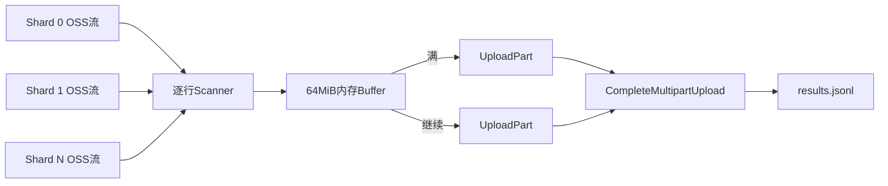

合并不需要把所有结果或一个完整 Shard 结果常驻内存。

## 3. 合并前校验

`loadCompletedShardMetadataForMerge` 按 Task Metadata 的 Shard 顺序读取 Metadata，只把 status=completed 的 Shard 加入列表，并累计：

```text
total_lines
success_count
failed_count
```

文件模式正常情况下只有全部 Shard completed 才会触发 Merge，因此顺序与输入分片顺序一致。

## 4. 逐行写入

每个 Shard Result 使用 Scanner 逐行读取：

- 单行最大 24MiB；
- 跳过空白行；
- 写出原行；
- 若没有换行则补 `\n`。

最终文件顺序为 `(ShardIndex, LineIndex)`，与动态分片前的原 JSONL 顺序一致。

## 5. Multipart Writer

关键参数：

```text
partSize = 64 MiB
maxParts = 10000
```

理论可覆盖约：

```text
64 MiB × 10000 ≈ 625 GiB
```

的合并对象，实际还受 S3 服务限制和单行上限约束。

内存复杂度近似：

```text
O(64MiB buffer + 当前JSONL行 + SDK/网络缓冲)
```

与最终结果总大小无关。

## 6. 小文件优化

Multipart Upload 只有在第一次 flush 时才初始化。如果全部结果小于 64MiB，`Close` 直接调用普通 `UploadWithSize`，避免小对象也创建 Multipart 会话。

如果已经初始化：

1. flush 最后一个不足 64MiB 的 Part；
2. 按 PartNumber/ETag 调用 Complete；
3. 成功后标记 completed。

## 7. 重试策略

| 操作 | 最大尝试 | 间隔 |
| --- | --- | --- |
| 普通小文件 Upload | 3 | 2 秒 |
| Initiate Multipart | 3 | 2 秒 |
| UploadPart | 3 | 2 秒 |
| Complete Multipart | 3 | 2 秒 |

任一步最终失败时调用 Abort；Abort 本身失败会记录日志，S3 生命周期规则还应清理遗留会话。

## 8. Complete 响应不确定性

分布式系统中可能出现：S3 已经完成对象，但 Complete 响应在网络上丢失。客户端重试后收到错误，如果直接 Abort/判失败，会把实际成功误判为失败。

初始化 Multipart 时给对象写元数据：

```text
task_id
total_lines
success_count
failed_count
merge_time
```

Complete 重试仍失败后，代码 HEAD/GetMetadata 最终对象；所有期望 metadata 都匹配，则判定已成功。

这是对“远端已提交、本地未知”的不确定结果做幂等确认，比盲目重试更稳健。

## 9. 为什么 64MiB

Part 太小：Part 数多、请求开销高、容易触及 10000 上限；Part 太大：内存峰值高、失败重传代价大。64MiB 是吞吐、内存和 Part 数之间的工程折中。

对于 20GB 结果，约为：

```text
20 GiB / 64 MiB = 320 Parts
```

数量在合理范围内。

## 10. 并发与幂等边界

- output key 是确定性的，重做会覆盖同一路径；
- `outputLock` 是进程级全局锁，不是 per-task、也不是分布式；
- metadata 的 `merge_time` 每次不同，两个并发 Merge 的 Complete 错误确认不会把另一次对象误认成自己的成功；
- 但跨副本并发仍会产生两套 Multipart 会话和重复 IO。

建议用 `merge:{taskID}` 分布式锁，并在 Task 增加 merging 状态/merge attempt。

## 11. 仍然存在的非流式环节

这项重构解决的是最终结果合并内存随总量增长的问题。完整链路仍有：

- 输入文件做校验计数和分片两遍下载；
- 分片创建时一个 Shard 在内存中缓冲；
- 执行时一个 Shard 的 requests/results 在内存；
- `saveResults` 用 strings.Builder 组装整个 Shard 输出。

因此准确表达是“实现输入流式读取与最终 Multipart 流式合并，把内存边界从整任务降到单 Shard/固定 Part”，不要说“整个链路 O(1) 内存”。

## 12. `Experience Result`：20GB 单文件

源码可以证明支持流式读取、动态分片、64MiB Multipart 和固定内存合并机制；“支持 20GB 单文件处理”来自项目压测/线上实践，应标为 `Experience Result`。

建议保留的证据口径：

- 输入/输出大小与请求行数；
- Shard 数、每 Shard 行数；
- Pod 内存峰值和临时磁盘；
- 总耗时与 OSS 吞吐；
- 网络中断、Part 失败和实例重启测试结果。

## 13. 面试表达

> 大任务稳定性的核心不是把 20GB 内容搬到本地再合并，而是让数据一路按边界流动：输入流式扫描后动态切 Shard，最终结果按 ShardIndex 顺序读取，只保留 64MiB Part buffer，满了就 UploadPart。Complete 响应丢失时再用对象 metadata 确认远端是否实际成功。这样最终合并内存与结果总量解耦，20GB 是我们压测和实际运行验证过的能力。

## 14. 源码定位

- `scheduler/executor/executor.go: multipartMergeWriter`
- `scheduler/executor/executor.go: MergeShardOutputs`
- `scheduler/executor/executor.go: loadCompletedShardMetadataForMerge`
- `scheduler/executor/executor.go: mergeShardToWriter`
- `services/oss/s3_multipart.go`
- `pkg/utils/oss_file_utils.go`

---

来源：`06-concurrency-autotuner/01-problem-and-control-loop.md`

## 并发自动探测：问题与控制闭环

## 1. 静态并发为什么不够

批量推理追求吞吐，但模型可承载并发随以下因素变化：

- Ready 副本数量伸缩；
- GPU 卡型和单卡能力；
- 模型结构、上下文长度与输出长度；
- KV Cache 占用和调度策略；
- 同资源池其他流量；
- Gateway/Engine 瞬时健康状态。

固定低并发会造成 GPU/KV Cache 利用不足，固定高并发会积压队列、触发 429/529/5xx 和任务超时。人工配置也跟不上副本与负载变化。

## 2. 系统控制目标

自动探测需要同时满足：

1. 安全：并发不超过 Ready 容量推导的上界；
2. 效率：健康且队列轻时持续提高并发；
3. 稳定：成功率下降或队列过载时快速回退；
4. 收敛：信号处于中间区间时减小步长或保持；
5. 多实例一致：同一周期只有一个 Batch 实例采样/写配置；
6. 可解释：每次变更能说明上界、信号、决策和前后值。

## 3. 两层控制

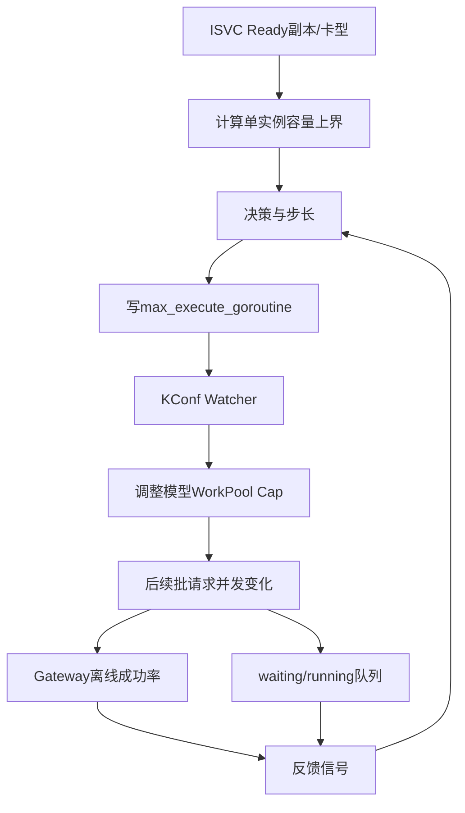

- 前馈容量层：Ready replicas × 单副本并发，给出硬上界；
- 反馈探测层：成功率和排队压力决定在上界以内如何移动。

只有容量层会随副本变化直接跳目标，容易在模型实际承载低于理论值时过载；只有反馈层又可能探索到明显超出资源能力。两者组合更稳健。

## 4. 三个时间尺度

默认配置：

| 维度 | 默认值 | 作用 |
| --- | --- | --- |
| 指标采样间隔 | 30 秒 | 跟踪负载变化 |
| 滑动窗口 | 600 秒 | 平滑短时抖动 |
| 调谐间隔 | 300 秒 | 给新并发足够观测时间 |

窗口内约有 20 个 Scaler 采样点。调谐间隔小于窗口，连续决策会共享一部分历史样本，变化更平滑，但也会带来反馈滞后。

## 5. 启用门槛

全局需要：

```text
model_concurrency_tuning.auto_tuner_enabled = true
```

单模型还需要：

```text
auto_reconcile_enabled = true
per_instance_concurrency != nil
```

反馈 AutoTuner 进一步要求该模型存在 pending/running Batch Task。没有活跃任务时保持当前并发，不制造空载探测。

若活跃任务 DB 查询失败，代码选择 fail-open：继续调谐，并记录 warning；这是可用性优先的策略。

## 6. public/private 模型差异

- public 模型：只把符合离线池条件的 Ready KSN 纳入容量与采样；
- private 模型：允许 online 等非离线池，但仍要求 Runtime KSN 有效且 Ready。

私有模型通过 `private_model_instances` 识别，public 模型通过 `model_instances` 映射；BatchTask 的 model 字段存模型实例 ID，需要先反查到 ModelServiceName 才能做活跃任务门禁。

## 7. 多实例协调

服务每个副本都会启动定时器，但使用 Redis 全局锁：

```text
采样锁: batch-inference:model-concurrency-metrics-sample
调谐锁: batch-inference:model-concurrency-reconcile
```

采样锁 TTL 为采样间隔的 80%，至少 1 秒；默认 30 秒间隔时 TTL 为 24 秒。调谐锁 TTL 默认等于 300 秒，所有实例每 30 秒尝试一次。

`Risk`：全局定时器只依赖锁 TTL，不做 owner token 和安全释放；任务运行超过 TTL 时可能有第二实例进入。当前 Reconcile 通常应远小于 5 分钟，但最好使用带 fencing token 的锁或把 KConf revision 作为 CAS。

## 8. 一轮 Reconcile

```text
拉取全部 ISVC Runtime
  → 读取当前模型 KConf
  → 过滤开启自动调谐的模型
  → 计算每个 KSN 单副本能力和 Ready Capacity
  → 计算 raw upper bound
  → 读取各 KSN 滑动窗口指标
  → 排除缺少必要指标的 KSN
  → 按有效 KSN Capacity 重算 upper bound
  → 聚合信号并计算 target
  → 批量写回 KConf
  → 保存本轮 last result
```

只有 KConf 写回成功后才保存 last result，避免控制器状态宣称已执行但实际配置未生效。

## 9. 手动控制与自动控制

手动 API 和 Reconciler 都走 `ApplyModelConfigUpdates`，共享：

- 参数校验；
- 配置克隆与批量更新；
- KConf 写回；
- 指标和审计日志。

这避免两套写配置代码产生不同校验规则。仍需定义人工覆盖策略，例如 emergency override 是否临时关闭 `auto_reconcile_enabled`，否则下一轮自动调谐可能覆盖人工值。

## 10. 面试表达

> 我把自动并发设计成前馈加反馈的闭环：先按 Ready 副本和卡型推导单实例硬上界，再在上界内用离线 Gateway 成功率与 waiting/running 队列比做快探、慢探、保持或回退。结果写 KConf，经 Watcher 热更新模型 WorkPool，新的运行数据再进入下一轮窗口。采样与调谐都有 Redis 全局锁，保证多副本只有一个控制器生效。

## 11. 源码定位

- `internal/service/modelconcurrency/model_concurrency_reconciler.go`
- `internal/service/modelconcurrency/model_concurrency_autotuner_metrics.go`
- `internal/service/modelconcurrency/model_concurrency_signal.go`
- `internal/service/service.go` 启动与定时器
- `scheduler/timer.go`


---

来源：`06-concurrency-autotuner/02-signal-collection-and-window.md`

## 成功率、队列负载与滑动窗口

## 1. 两类主要反馈信号

| 信号 | 含义 | 主要来源 |
| --- | --- | --- |
| request success rate | 当前并发是否产生容量相关失败 | Gateway perflog Kafka，Scaler 兜底 |
| queue load ratio | 排队压力相对执行中请求的大小 | Scaler `queue.waiting/queue.running` |

代码也能读取 load1，但 AutoTuner 明确不使用它做决策。GPU 模型服务中系统 load 不一定能直接代表 KV Cache 与请求队列饱和。

## 2. Gateway 成功率采集

独立 Kafka Consumer 消费 Gateway protobuf perflog，只保留：

```text
metric = wanqing.intelligent.router.request_cost
traffic = offline/Sheddable
model service name 可识别
HTTP status 可识别
```

Batch 请求固定携带 `X-Ks-Wq-Request-Schedule-Priority: Sheddable`，因此可以从混合 Gateway 日志中筛出离线流量，避免在线请求污染控制信号。

## 3. 成功和失败口径

```text
2xx       → success +1, total +1
429       → success +0, total +1
5xx       → success +0, total +1
其他状态  → 不进入这个成功率
```

因此它更准确地表示“容量/服务端健康成功率”，不是所有 API 请求的业务成功率。400/401 等客户端错误被排除，避免坏数据或鉴权问题触发错误降容。

529 属于 5xx，自动包含在失败口径中，和 Executor 的容量重试分类一致。

## 4. 时间桶

默认每 30 秒一个 Redis Hash：

```text
batch-inference:gateway-request-success:v3:{bucket}:{encodedModel}
  success = ...
  total   = ...
```

使用 `HINCRBY` 聚合 Kafka 样本，TTL 至少 30 分钟。查询 10 分钟窗口时只读取已经结束的桶，排除当前未完整桶，避免分母尚未到齐产生抖动。

默认最小样本数是 100。窗口总量不足时不使用 Gateway 成功率，回退到 Scaler 成功率。

## 5. Scaler 成功率选择

Scaler View 同时可能有：

```text
engine.http.success_rate
gateway.success_rate
```

采样时优先 engine，其次 gateway，并记录 source。到决策阶段，如果独立 Gateway Collector 在窗口内达到最小样本数，则覆盖 Scaler 成功率；否则保留 Scaler 值。

独立 Collector 的价值是能严格筛选 Batch/Sheddable 流量，并按控制窗口重新聚合，而不是混用模型全部流量。

## 6. 队列负载公式

```text
queue_load_ratio = queue.waiting / queue.running
```

特殊情况：

| waiting | running | ratio |
| ---: | ---: | --- |
| 0 | 0 | 0 |
| >0 | 0 | missing |
| 任意 | >0 | waiting/running |

空队列被视为健康；有等待但 running=0 时无法做除法，当前记 missing。

`Risk`：`waiting>0 && running=0` 往往是严重异常，却会因 missing 导致该 KSN 被排除，而不是 rollback。建议额外定义 `stalled` 信号并最高优先级回退/告警。

## 7. KSN 采样过滤

只有以下 View 才参与：

- kind=isvc；
- state=active；
- model 与 KConf 模型一致；
- KSN 非空；
- ISVC Runtime 显示属于合法 Batch pool；
- Runtime ReadyReplicas > 0。

KConf 已配置 KSN 也会尝试采样；运行时发现的新 KSN 可以纳入。多个 View 对同一 model/KSN/pool 匹配时视为 ambiguous并跳过，避免随意选择错误指标。

## 8. 滑动窗口存储

每 `(modelServiceName, KSN)` 一个 Redis ZSET：

```text
batch-inference:auto-tuner:metrics:{model}:{ksn}
score  = sample timestamp(ms)
member = JSON sample
```

写入时清除窗口之前的数据、ZADD 当前样本并刷新 TTL。决策时读取窗口内样本并分别计算：

```text
avg(success_rate over non-missing samples)
avg(queue_load_ratio over non-missing samples)
```

同时保留 window_samples、各信号有效样本数和 source，便于判断是不是“平均值正常但有效点太少”。

## 9. Redis 故障边界

- Redis client 不存在：测试/降级场景使用进程本地窗口。
- Redis client 存在但写失败：只记录 warning，当前实现不会再写本地窗口。
- Gateway Collector 使用 Kafka auto-commit；Redis 不可用时样本丢弃，之后回退 Scaler。
- ZSET member 是完整 JSON；同毫秒且内容完全相同的样本可能因 member 相同被去重，正常全局采样每周期一次，影响很小。

## 10. 样本平均的统计边界

当前是对每个采样点的比率做算术平均，不是按请求总量加权。例如两个点分别为 10/10 和 900/1000，平均比率为 95%，全量比率约 90.1%。独立 Gateway Collector 则先累计 success/total 后计算，更符合请求级加权成功率。

这也是决策阶段优先使用 Gateway 聚合值的一个理由。

## 11. 面试表达

> 成功率只统计 Sheddable 离线流量，并把 2xx 视为成功、429和5xx视为容量失败，主动排除业务4xx。30秒分桶、10分钟窗口且至少100个样本，避免小样本误调。第二个信号是 waiting/running，它描述模型排队压力。独立 Gateway 数据足够时覆盖 Scaler 成功率，不足时安全回退。

## 12. 源码定位

- `internal/service/gatewaymetrics/request_success_collector.go`
- `internal/scaler/views.go`
- `internal/service/modelconcurrency/model_concurrency_autotuner_metrics.go`
- `internal/service/modelconcurrency/model_concurrency_autotuner_state.go`
- `services/llm/openai.go` Sheddable header


---

来源：`06-concurrency-autotuner/03-capacity-upper-bound.md`

## Ready Capacity 与并发上界

## 1. 配置模型

每个开启调谐的模型配置：

```yaml
max_execute_goroutine: 100
auto_reconcile_enabled: true
per_instance_concurrency:
  baseline_concurrency: 80
  ksn_concurrency:
    ksn-a: 80
    ksn-b: 120
```

- baseline_concurrency：基准卡型的单副本并发；
- ksn_concurrency：各 KSN 单副本并发；
- max_execute_goroutine：每个 batch-inference 服务实例的模型 WorkPool cap。

## 2. 卡型归一

不同 GPU 卡型通过比例表换算：

```text
perReplicaCapacity(KSN)
  = floor(baselineConcurrency × cardTypeRatio[deviceType])
```

示例比例：X40=1.0、X50=1.5、X60=2.0。若 baseline=80：

```text
X40 → 80
X50 → 120
X60 → 160
```

Go 转 int64 会向下截断。baseline、卡型、比例缺失或非正时，已配置 KSN 回退到原 `ksn_concurrency`；新发现 KSN 则无法纳入。

## 3. KSN Ready Capacity

```text
readyCapacity(KSN)
  = readyReplicas(KSN) × perReplicaCapacity(KSN)
```

模型集群原始容量：

```text
totalReadyCapacity = Σ readyCapacity(KSN)
```

只统计 Runtime 有效、满足 public/private pool 规则的 Ready KSN。

## 4. 单实例上界

```text
clusterTarget = totalReadyCapacity × safetyRatio

upperBoundPerBatchInstance
  = ceil(clusterTarget / serviceInstanceNum)

upperBound
  = clamp(upperBoundPerBatchInstance, goroutineMin, goroutineMax)
```

当前默认：

```text
safetyRatio = 1.0
goroutineMin = 1
goroutineMax = 全局 goroutine_max（无配置时200）
```

`serviceInstanceNum` 是静态配置，不是实时 Ready 的 batch-inference Pod 数；配置不准会导致集群总并发偏高或偏低。

## 5. 计算示例

假设：

| KSN | 卡型 | Ready | 单副本能力 | Capacity |
| --- | --- | ---: | ---: | ---: |
| A | X40 | 2 | 80 | 160 |
| B | X60 | 3 | 160 | 480 |

```text
totalReadyCapacity = 160 + 480 = 640
serviceInstanceNum = 2
upperBound = ceil(640 / 2) = 320
```

若 `goroutine_max=200`，最终每实例上界为 200，集群 Batch 请求并发约 400。

## 6. 原始上界与有效上界

控制器先对所有匹配 KSN 算 `raw_upper_bound`。但某些 KSN 可能缺成功率或队列指标，无法安全参与反馈决策；这些 KSN 会连同其 Ready Capacity 一起排除，再计算：

```text
effectiveUpperBound
  = upperBound(Σ effectiveKSNReadyCapacity)
```

这是一个保守原则：没有观测能力的容量不参与自动扩并发。日志同时打印 raw/effective upper bound 和 excluded capacity，便于判断是资源少还是指标缺失导致降上界。

## 7. KSN 配置自校准

对于 KConf 中已有 KSN，如果根据 baseline×card ratio 推导的值不同，Reconciler 会同时更新 `ksn_concurrency`。这样卡型能力表成为统一基线，减少逐 KSN 手工配置漂移。

运行时新发现但 KConf 未列出的 KSN 当前只用于上界计算，日志明确标记 `upper bound only`，不会自动补进 KSNConcurrency map。

## 8. Ready 副本变化

- 扩容：上界升高，反馈探测仍按步长逐渐增并发；
- 缩容：新上界降低，`clamp` 会立即把目标压到上界以内；
- 无匹配 KSN：跳过该模型配置更新；
- total capacity<=0：上界函数回退 goroutineMin，但通常前面的 matched/ready 过滤会先跳过。

这种“升慢降快”符合容量控制的安全方向。

## 9. 安全系数的现实含义

代码默认 1.0，注释建议 0.7~0.8。即使单副本基线来自压测，生产仍可能因长上下文、输出长度分布和其他流量产生偏差。

可以考虑：

```text
effectiveSafety = baseSafety × workloadCorrection × SLOCorrection
```

或者保留 1.0 的硬理论上界，由反馈探测永远不直接跳满；当前初始探索和步长已经部分承担这一作用。

## 10. KV Cache 的联系

并发太低时，同时在途序列少，KV Cache 利用率低；提高并发可以填充 batch 和 cache。但并发超过可承载点后，排队和显存压力会上升，成功率下降。

因此 Ready Capacity 不是直接优化 KV Cache 的指标，而是提供安全搜索空间；成功率与队列负载负责判断是否接近拐点。KV Cache 利用率适合作为灰度效果指标和未来第三反馈信号。

## 11. 风险与改进

- `service_instance_num<=0` 时 CeilDiv 返回 0，最终被 min clamp 为1并记录错误；应启动时强校验。
- 卡型比例是线性模型，但推理能力可能与模型、序列长度非线性相关；应按模型族/卡型维护 profile。
- 单副本能力不区分输入输出 token 分布；可用 token/s、prefill/decode 分段建模。
- ReadyReplicas 只说明 Kubernetes readiness，不保证持续健康，需反馈信号二次约束。

## 12. 面试表达

> 上界不是直接拿副本数乘固定值。我先用 baseline concurrency 和 GPU 卡型比例推导每个 KSN 的单副本能力，再乘 ReadyReplicas 求集群容量，按 batch 服务实例数分摊并做 min/max 限制。缺少反馈指标的 KSN 连容量也排除，用有效容量重算上界，避免拿不可观测资源冒险扩并发。

## 13. 源码定位

- `internal/service/modelconcurrency/model_capacity_deriver.go`
- `internal/service/modelconcurrency/model_concurrency_policy.go`
- `internal/service/modelconcurrency/model_concurrency_reconciler.go`
- `internal/config/model_config.go`
- `internal/isvc/`


---

来源：`06-concurrency-autotuner/04-signal-policy-and-multi-ksn.md`

## 信号决策、步长与多 KSN 聚合

## 1. 信号分级

默认阈值：

### 成功率

```text
rate < 0.990  → bad
rate > 0.995  → good
其他          → ok
无值          → missing
```

### 队列负载

```text
ratio > 1.0  → bad
ratio < 0.4  → good
其他         → ok
无值         → missing
```

严格使用 `<`/`>`，所以恰好 0.990、0.995、0.4、1.0 都属于 ok。两个阈值之间形成迟滞区，防止并发在单一边界附近来回震荡。

## 2. 单 KSN 决策矩阵

| success | queue | 决策 |
| --- | --- | --- |
| 任一 missing | 任意 | insufficient_metrics |
| 任一 bad | 任意 | rollback |
| good | good | probe_fast |
| good | ok | probe_slow |
| ok | good | probe_slow |
| 其他 | 其他 | hold |

成功率代表错误风险，队列比代表压力。必须两个都健康才快探；一个健康一个中性只慢探；任一恶化立即回退。

## 3. 调整步长

步长以“当前有效容量上界”而不是当前并发为基数：

```text
fast step     = ceil(upperBound × 5%)
slow step     = ceil(upperBound × 2%)
rollback step = ceil(upperBound × 10%)
```

```text
probe:    target = current + step
rollback: target = current - step
hold:     target = current
target = clamp(target, min, upperBound)
```

至少移动 1。回退比上探更快，体现风险不对称。

示例：上界 500、当前 200：

```text
fast → 225
slow → 210
rollback → 150
```

## 4. 首轮探索

没有可用 previous upper bound 时，不从当前值继续探，而是：

```text
target = clamp(initialExploreGoroutine, min, upperBound)
```

默认初始值 100。这让首次开启自动调谐从统一、相对保守的点开始。

配置中有 `upper_bound_change_reset_threshold`（默认20%），但“上界显著变化后重置到初始探索”的代码当前被注释禁用；后续副本变化仍走正常决策，只由 clamp 限制新上界。

## 5. 为什么按上界算步长

如果按 current 的比例，低位探索很慢；按上界比例可以让不同规模模型在相似的轮数内覆盖搜索区间。例如 5% 上界理论上约 20 个快探步从低位走到上限。

代价是大容量模型的绝对步长较大，因此滑动窗口和 rollback 必须可靠。

## 6. 缺指标 KSN 的处理

每个匹配 KSN 先独立决策。decision 不存在或为 insufficient_metrics 时：

- 加入 excluded KSN；
- 不参与决策聚合；
- 其 Ready Capacity 也不计入有效上界；
- 记录排除原因和容量。

如果所有 KSN 都被排除：

```text
decision = hold
target = current
upperBound = 0（表示无有效自动上界）
不覆盖上一次有效 AutoTuner 状态
```

这避免短暂观测缺失把 current 强行 clamp 到 1。

## 7. 多 KSN 决策优先级

对有效 KSN 聚合：

```text
rollback > hold > probe_slow > probe_fast
```

更完整地说：

1. 任一 KSN rollback → 整模型 rollback；
2. 任一 KSN hold → 整模型 hold；
3. 全部可探，且至少一个 slow → slow；
4. 全部 fast → fast。

`AggregateAutoTuneDecision` 本身还有 insufficient→hold 分支，但缺指标 KSN 已在选择阶段排除，所以正常主链路不会把 insufficient decision 传入聚合。

## 8. 保守聚合的含义

模型的多个 KSN 共享一个 Batch WorkPool cap，而 Gateway 可能把请求路由到任一 KSN。只要一个有效 KSN 过载，就不能假设其他 KSN 的健康能抵消它，因此 rollback 优先。

但这也可能让小容量异常 KSN拖累全模型。进一步可按路由权重/容量做：

- 独立 KSN 并发预算；
- 异常 KSN 摘流；
- 按容量加权信号，但保留硬错误 veto；
- 调整 Gateway 路由权重而非只调总并发。

## 9. 控制稳定性

现有稳定机制：

- good/bad 双阈值迟滞；
- 10 分钟平滑窗口；
- 5 分钟调节周期；
- 上探小步、回退大步；
- 硬容量上界；
- 样本不足保持/排除。

仍可增加：

- 决策连续 N 轮确认；
- full jitter/随机探索避免多模型同步；
- 调整后冷却期；
- SLO 紧急熔断；
- PID/AIMD 或 bandit，但必须保持可解释和安全约束。

现策略本质接近带硬上界的 AIMD 变体：加性上升、较大步长下降。

## 10. 面试表达

> 我没有用单阈值开关，而是给成功率和队列比各设 good/ok/bad 区间形成迟滞。两个都好快探，一个好一个中性慢探，任一坏就回退。步长分别是有效上界的5%、2%和10%，升慢降快。多 KSN 时先排除缺指标的容量，再以 rollback、hold、slow、fast 的保守优先级聚合。

## 11. 源码定位

- `internal/service/modelconcurrency/model_concurrency_signal.go`
- `internal/service/modelconcurrency/model_concurrency_reconciler.go: selectAutoTuneKSNs`
- `internal/service/modelconcurrency/model_concurrency_reconciler.go: applyAutoTuneKSNSelection`
- `internal/config/model_concurrency_tuning_config.go`


---

来源：`06-concurrency-autotuner/05-kconf-writeback-and-runtime-update.md`

## KConf 写回与 WorkPool 热更新

## 1. 控制输出是什么

AutoTuner 最终修改模型配置中的：

```text
max_execute_goroutine
```

容量推导发现已配置 KSN 的 per-replica 值变化时，还会更新：

```text
per_instance_concurrency.ksn_concurrency
```

它不自动修改 `max_execute_shard`；Shard 并发仍是独立的内存/调度保护参数。

## 2. 统一写入口

Reconciler 构造 `ModelConfigUpdateRequest`：

```text
source   = reconciler
operator = model-concurrency-reconciler
reason   = target、decision、upper bound等
```

与手动 API 一样进入 `ApplyModelConfigUpdates`：

1. 校验模型名和字段；
2. 克隆当前配置为 working copy；
3. 批量应用所有模型更新；
4. 一次写回 KConf；
5. 记录更新指标与审计日志。

批量写失败则本轮所有模型都不保存 AutoTuner last result。

## 3. KConf Watcher

每个 Batch 服务实例注册模型配置 Watcher。KConf 变化后：

- 解析新 `ModelExecuteConfig`；
- 对比并记录模型新增、删除、goroutine/shard 变化；
- 替换进程内全局配置指针。

Watcher 自身不直接改 WorkPool。服务还有周期任务按 `work_pool_cap_check_interval` 读取最新全局配置并调用：

```text
ExecuteCoreController.UpdateConcurrencyController(models)
```

所以控制生效延迟近似为：

```text
KConf传播延迟 + WorkPool检查间隔
```

## 4. WorkPool 如何变更

模型已存在 Pool：

```text
pool.CompareAndChangeCap(newCap)
```

模型首次出现则创建新 Pool。新请求会受新 cap 控制；已经 Running 的 goroutine不会被强杀，缩容通常是让并发随完成逐步降到新上限。

模型 Shard limit 也在同一周期更新到 Controller，并同步初始化/更新进程内 Shard Counter。

## 5. Last Result 状态

每个模型保存最近一轮有效结果：

```text
decision / reason
current goroutine
candidate target
previous upper bound
current upper bound
write enabled
timestamp
```

Redis Key：

```text
batch-inference:auto-tuner:last:{model}
```

TTL：

```text
metricsWindow + 2 × tuneInterval + 60s
```

默认 600 + 2×300 + 60 = 1260 秒（21分钟）。它用于识别是否首次探索以及记录决策连续性，不是永久审计库。

## 6. 写入与状态保存顺序

```text
计算 candidate
  → 调用 KConf Update
  → 成功：保存 last result
  → 失败：不保存
```

如果 target 与当前相同但产生了有效决策，代码仍可保存 last result而不写 KConf。若所有 KSN 缺指标，`PersistLastResult=false`，保留上一轮有效状态。

这个顺序避免控制器在重启后误以为某个目标已经应用。

## 7. 可观测与审计

日志/指标覆盖：

- 拉取 ISVC 失败；
- raw/effective capacity 和 KSN detail；
- 每 KSN 平均信号、级别与来源；
- excluded KSN 和原因；
- current/target/upper bound/previous bound；
- KConf 写成功/失败；
- 模型 goroutine/shard 前后值与 source；
- 设置 0 的告警。

建议把每轮决策落结构化时序表，保留灰度回放所需的 input、decision、output、config revision，而不只依赖短 TTL Redis 和文本日志。

## 8. 0 值语义不一致

配置更新 API 允许把 goroutine/shard 设为 0，并告警其可能导致队列积压。但 Runtime Controller 的 `GetMaxModelConfigMap` 会把 `<=0` 转成默认：

```text
goroutine → 10
shard → 5
```

因此“0 表示暂停”在当前运行时不成立。控制面、配置说明和执行面必须统一：

- 若 0=暂停，WorkPool/调度器必须真正拒绝新任务；
- 若 0=自动/默认，API 和告警应这样描述；
- 更清晰的是独立 `enabled/paused` 字段。

## 9. 并发安全风险

Watcher 替换全局配置指针、WorkPool 定时器读取配置；`ConcurrencyController` 的 poolMap/shardMap 也由定时器更新并被 Scheduler/Executor 并发读取，当前 Controller map 没有显式 mutex。

Go map 读写并发可能 data race 甚至 panic。建议：

- 配置使用 `atomic.Pointer` 或 RWMutex；
- Controller 使用不可变 snapshot 原子替换；
- WorkPool 对象保留，map 结构 copy-on-write；
- CI 执行 `go test -race`。

## 10. 人工回滚与熔断

闭环系统需要明确运维开关：

- 全局 `auto_tuner_enabled=false`：停止反馈探测；
- 单模型 `auto_reconcile_enabled=false`：冻结该模型自动写；
- 手动设置保守 goroutine；
- Gateway 成功率 Collector 可独立关闭并回退 Scaler；
- 变更审计应能找回上一 revision。

关闭 AutoTuner 后，Ready Capacity Reconciler 是否仍写目标取决于 `auto_reconcile_enabled`：当前主 Reconciler 仍会按物理容量计算并写并发，只是不做反馈探测。若要完全冻结自动更新，需要关闭单模型 auto_reconcile。

## 11. 面试表达

> 决策不是只打日志，而是批量写回 KConf；所有实例通过 Watcher拿到新配置，再由周期任务热调整模型 WorkPool cap，形成执行反馈。手动API和自动控制共用一套校验、审计和写入口。last result 只在 KConf 成功后保存，避免状态与真实配置分叉。我们还需要特别防止0值语义不一致和Controller map并发读写问题。

## 12. 源码定位

- `internal/service/apiserver/model_config_service.go`
- `pkg/kconf/model/model_execute_watcher.go`
- `internal/config/model_config.go`
- `scheduler/executor/concurrency_controler.go`
- `internal/service/service.go`
- `internal/service/modelconcurrency/model_concurrency_autotuner_state.go`


---

来源：`06-concurrency-autotuner/06-gray-release-results-and-analysis.md`

## 灰度方法与项目结果分析

## 1. 项目结果

以下为项目实践数据，标记为 `Experience Result`，不是仅凭代码仓库可证明的结论：

| 指标 | 灰度前 | 灰度后 | 变化 |
| --- | ---: | ---: | ---: |
| 高峰期容量相关失败率 | 12.1% | 1.8% | -10.3 个百分点，约下降 85.1% |
| KV Cache 平均利用率 | 37% | 71% | +34 个百分点，约提升 91.9% |

适合的简历原句：

> 开发模型并发自动探测机制，基于网关成功率、队列负载等实现闭环自动调谐；核心离线模型灰度期间，高峰期容量相关失败率由 12.1% 降至 1.8%，KV Cache 平均利用率由 37% 提升至 71%。

## 2. 两个结果为什么能同时发生

表面看，“降低失败率”像是降低并发，“提高 KV Cache 利用率”像是增加并发。闭环控制解决的是不同时间段采用不同动作：

- 低负载/健康阶段：逐步提高并发，填充 KV Cache，提升吞吐；
- 高峰/过载阶段：成功率或队列变坏，快速回退，减少 429/529/5xx；
- 副本变化：Ready Capacity 动态收缩/扩张搜索空间；
- 中间区间：慢探或保持，减少震荡。

因此改进来自“并发贴近实时容量”，不是永久增大或永久减小一个固定值。

## 3. 失败率口径必须讲清楚

代码中的 Gateway 控制信号口径是：

```text
capacity failures = 429 + 5xx
success = 2xx
其他4xx排除
```

简历中的“容量相关失败率”最好保留当时监控的精确定义：是否包含 529、哪些 5xx、分母是否只含 Batch/Sheddable、是否按请求量加权。

如果历史看板口径与代码略有不同，面试中应说“灰度看板口径为……；控制器使用的在线信号口径为……”，不要强行说二者完全相同。

## 4. KV Cache 利用率口径

需要保留：

- 指标来源（Engine/监控系统）；
- 时间聚合方式（按分钟平均、峰值、P50等）；
- 多副本如何聚合（副本平均还是按流量加权）；
- 是否只统计 Ready 离线副本；
- 灰度前后时间范围。

源码中的 AutoTuner 当前没有直接读取 KV Cache 指标，它是效果指标而非控制输入。准确表达应是“闭环调并发后 KV Cache 利用率提升”，而不是“控制器基于 KV Cache 调节”。

## 5. 推荐灰度设计

### 5.1 对照维度

优先同一模型、相近卡型/副本数、相同流量类型，在相邻高峰时段做 before/after；条件允许时做模型或资源池 A/B。

### 5.2 分阶段

1. shadow：只计算 decision，不写 KConf；
2. 小流量/单模型：限制 goroutine_max 和步长；
3. 扩大时段：覆盖一次完整高峰；
4. 扩模型：先相似模型，再异构模型；
5. 常态化：保留自动回滚与人工熔断。

### 5.3 Guardrail

- 容量失败率、总成功率；
- 请求 P95/P99 延迟；
- queue waiting/running；
- Task 超时率和 24h 完成率；
- GPU/KV Cache 利用率；
- token throughput；
- 成本/千请求；
- 在线高优流量 SLO（若共享资源）。

## 6. 因果归因注意事项

要排除：

- 灰度期间副本扩容；
- 输入/输出 token 分布变化；
- 模型版本或 Gateway 版本变化；
- 上游重试策略变化；
- 高峰流量规模不同；
- 其他离线/在线流量迁移。

如果不能完全排除，应说“灰度期观察到”而不是“严格因果证明”。简历可以简洁，深问时主动给出控制变量和局限，会更可信。

## 7. 可复述的案例结构

### Situation

静态并发配置偏保守时 KV Cache 利用不足，人工拉高后在高峰又容易触发 Gateway 容量失败；模型副本和卡型变化导致单一配置无法长期适用。

### Task

建立能自动探索安全吞吐、出现过载能快速回退、支持多模型多 KSN 和多服务副本的闭环控制。

### Action

- 用 ReadyReplicas×卡型单副本能力计算硬上界；
- 从 Gateway perflog 筛选 Sheddable 流量，统计 2xx/429/5xx；
- 结合 waiting/running 队列比，10 分钟窗口平滑；
- 设计 fast/slow/hold/rollback 迟滞策略；
- Redis 全局锁协调多实例；
- 写 KConf 并热更新模型 WorkPool；
- shadow→单模型→高峰逐步灰度，设置 guardrail。

### Result

核心离线模型高峰期容量相关失败率 12.1%→1.8%，KV Cache 平均利用率 37%→71%。

## 8. 常见追问

### 为什么不用 CPU/GPU 利用率？

批推理瓶颈更直接表现在 Gateway 容量错误、请求排队和 KV Cache；通用 GPU 利用率可能高但吞吐仍受 KV/调度约束。当前选择成功率+队列是贴近 SLO 的信号，KV Cache 作为效果验证。

### 为什么窗口 10 分钟、5 分钟调一次？

需要覆盖足够请求量并平滑短抖动，也要在一个高峰内多次响应。5分钟变更、10分钟窗口意味着新旧样本混合，稳定优先；参数应通过历史回放验证。

### 为什么失败时降10%、健康时只加5%？

过载损失非线性且会引起重试放大，回退必须快；健康探索可以保守，观察一轮再加。

### 如何防止误调？

硬上界、最小样本、双信号、迟滞区、缺指标保持、活跃任务门禁、KConf开关、goroutine_max和灰度 guardrail共同保护。

### 如果 Gateway 成功率采不到？

样本少于100时回退 Scaler 成功率；两种成功率或队列信号仍缺失，则该 KSN 不参与自动探测，其容量也从有效上界排除。

## 9. 后续优化

- 持久化每轮输入/输出用于离线 replay；
- 加入 KV Cache、token throughput 和上下文长度分布；
- stalled queue 强制回退；
- 按 KSN/路由权重独立预算；
- 自动检测 batch 服务真实副本数；
- 变更冷却、连续多轮确认和异常熔断；
- 用历史流量仿真比较阈值策略、AIMD、PID/bandit。

## 10. 证据清单

在离开项目之前，建议脱敏保留以下“口径”，不是原始敏感数据：

- 灰度模型范围和日期；
- before/after 时间窗；
- 失败率 PromQL/看板定义；
- KV Cache 指标定义与聚合；
- 当时副本数、卡型、并发前后值；
- guardrail 阈值与回滚记录；
- 典型一轮 decision 日志的字段说明。

## 11. 源码定位

- `internal/service/modelconcurrency/`
- `internal/service/gatewaymetrics/request_success_collector.go`
- `internal/scaler/views.go`
- `internal/service/apiserver/model_config_service.go`
- `scheduler/executor/concurrency_controler.go`

---

来源：`07-reliability/01-delivery-semantics-and-idempotency.md`

## 交付语义、幂等与一致性

## 1. 总体结论

当前系统的核心语义是：

```text
Shard 执行：at-least-once
Gateway 调用：可能重复
OSS 确定性对象：last-write-wins
Redis 实时进度：按requestID幂等
Kafka逐请求结果：可能重复或丢失
Task状态：条件更新为主，但路径不完全统一
```

它追求“实例故障后不丢任务”，没有提供端到端 exactly-once。

## 2. 各阶段语义

| 阶段 | 机制 | 故障后结果 |
| --- | --- | --- |
| API→TaskCreator | DB 后本地 goroutine | 进程崩溃可能 Task 留 init |
| 输入→Shard OSS | 确定性 key、整对象覆盖 | 重试可覆盖，但部分上传/入队可残留 |
| pending→process | Redis Lua 原子移动 | 元素不在两队列间丢失 |
| Shard 执行 | process记录+heartbeat恢复 | 宕机后可重做整个 Shard |
| Gateway 请求 | 稳定 request ID，但无已知结果事务 | 响应丢失时可能重复推理 |
| 实时进度 | requestID Set+Lua | 重复完成不重复计数 |
| Shard结果 | 确定性 OSS key | 重做覆盖同对象 |
| Kafka结果 | 异步 producer retry | 崩溃可丢、恢复可重复 |
| 最终Merge | 确定性 key+Multipart metadata确认 | 可重做，跨实例会重复 IO |

## 3. 幂等键

| 对象 | 幂等标识 |
| --- | --- |
| Task | `bt-{uuid}` |
| Request | 分片时生成的 `batch-{uuid}` |
| 无响应ID进度 | `shard:{index}:line:{index}` |
| Shard输入/Metadata/输出 | `(taskID, shardIndex)`确定性OSS路径 |
| Running/Schedule通知 | Task ID 的 ExecuteOnce key |
| 实时进度 | `(taskID, requestID)` Redis Set |
| AutoTuner周期 | Redis全局定时器锁 |

这些键把重复执行的“状态副作用”部分收敛，但不能撤销已经发生的模型计算/计费。

## 4. exactly-once effect 需要什么

若 Gateway 支持 request ID 幂等：

```text
第一次请求成功但响应丢失
  → 重试携带同requestID
  → Gateway返回原结果/拒绝重复计费
```

否则只能做到 at-least-once invocation。要提升为 exactly-once effect，需要：

- Gateway 维护 requestID→结果/计费记录；或
- Batch 平台在调用前写 durable intent、调用后写 result，但仍需下游幂等解决“调用成功、结果未写”的不确定窗口。

分布式事务不能凭本地锁消除这个窗口。

## 5. Task 状态一致性

理想状态更新：

```sql
UPDATE task SET status=:next
WHERE id=:id AND status=:expected
```

并检查 `RowsAffected==1`。当前事件更新虽然带旧状态条件，但：

- 读取 source Task 使用 DB 主连接而非同一 tx；
- Updates 只检查 Error，不可靠检查 RowsAffected；
- `FAIL` 与 `RUN_COMPLETE` 可从任意状态生成目标状态；
- 取消路径直接 Updates，不统一走事件状态机。

因此日志中的“更新成功”不总等于状态确实发生转换。

## 6. OSS Metadata 一致性

Task/Shard Metadata 是整对象覆盖，没有版本号、ETag CAS 或单调状态校验。两个执行 attempt 并发时可能：

```text
新attempt写 completed
旧attempt稍后写 failed
```

最终对象取决于最后写入者。确定性 Key 解决对象数量膨胀，不等于解决并发写顺序。

建议 Metadata 带 `attempt`、`revision`，写入时 CAS；Reducer 只接受更高 attempt 或合法单调状态。

## 7. Kafka 与 Outbox

结果消息在保存 Shard Metadata 后异步发送，不和 OSS/MySQL 构成事务：

- goroutine 未开始前进程退出：丢失；
- 部分消息发送后进程退出：恢复后重复部分；
- Kafka 5次失败：只告警，Task 仍可 completed。

可靠方案是 durable outbox/Shard manifest，Dispatcher 有 delivery cursor、attempt 和对账。

## 8. 终态不可逆原则

应明确：completed/failed/stopped/expired/deleted 都是终态，任何迟到 Shard 不应改变终态或重建进度。当前 Redis closed 已实现这一原则；DB 状态机的无条件 FAIL/RUN_COMPLETE 仍可能破坏它。

建议所有终态事件使用优先级和 expected states：

```text
RUN_COMPLETE: only running/merging
FAIL: only init/pending/running/merging
STOP_COMPLETE: only stopping
TIMEOUT: only init/pending/running
```

## 9. 面试表达

> 系统提供的是 Shard 级 at-least-once：pending到process用Lua原子claim，实例退出后heartbeat过期会重做。稳定requestID、Redis Set和确定性OSS Key让状态副作用幂等，但Gateway调用与Kafka交付仍可能重复或丢失，所以不能宣称端到端exactly-once。真正的exactly-once effect要靠Gateway幂等和durable outbox。

## 10. 源码定位

- `scheduler/queue/queue_controller.go`
- `scheduler/executor/upgrade/handler.go`
- `services/redis/batch_progress.go`
- `internal/client/store/msql/store_batch_task.go`
- `scheduler/executor/executor.go`
- `services/mq/producer.go`


---

来源：`07-reliability/02-risk-register-and-evolution.md`

## 风险清单与演进优先级

## 1. P0/P1：会造成任务丢失、卡死或错误终态

| 风险 | 影响 | 建议 |
| --- | --- | --- |
| DB创建后只启本地TaskCreator goroutine | 进程退出时Task永久init | durable task-created event/outbox + Reconciler |
| Merge失败只打点并return | 全Shard完成但Task长期running | merge retry queue + merging状态 + Reconciler |
| 最后多个Shard跨副本重复Merge | 重复OSS IO、状态竞争 | per-task分布式锁/DB CAS |
| 状态更新不检查RowsAffected | 误报更新成功、竞态不可见 | tx内读写、检查RowsAffected/revision |
| FAIL/RUN_COMPLETE无条件转换 | 终态可被迟到事件覆盖 | 限定expected states和终态优先级 |
| 取消直接stopped | 状态机与执行观察不一致 | STOP→stopping→STOP_COMPLETE |
| TaskReconciler为空 | 卡死状态没有通用兜底 | 实现周期对账 |

## 2. P1：大任务稳定性与资源风险

| 风险 | 影响 | 建议 |
| --- | --- | --- |
| 输入下载两遍 | 带宽/源站压力和耗时翻倍 | 单遍临时分片+完成后manifest，或源文件落OSS |
| 执行阶段整Shard请求/响应常驻 | Shard过大时内存峰值 | 有界流式producer/consumer，结果分段落OSS |
| saveResults整Shard strings.Builder | 响应大时额外内存副本 | pipe/Multipart或流式JSONL writer |
| 每Shard完成全扫Metadata | O(S²) OSS请求 | 原子Reducer+最终全量校验 |
| Ready等待Background无deadline | 无Ready模型占住Shard | Task context/deadline贯穿 |
| 退避time.Sleep无jitter/cancel | 惊群且取消不及时 | full jitter + context timer |
| 部分Shard入队后后续入队失败 | Task failed但已入队Shard仍执行 | manifest commit后原子发布/补偿删除 |

## 3. P1：控制闭环风险

| 风险 | 影响 | 建议 |
| --- | --- | --- |
| Controller map并发读写无锁 | data race/panic | immutable snapshot/atomic/RWMutex |
| `waiting>0,running=0`记missing | 严重停滞未rollback | stalled最高优先级信号 |
| service_instance_num静态 | 容量分摊不准 | 实时发现Batch Ready副本 |
| Redis写失败不回退本地窗口 | 暂时缺指标/停止调谐 | 明确failover或降级状态 |
| 上界变化reset禁用 | 大扩缩容后历史状态可能不适配 | 评估后恢复reset/冷却策略 |
| 0值被Runtime转默认 | 无法按控制面语义暂停 | 独立paused字段/统一0定义 |

## 4. P1/P2：消息和通知

- 逐请求 Kafka 没有 durable outbox，可能丢/重；
- Message 模式最终文件只合并第一个 Shard；
- Compute Finish Notice 早于 Result Ready；
- 发送失败不影响 Task 终态，用户可能看到 completed 但消息不全；
- 通知与业务结果需分别定义幂等 key 和消费契约。

## 5. P1：安全与敏感信息

代码启动时记录整个 `config.Global()`，Config 的字符串化会包含 Gateway Key、OpenAPI token、存储配置等敏感值。仓库中的运维记录也可能包含仍在有效期内的预签名下载链接。

建议立即：

- 配置对象实现 `RedactedString()`，敏感字段只显示末4位；
- 禁止整对象日志，按白名单打印非敏感字段；
- Secret 只从密钥系统/环境注入，不给示例真实默认值；
- CI secret scanning；
- 文档中的预签名URL、账号、Bucket和内部Token统一脱敏；
- 对已暴露凭证/链接按安全流程轮换或失效。

本手册不复制任何凭证和预签名 URL。

## 6. P2：代码与架构清理

- 镜像只启动 apiserver，但仓库保留独立 scheduler 命令，容易误解部署；
- `pkg/taskprocessor` 是另一套未装配实现，与 manager 重复；
- `pkg/statemanager`、TaskReconciler 等骨架未完成；
- 旧 DB TaskShard 方法仍在 Executor，但主流程用 OSS Metadata；
- README 与真实进程边界需要同步；
- TODO 注释中有些已经实现、有些是真缺口，应转为 issue/ADR。

## 7. 推荐演进路线

### 阶段一：消灭卡死

1. Task create outbox；
2. merging 状态、Merge 锁和重试；
3. 通用 Reconciler；
4. 统一状态机 CAS。

### 阶段二：控制资源峰值

1. Shard 内有界 streaming pipeline；
2. 结果分段写；
3. 增量进度 Reducer；
4. Task context 全链路传播。

### 阶段三：完善交付

1. Kafka outbox/manifest；
2. 消息与文件契约统一；
3. 对账、补发、DLQ；
4. exactly-once effect 与计费幂等。

### 阶段四：控制器工程化

1. 决策历史库与 replay；
2. stopped queue 信号、KV/Token 指标；
3. 动态服务实例数；
4. 模型/卡型 profile和自动灰度。

## 8. 讲风险的方式

面试时先说明当前机制为何有效，再说明边界和改进：

> 现有heartbeat能恢复升级中的Shard，确定性Key能让结果覆盖，因此在当前规模下保障了可用性；但语义是at-least-once，且Merge缺少跨实例锁。下一步我会优先加Task Reconciler和per-task lease，把“可恢复”升级为“可自动收敛”。

不要只列缺陷，也不要把尚未实现的改进说成已有能力。


---

来源：`07-reliability/03-failure-recovery-matrix.md`

## 故障恢复矩阵与卡任务排查

## 1. 通用排查顺序

```text
MySQL Task状态/时间/计数
  → Task Metadata与Shard清单
  → 每Shard Metadata状态
  → 模型pending/process/failed队列
  → process heartbeat
  → Gateway/Ready/账号状态
  → Shard结果与最终结果对象
  → Kafka/通知指标
```

不要只看一个 Redis 队列。MySQL 是 Task 控制状态，OSS Metadata 是 Shard/结果事实，Redis 是调度和实时视图，必须交叉验证。

## 2. 故障矩阵

| 现象 | 可能原因 | 当前恢复 | 人工/后续动作 |
| --- | --- | --- | --- |
| 长期 init | API进程在goroutine前退出；输入校验卡住 | 无通用Reconciler | 查创建日志/Task Metadata，安全重触发或失败 |
| pending且pending queue有元素 | 模型无调度容量/配置缺失 | Scheduler周期扫描 | 查模型配置、Shard counter、服务实例 |
| pending但所有队列无元素 | 部分入队失败/控制状态丢失 | 无可靠兜底 | 用Task Metadata重建未完成Shard队列 |
| running且process有元素 | 正常执行或Ready等待 | heartbeat续期 | 查heartbeat、Ready KSN、请求进度 |
| process有元素无heartbeat | 实例退出/升级 | 开启silky upgrade后恢复 | 确认保护期后重执行 |
| failed queue增长 | Shard级基础设施故障 | 时间窗口后重试 | 按fail reason修复OSS/模型/账号 |
| 请求失败率高 | 429/529/5xx、并发过高 | 请求重试+AutoTuner回退 | 查成功率/queue ratio/目标并发 |
| 实时进度不动 | 请求没完成或Redis上报失败 | Shard完成后MySQL纠正 | 查WorkPool、Gateway、progress keys |
| 全Shard completed但Task running | Merge失败/重复触发竞态 | 当前仅指标，无自动恢复 | 重试Merge并补状态；实现Reconciler |
| Task completed但文件不完整 | Message模式只合并一个Shard/对象覆盖 | 无 | 按Shard结果重建，明确交付契约 |
| completed但消息缺失 | Kafka异步发送失败/进程退出 | producer最多5次 | 从OSS Shard结果补发并幂等 |
| 取消后仍有请求 | 60秒缓存、无Task cancel context | 请求边界最终看到状态 | invalidate/广播cancel，核对计费 |
| expired仍有process元素 | 终态与队列未清理 | 请求执行时停止 | 清理/消费残留，closed防进度重建 |

## 3. init 卡住

检查：

1. DB 中 created_at 是否已远超正常分片耗时；
2. 是否存在 `tasks/{taskID}/task_metadata.json`；
3. 是否已有部分 `shard_*_data/meta`；
4. TaskCreator 日志是否有 JSONL、网络中断、单行过大；
5. pending queue 是否已有部分 Shard。

安全恢复必须避免对已入队 Shard重复生成新 request ID。最佳方式是基于已有 manifest 补齐；不要盲目重新跑整套 createShards。

## 4. pending 卡住

```text
LLEN {model}_pending_queue
LLEN {model}_process_queue
LLEN {model}_failed_queue
```

再检查：

- 模型是否在 KConf model list；
- `max_execute_shard` 运行时实际值；
- 进程内 Shard Counter 是否异常不归零；
- Scheduler interval和服务健康；
- 模型名是否与入队时一致；
- private/public pool过滤是否正确。

## 5. running 卡住

按 Shard 定位：

- Metadata processing：看 process queue 和 `upgrade@{queueValue}` TTL；
- heartbeat持续：执行实例还活着，可能等Ready或某个长请求；
- heartbeat消失：等保护期/升级扫描；
- Redis实时 completed持续增加：正常慢任务；
- 完全不增：查模型 WorkPool running、Gateway timeout、Ready等待日志。

Task completion window 到期只在请求边界被发现；Ready的Background等待可能拖延，应特别关注。

## 6. failed queue

要区分：

- Request 失败：写在结果中，Shard可completed，不进failed queue；
- Shard 失败：下载/模型/Ready/账号等流程错误，进入failed queue；
- 超过最大retry window：元素不再重入队，无DLQ。

需要从日志拿首次 join timestamp和最新 err，因为队列元素没有 attempt/lastError字段。

## 7. Merge 卡住/失败

确认：

1. Task Metadata `TotalLines`；
2. 所有 Shard Metadata 是否 completed且计数和相等；
3. 每个 Shard output对象是否存在、大小合理；
4. 最终 `results.jsonl` 是否已存在；
5. 对象 metadata是否匹配 task_id/counts；
6. `oss_task_merge_failed` 指标与日志；
7. 是否有残留 Multipart upload。

若最终对象已存在且 metadata正确但DB仍running，可在校验后补 `RUN_COMPLETE`。人工合并必须保留Shard顺序、换行、计数并记录审计；不要使用含长期有效签名的公开文档传递结果。

## 8. AutoTuner 不生效

检查：

- 全局/单模型开关；
- per_instance_concurrency是否存在；
- 模型是否有pending/running Task；
- ISVC Runtime是否匹配model/KSN/pool且Ready>0；
- Scaler View是否唯一 active；
- Gateway样本是否达到100；
- ZSET窗口是否有样本；
- KConf Update是否失败；
- Watcher是否收到变更；
- WorkPool cap检查任务是否执行；
- 全局锁是否长期占用。

## 9. 恢复操作原则

- 先只读确认对象和状态，再修改；
- 以 taskID/shardIndex明确目标，禁止批量模糊清理；
- 重放前确认 Gateway/Kafka 下游幂等；
- 手工修改DB必须同时处理缓存和Redis实时进度；
- 手工结果必须写确定性/审计路径，不覆盖原始证据；
- 记录操作人、原因、前后状态和对象 ETag。


---

来源：`07-reliability/04-observability-slo-and-alerting.md`

## 可观测性、SLO 与告警

## 1. 四层指标

### API/Task

- 创建请求成功率和延迟（需从HTTP框架/Access Log补齐）；
- `task_finish{task_result=success|fail}`；
- 各状态 Task 数与停留时间；
- completion window 内完成率；
- `db_task_update_failed`；
- `oss_task_merge_failed`。

### Queue/Shard

- `pending_queue_counter`、`process_queue_counter`、`failed_queue_counter`；
- `shard_create`、`shard_add_queue`；
- `execute_shard_fail{fail_reason}`；
- `retry_shard_in_fail_queue`；
- `time_out_shard_in_fail_queue`；
- upgrade recovered shard数。

### Request/Gateway

- `request_count`、`request_final_counter{req_result}`；
- `request_cost` 与 `request_cost_with_retry`；
- 429/529/5xx容量失败率；
- waiting/running queue ratio；
- 请求重试次数分布（当前缺显式指标，建议补）；
- token吞吐、KV Cache、GPU指标（来自模型侧）。

### Control Plane

- `model_concurrency_reconcile_success/fail/fetch_fail`；
- Gateway sample too small/Redis write failed；
- `model_config_update`、goroutine/shard前后值；
- excluded KSN capacity；
- decision类型与target/upper bound（当前主要日志，建议指标化）。

## 2. 建议 SLO

| SLO | 示例定义 |
| --- | --- |
| 接入可用性 | 合法Create请求成功率 |
| 调度及时性 | P99 pending等待时间 |
| 窗口完成率 | completion window内终态Task比例 |
| 请求质量 | Batch 2xx/(2xx+429+5xx) |
| 结果可用性 | completed Task的output对象可读比例 |
| 消息完整性 | 期望请求数与成功投递/对账数一致率 |
| 控制器正确性 | KConf写后规定时间内所有实例cap收敛比例 |

不要只以 Task completed 作为结果 SLO；还要验证对象存在、行数/计数和消息交付。

## 3. 高价值告警

### 立即告警

- running Task 全部 Shard completed 超过 N 分钟；
- init Task 超过正常分片 P99；
- `oss_task_merge_failed > 0`；
- process heartbeat过期但未恢复；
- 容量失败率超过阈值且 AutoTuner未rollback；
- KConf更新失败/Watcher未收敛；
- Task completed但输出对象不存在。

### 趋势告警

- pending queue持续增长；
- failed queue年龄逼近最大重试窗口；
- Redis进度和MySQL/OSS计数差距扩大；
- Gateway success样本长期不足；
- excluded Ready Capacity占比过高；
- KV Cache利用率长期低或OOM/排队同时升高。

## 4. 结构化日志字段

所有关键事件建议统一：

```text
trace_id / task_id / shard_index / request_id
model_id / model_service_name / ksn / pool
attempt / event / old_status / new_status
queue / queue_value_hash
duration_ms / error_class / retryable
config_revision / current / target / upper_bound
```

当前很多日志有 taskID/model/queueKey，但 error reason直接做高基数 metric tag可能导致指标基数爆炸。应将错误归一为有限 `error_class`，完整文本留日志。

## 5. 分布式追踪

Batch Request ID 已通过 Gateway header传递，可作为跨系统关联键。推荐链路：

```text
Create API trace
  → Task/Shard span links
  → Gateway request span
  → OSS/Kafka event
```

百万请求 Task不宜创建一个包含百万 child span的单trace；可以按Shard采样，并保留每请求结构化日志/指标。

## 6. 控制器可解释性看板

同一时间轴展示：

- Ready replicas和card type；
- raw/effective upper bound；
- current/target goroutine；
- success rate及good/bad阈值；
- queue ratio及阈值；
- decision；
- 429/529/5xx；
- KV Cache与token throughput；
- KConf revision。

这样才能回答“为什么13:05从220降到170，以及是否有效”。

## 7. 数据保留

Redis AutoTuner last result默认仅21分钟，无法支撑长期复盘。建议决策事件进入持久时序库，至少保留一个发布周期；敏感标识做脱敏，绝不保存 API Key/token 或预签名URL。

## 8. 面试表达

> 我会把观测拆成Task、Queue/Shard、Request/Gateway和控制面四层。高价值告警不是“错误日志多了”，而是状态不收敛，例如全Shard completed但Task仍running、output不存在、heartbeat过期未恢复。自动调谐还要有解释性看板，把上界、信号、decision、KConf revision和KV Cache放在同一时间轴。

---

来源：`08-platform-capabilities/01-current-capability-map.md`

## 当前平台能力地图

## 1. `Implemented` 能力

| 能力 | 关键实现 |
| --- | --- |
| Batch任务管理 | Create/Get/List/Timeout/Cancel/Delete API |
| public/private模型解析 | 按scope查询模型实例和项目 |
| HTTP JSONL输入 | HEAD+GET、连接/首包/读空闲超时 |
| 大文件处理 | 流式扫描、动态分片、OSS中间结果 |
| 模型级调度 | Redis pending/process/failed队列 |
| 多实例claim | Lua原子pending→process |
| 两级并发 | 模型Shard limit + Request WorkPool |
| Gateway执行 | OpenAI-compatible chat，stream聚合 |
| 请求重试 | 429/529/500-505指数退避 |
| 升级恢复 | process heartbeat与孤儿Shard重做 |
| 实时进度 | Redis requestID去重snapshot |
| 文件交付 | Shard JSONL+S3 Multipart最终合并 |
| 消息交付 | Kafka逐请求结果和Task Notice |
| 账号冻结 | 提交前/attempt前/周期扫描+通知 |
| 并发自动调谐 | Ready容量+成功率+队列负载闭环 |
| 配置管理 | 手动API/Reconciler统一写KConf、热更新 |

## 2. API 面

当前 `/v1` 提供：

```text
POST   /batches
GET    /batches?batch_ids=...
GET    /batches/:batch_id
POST   /batches/:batch_id/timeout
POST   /batches/:batch_id/cancel
DELETE /batches/:batch_id

POST   /models/config
GET    /models/:model_name/config
GET    /models/config
```

另有 test model worker接口，应视为调试/兼容入口，不作为正式产品能力重点。

## 3. 输入/输出模式

输入的主执行路径实际使用 `input_file.info.url` 做 HTTP 下载。请求结构也有 bucket/key，但 TaskCreator 当前不直接按 bucket/key下载。

输出支持：

- file：最终OSS JSONL；
- message：每请求Kafka结果，OSS仍保留Shard结果；
- Task lifecycle notices；
- failed request JSONL。

## 4. 模型范围

public/private模型都能进入 Batch 链路。差异主要在：

- 模型实例查询来源和 model_project_id；
- Ready KSN 对资源池的过滤；
- private 模型允许非offline pool；
- 并发采样需要识别 private model service。

## 5. 控制面与数据面

```text
控制面：API、MySQL状态、KConf、AutoTuner、通知
数据面：HTTP JSONL、OSS Shard、Redis队列、Gateway请求、Kafka结果
```

当前两者在同一个 apiserver 进程中运行。这减少部署组件，但故障域较大；未来拆分前应先把 TaskCreator 触发、状态变化和结果交付变成 durable event。

## 6. 运维能力

- KConf动态模型配置；
- 队列长度与执行计数指标；
- silky upgrade恢复；
- 任务超时时间延长；
- 欠费自动终止与SMS/KIM；
- AutoTuner全局/单模型开关；
- 手动模型并发更新。

当前缺少正式的 Task重放、Merge补偿、消息补发、DLQ和统一管理后台接口。

## 7. 能力边界

- 执行协议集中在 Chat Completions，不是任意endpoint代理；
- Task创建异步处理不是durable；
- 取消响应不代表所有在途请求立刻停止；
- 文件Task结果有序，消息到达顺序不保证；
- Request部分失败时Task仍可completed；
- 20GB是实践验证，执行内存边界仍是单Shard；
- 自动调谐只改变Request并发，不自动改变Shard并发。


---

来源：`08-platform-capabilities/02-private-model-task-window-design.md`

## 私有模型任务窗口资源调度

## 1. 状态

`Designed`：仓库有完整设计文档，但当前代码快照没有实现或接入该调度器。不能在简历中描述为已上线能力。

完整原设计见仓库 `docs/PRIVATE_MODEL_PHASE2_TASK_WINDOW_SCHEDULING.md`。本章只保留理解架构所需的摘要。

## 2. 背景

私有部署场景可能有一个固定卡数资源池，由多个行业、多个模型共享。目标不是在同一时刻混跑全部模型，而是根据活跃Batch任务把资源池独占分配给某个行业下的某个模型，并调用底层扩缩接口完成实例启停。

它位于现有 Shard claim 之前：

```text
任务窗口调度器决定 resource pool lease归属
  → 现有Scheduler只允许lease模型claim Shard
  → Executor和结果链路保持不变
```

## 3. 复用基础

现有架构已经：

- 以 model_service_name 命名 pending/process/failed队列；
- Scheduler遍历模型并领取Shard；
- 有Redis全局周期任务模式；
- public/private模型都能映射到运行时服务；
- 能查询Ready副本、卡型和Scaler指标。

因此最小改动是在 `FindIdleShardTask` 前增加 lease过滤，而不是重写执行链路。

## 4. 核心策略

- 资源池同一时刻只属于一个行业/模型；
- 行业有显式优先级，行业内模型有显式顺序；
- 当前模型无pending/process/retry且持续空闲10分钟后切下一个模型；
- 行业整体空闲10分钟后切下一优先级行业；
- 第一版非抢占，避免中断在途推理和复杂补偿；
- 新任务到来刷新活跃时间，但不直接抢占当前活跃lease。

Go map遍历不能表示优先级，顺序必须由KConf数组/priority显式定义。

## 5. Lease 状态机

```text
IDLE → STARTING → ACTIVE → DRAINING → STOPPING → IDLE
                      └──失败──→ ERROR/RETRY
```

Redis保存当前lease和TTL，DB/审计存长期变更历史。调度器必须用 fencing token 防止旧owner在lease过期后继续发扩缩命令。

## 6. 活跃判断

不应只看 pending queue：

```text
active = pending>0 OR process>0 OR retryEligibleFailed>0
         OR DB存在pending/running Task
```

Redis活跃快照用于降扫描成本，不是唯一事实源；周期对账从队列和DB修正。

## 7. 与AutoTuner关系

- 任务窗口调度：决定“哪个模型获得GPU实例”；
- AutoTuner：决定“获得实例后Batch请求并发是多少”。

扩容到Ready后才能开放Shard claim；停止前先drain，不再claim新Shard，等待process归零或达到deadline。模型切换后AutoTuner应重置/冷却，避免沿用上一个资源形态的窗口。

## 8. 关键失败处理

- 扩容API成功但响应丢失：查询实际Runtime确认；
- lease owner退出：TTL过期，新owner凭fencing接管；
- STARTING长时间无Ready：回滚资源归属并告警；
- DRAINING超时：按非抢占原则等待/把剩余Shard恢复，不强杀未知请求；
- Redis与底层Runtime不一致：Reconciler以带revision的期望状态收敛。

## 9. 面试边界

可以说：

> 在私有模型接入后，我们进一步设计了基于任务窗口的固定资源池lease调度，复用现有模型队列，在claim前做独占归属过滤，并规划了非抢占切换和扩缩容状态机。

不可说“已经上线”“已产生收益”，除非另有真实上线证据。


---

来源：`08-platform-capabilities/03-legacy-and-unwired-code.md`

## 遗留、未装配与重复实现

## 1. 判断方法

不能因为仓库里有代码就认为生产运行。判断顺序：

1. 镜像 entrypoint 启动哪个二进制；
2. main 是否初始化关键依赖；
3. Service.Start 是否构造并启动组件；
4. 是否有调用入口/注册；
5. 测试和文档是否只是设计。

## 2. 独立 scheduler 命令

`cmd/scheduler` 也调用同一个 `service.New(cfg).Start()`，并非纯 Scheduler；但它没有像 apiserver main 那样显式 `redis.Init()`，也没有路由/store side-effect import。

当前 Docker entrypoint 只运行 apiserver。因此独立 scheduler 应标为 `Legacy/Unwired`，不能据此画成线上独立 Scheduler 微服务。

## 3. pkg/taskprocessor

`TaskProcessorV2` 有另一套：

- JSONL下载/校验；
- 动态分片；
- OSS上传；
- Kafka Shard message思路。

但当前 Create API 调用的是 `manager.TaskCreator`，Service也没有构造 TaskProcessorV2。它的下载器还是固定5分钟Resty timeout，缺少当前 manager链路的网络分类与重试改造。

应视为历史/原型实现，避免修Bug时改错路径。

## 4. pkg/statemanager

大部分代码被整段注释，描述通过Kafka状态消息更新DB的异步架构。当前状态由 TaskCreator/Executor直接调用Store更新，不经过该组件。

这说明项目可能从“多组件事件驱动”演进到“单进程直接编排”，README/图示若仍保留前者会造成认知偏差。

## 5. TaskReconciler

`pkg/controller/taskreconciler` 有30秒循环骨架，但 reconcile内容全是TODO，也没有在 `Service.Start` 接入。

手册中提到的 init卡死、Merge卡死、队列/Metadata对账，都属于它应该承担但当前未实现的能力。

## 6. DB TaskShard方法

Executor仍保留基于GORM更新 `TaskShard` 的旧方法，但当前主流程的 Shard状态事实在 OSS Metadata。排查时应先看调用关系，不要默认DB有完整Shard行。

## 7. messages中的状态事件

`messages` 定义了 Task/Shard/Progress更新消息，但当前核心路径主要只使用TaskMessage等数据结构；状态更新消息与Statemanager设计没有装配成完整事件链。

## 8. ad-hoc工具和运维记录

`cmd/kafka-tap` 是排查工具，不是服务主链路。手工合并记录也不是自动恢复机制，且运维文档不应保存可访问的预签名URL或凭证。

## 9. 清理建议

- 在目录README标 `active/legacy/designed`；
- 删除或归档不再维护的重复代码；
- 将架构决策写ADR，解释为何当前采用单体编排；
- CI做dead-code/call graph检查；
- 测试和示例彻底移除真实凭证；
- 运行文档以镜像entrypoint和启动调用图为准。

## 10. 面试表达

> 我梳理仓库时不是按目录名画微服务，而是从镜像入口反向追调用。线上镜像只起apiserver，但它内部同时起API、TaskCreator、Scheduler、Executor和AutoTuner，所以实际是多副本单体编排。独立scheduler、TaskProcessorV2、Statemanager和TaskReconciler属于未装配或历史实现，这个区分对排障和架构复盘很重要。

---

来源：`09-reference/01-api-reference.md`

## API 速查

## 1. 创建 Batch

```http
POST /v1/batches
Content-Type: application/json
X-Ks-Wq-Api-Key-Id: <id>
X-Ks-Wq-Project-Id: <project>
X-Ks-Wq-Workload-Name: <name>
X-Ks-Model-Name: <display-name>
```

```json
{
  "completion_window": 86400,
  "input_file": {
    "type": "url",
    "info": {"url": "https://example/dataset.jsonl"}
  },
  "project_id": "optional-body-fallback",
  "customer_id": "optional",
  "endpoint": "/v1/chat/completions",
  "model": "model-instance-id",
  "model_scope": "public",
  "provide_method": "file",
  "result_topic": "",
  "tag": "",
  "metadata": {"description": "..."}
}
```

关键校验：

- model必填，按scope查模型实例；
- scope为空/public/private；
- private模型必须有model_project_id；
- model_service_name优先用模型实例返回值；
- customer为空时回退API Key ID；
- 创建成功返回DB Task，但异步分片尚未完成。

## 2. 获取/批量获取

```http
GET /v1/batches/{batch_id}
GET /v1/batches?batch_ids=bt-a,bt-b
```

批量最多20个ID。非终态Task会用Redis实时snapshot覆盖 request_counts.completed/failed；终态只返回MySQL持久计数。

核心响应字段：

```text
id / status / input_file / output_file
project_id / endpoint / model
completion_window / created_at / running_at / completed_at...
request_counts.total/completed/failed
errors / metadata
```

## 3. 延长超时

```http
POST /v1/batches/{batch_id}/timeout
```

```json
{"completion_window": 172800, "reason": "approved extension"}
```

限制：

- Task不能是终态；
- 新window必须>0且大于当前值；
- DB使用状态/时间条件更新，防止并发终态后仍延长；
- window单位秒，从created_at计算，不是从修改时重新计时。

## 4. 取消

```http
POST /v1/batches/{batch_id}/cancel
```

当前实现直接写 stopped，并同时写 stopping_at/stopped_at。响应成功不代表所有在途Gateway请求已立即终止，Executor依靠状态缓存/request边界逐步发现。

## 5. 删除

```http
DELETE /v1/batches/{batch_id}
```

Store使用GORM Delete；是否软删取决于模型字段。API代码未限制只能删除终态，也未在此处删除OSS对象和队列元素。调用方应确认业务契约。

## 6. 模型配置

```http
POST /v1/models/config
```

```json
{
  "model_name": "runtime-model-service",
  "max_execute_goroutine": 120,
  "max_execute_shard": 3
}
```

至少一个可更新字段，值不能为负。接口写KConf，不保证同步立即改变当前进程WorkPool。

```http
GET /v1/models/{model_name}/config
GET /v1/models/config
```

读取进程内最新KConf snapshot。

## 7. 错误响应

服务使用统一 Result envelope，业务code大体按资源/操作/HTTP语义编码。客户端应同时检查HTTP Status和响应业务code，不要只看200。

## 8. 鉴权和敏感字段

API Key/项目/用户相关header会继续传向Gateway。日志、错误响应和手册不得打印真实Key、Token、预签名URL；样例一律使用占位符。

## 9. 源码定位

- `internal/service/apiserver/api_batch/api.go`
- `internal/service/apiserver/api_batch/api_batch.go`
- `internal/service/apiserver/model_config_service.go`
- `internal/models/db/batch_task.go`


---

来源：`09-reference/02-configuration-dictionary.md`

## 配置字典

所有数值必须以实际环境KConf/启动配置为准；表中只说明代码语义。任何密钥字段不得写进手册、日志或工单。

## 1. 任务接入与分片

| 字段 | 单位 | 语义 |
| --- | --- | --- |
| min_shard_size | 行 | 动态分片最小行数 |
| max_shard_number | 个 | 动态公式期望最大Shard数 |
| max_line_per_shard | 行 | >0时直接覆盖动态公式结果 |
| max_jsonl_line_bytes | byte | 输入Scanner单行上限 |
| dataset_connect_timeout_seconds | s | HTTP建连超时 |
| dataset_response_header_timeout_seconds | s | 响应头超时 |
| dataset_read_idle_timeout_seconds | s | 连续无读取进展超时 |
| create_shards_max_attempts | 次 | 网络中断型分片重建总attempt |
| create_shards_retry_delay_seconds | s | 分片重建间隔 |

注意：`max_line_per_shard>0` 会使 `min_shard_size/max_shard_number` 公式失效。

## 2. 调度和恢复

| 字段 | 单位 | 语义 |
| --- | --- | --- |
| scheduler_interval | s | process调度周期 |
| pending_scheduler_interval | s | 当前启动路径对应任务被注释 |
| failed_scheduler_interval | s | failed queue调度周期 |
| pending_task_retry_interval | s | pending重试窗口参数 |
| failed_task_retry_interval | s | failed首次可重试等待 |
| failed_max_retry_interval | s | failed最大时间窗口 |
| open_silky_upgrade | bool | 开启process heartbeat恢复 |
| mark_live_minutes | min | heartbeat续期后的TTL |
| mark_update_minutes | min | heartbeat更新周期 |
| upgrade_check_interval | s | 全局扫描抢锁检查周期 |
| upgrade_execute_interval | s* | 传给锁TTL/执行间隔；注释单位有歧义，按代码time.Second使用 |

## 3. 请求执行

| 字段 | 单位 | 语义 |
| --- | --- | --- |
| worker_config.max_retry | attempt总数 | 每请求Gateway最多调用次数 |
| worker_config.base_delay | ms | 指数退避基数 |
| worker_config.max_retry_delay | ms | 退避上限 |
| http_req_time_out_minutes | min | 单次Gateway HTTP总超时 |
| work_pool_cap_check_interval | s | KConf到Runtime Pool更新周期 |
| service_instance_num | 个 | 容量上界分摊使用的Batch实例数 |
| goroutine_max | 个/实例/模型 | AutoTuner硬上限 |

`worker_config.max_concurrency`、全局 `work_pool_cap` 已标delete，主流程使用模型KConf。

## 4. 每模型KConf

```yaml
model_config:
  models:
    <model-service-name>:
      model_service_name: <name>
      max_execute_shard: 3
      max_execute_goroutine: 100
      auto_reconcile_enabled: true
      per_instance_concurrency:
        baseline_concurrency: 80
        ksn_concurrency:
          <ksn>: 80
```

| 字段 | 含义 |
| --- | --- |
| max_execute_shard | 单进程该模型同时运行Shard数 |
| max_execute_goroutine | 单进程该模型请求WorkPool cap |
| auto_reconcile_enabled | Ready容量Reconciler是否处理模型 |
| baseline_concurrency | 基准卡型单副本并发 |
| ksn_concurrency | KSN单副本并发映射 |

Runtime把goroutine/shard的<=0分别回退到10/5，不能用0暂停。

## 5. AutoTuner

| 字段 | 默认 | 含义 |
| --- | ---: | --- |
| auto_tuner_enabled | false* | 反馈探测全局开关；未配置指针时false |
| gateway_request_success_rate_enabled | false* | 独立Gateway Collector开关 |
| gateway_request_success_rate_bucket_seconds | 30 | 成功率桶 |
| gateway_request_success_rate_min_total | 100 | 最小请求样本 |
| metrics_sample_interval_seconds | 30 | Scaler采样间隔 |
| metrics_window_seconds | 600 | 滑动窗口 |
| tune_interval_seconds | 300 | 调谐周期 |
| success_rate_bad_threshold | .990 | 低于为bad |
| success_rate_good_threshold | .995 | 高于为good |
| queue_load_ratio_good_threshold | .4 | 低于为good |
| queue_load_ratio_bad_threshold | 1.0 | 高于为bad |
| probe_fast_step_ratio | .05 | 快探步长/上界 |
| probe_slow_step_ratio | .02 | 慢探步长/上界 |
| rollback_step_ratio | .10 | 回退步长/上界 |
| initial_explore_goroutine | 100 | 首轮起点 |
| upper_bound_change_reset_threshold | .2 | 代码当前未启用reset |
| card_type_ratios | 无 | 卡型能力比例，缺失会回退/排除 |

## 6. 外部依赖

| 配置组 | 内容 |
| --- | --- |
| store | MySQL DSN/连接池 |
| redis | Sentinel master/addrs |
| s3_config | region/endpoint/bucket/credentials |
| gateway_config | domestic/oversea URL/API key |
| openapi/private_openapi | 模型元数据URL/token |
| isvc_config | Runtime API host |
| scaler_config | View API URL |
| kafka_config | Gateway perflog topic/group/biz |
| sms_config | 欠费SMS、去重/聚合TTL |
| kim_notice | 项目路由与webhook |

## 7. 任务与结果Topic

- task_notice_topic：Task生命周期通知；
- task_req_result_topic：逐请求中转结果；
- KafkaConfig中的task processor/shard/status topic属于历史/其他设计，当前主编排不依赖完整事件链。

## 8. 校验缺口

`Config.Validate()` 当前直接返回nil。生产启动前应强校验：正数时间、service_instance_num、分片参数、retry关系、heartbeat TTL关系、必需URL和Secret引用，避免运行期才暴露除零/空指针/忙循环。


---

来源：`09-reference/03-redis-key-and-queue-reference.md`

## Redis Key 与队列速查

## 1. Shard队列

| Key | 类型 | 内容/生命周期 |
| --- | --- | --- |
| `{model}_pending_queue` | List | 待claim Shard |
| `{model}_process_queue` | List | 在途Shard，成功/失败后LREM |
| `{model}_failed_queue` | List | Shard级失败延迟重试 |
| `upgrade@{fullQueueValue}` | String | process heartbeat，初始TTL 360s |

队列元素把Shard dataset/meta/output Key和join timestamp编码为字符串。诊断工具应复用代码解码器，不要手工按不稳定分隔符拆。

## 2. Task/模型缓存

| Key | 类型 | TTL |
| --- | --- | --- |
| `batch_inference_runtime_task:{taskID}` | String JSON | 60s（普通Task缓存） |
| `batch_inference_model:{modelID}` | String/JSON | 模型缓存逻辑约5min |
| `batch_result_topic_{taskID}` | String `topic@tag` | 168h |

topic/tag直接用`@`拼接，值本身含多个`@`会解码失败；更稳妥是JSON。

## 3. 实时进度

```text
batch_progress:{taskID}:done
batch_progress:{taskID}:failed
batch_progress:{taskID}:snapshot
batch_progress:{taskID}:closed
```

TTL 7天；终态先closed再删除前三个。

## 4. AutoTuner

| Key | 类型 | 含义 |
| --- | --- | --- |
| `batch-inference:model-concurrency-metrics-sample` | String lock | 全局采样锁 |
| `batch-inference:model-concurrency-reconcile` | String lock | 全局调谐锁 |
| `batch-inference:auto-tuner:metrics:{model}:{ksn}` | ZSet | 窗口样本 |
| `batch-inference:auto-tuner:last:{model}` | String JSON | 最近有效决策 |
| `batch-inference:gateway-request-success:v3:{bucket}:{encodedModel}` | Hash | 成功/总请求桶 |

## 5. Task ExecuteOnce

Executor初始化前缀：

```text
batchInference:tasks:lock:{logicalTaskID}
```

逻辑ID包括 `taskSCHEDULE:{taskID}`、`taskStopped:{taskID}`、`taskRunningNotice:{taskID}`。实现使用随机lock value并校验释放，用于一次性状态/通知，不是永久done marker；调用方的TTL和状态CAS仍重要。

## 6. 账号冻结/通知

| Key前缀 | 用途 |
| --- | --- |
| `batch-inference:account-freeze-monitor` | 全局扫描锁 |
| `batch-inference:account-freeze-sms:sent:` | Task通知去重 |
| `batch-inference:account-freeze-sms:pending:` | 客户/项目待聚合Task Set |
| `batch-inference:account-freeze-sms:send-lock:` | 延迟聚合发送锁 |

KIM通知也有独立去重状态，具体以notice实现为准。

## 7. 运维查询原则

- 生产使用只读连接和显式task/model key；
- 禁止 `KEYS *`，使用SCAN或已知key；
- List查看先LLEN，再LRANGE有限范围；
- 不直接DEL process元素，先核对Metadata/heartbeat/执行实例；
- Redis是调度状态，不可仅凭key不存在删除MySQL/OSS；
- 修改前记录类型、TTL、长度和内容hash。

## 8. TTL关系

需要满足：

```text
heartbeat refresh interval < live TTL
upgrade保护期 < 初始 heartbeat TTL
AutoTuner sample lock TTL < sample interval
result topic TTL > 最大Task completion window（或改为持久状态）
closed progress TTL > 最大晚到请求窗口
```


---

来源：`09-reference/04-oss-and-kafka-reference.md`

## OSS 对象与 Kafka 事件速查

## 1. OSS 目录

```text
tasks/{taskID}/
├── task_metadata.json
├── shards/
│   ├── shard_0000_data.jsonl
│   ├── shard_0000_meta.json
│   └── ...
└── output/
    ├── shards/
    │   ├── shard_0000_data.jsonl
    │   └── ...
    ├── failed/
    │   ├── shard_0000_failed_reqs.jsonl
    │   └── ...
    └── results.jsonl
```

所有路径确定性，序号4位补零。

## 2. 对象含义

| 对象 | 内容 | 写者 | 读者 |
| --- | --- | --- | --- |
| task_metadata | Shard manifest/总行数 | TaskCreator | Executor汇总/Merge |
| shard_data | 加平台requestID后的输入 | TaskCreator | Executor |
| shard_meta | 范围、状态、计数、模型路由 | TaskCreator/Executor | Scheduler/汇总/Merge |
| shard_output | BatchResponse JSONL | Executor | 最终Merge/补发 |
| failed_reqs | 原始失败请求JSONL | Executor | 人工/自动重提 |
| results | 全量有序结果 | Multipart Merge | 用户/API |

## 3. 最终对象metadata

```text
task_id
total_lines
success_count
failed_count
merge_time
```

既用于审计，也用于Complete响应不确定时确认远端对象已成功。

## 4. Kafka：Task Notice

由 `notice.SendTaskNoticeMsg` 发送 Running/Finish/Failed/Expired 等事件。Running有Task级ExecuteOnce；不同终态路径也可能发送KIM。

消费端应明确Finish是“计算结束”还是“结果ready”；当前代码存在Merge前发送Finish的窗口。

## 5. Kafka：逐请求结果

统一中转Topic的 TaskReqResult：

```text
task_id
time
model_service_name
tag
result_topic
batch_response
```

下游按 result_topic/tag路由。生产端逐条最多5次，无事务outbox。

## 6. Kafka：Gateway perflog

AutoTuner Consumer只读取指定router request_cost指标，筛选offline/Sheddable，按模型和30秒桶写Redis：

- 2xx success；
- 429/5xx capacity failure；
- 其他状态忽略。

Consumer group保证分区分配，但Kafka重投可能重复HINCRBY；比率通常影响小，严谨方案需使用offset幂等或流处理框架。

## 7. 数据保留与清理

当前手册未发现完整的OSS生命周期/Task删除联动实现。应定义：

- 输入Shard、失败文件、最终结果各自保留期；
- failed/stopped/expired Task是否保留部分结果；
- Multipart未完成会话清理；
- Delete API是否只软删DB还是同时异步删对象；
- 合规擦除与审计。

## 8. 数据安全

- Bucket/Key可以记录，下载凭证和预签名query不可记录；
- Server-side encryption、IAM最小权限和审计由部署配置保障；
- Task Metadata含项目、模型和可能的业务标识，应按敏感数据处理；
- failed request文件保存原始输入，风险通常高于模型响应。


---

来源：`09-reference/05-metrics-and-source-index.md`

## 指标与源码索引

## 1. 主要指标

| 指标 | 说明 | 常用tag |
| --- | --- | --- |
| request_count | 发往Gateway请求 | project/task/model |
| request_fail | 单attempt错误 | model/fail_reason |
| request_final_counter | 最终请求结果 | task/model/req_result |
| request_cost | 单次Gateway耗时 | task/model |
| request_cost_with_retry | 含重试总耗时 | task/model |
| finished_req_counter | WorkPool任务结束 | task/model |
| finish_shard | Shard执行结束 | model/executor_type |
| execute_shard_fail | Shard级失败 | model/fail_reason |
| task_finish | Task完成/失败 | task/task_result |
| upload_shard_failed | Shard结果上传失败 | model/shard_path |
| upload_fail_req_failed | 失败请求上传失败 | model/shard_path |
| oss_task_merge_failed | 最终合并失败 | task/fail_reason |
| db_task_update_failed | 状态更新重试耗尽 | task/event |
| pending/process/failed_queue_counter | 队列长度 | model |
| retry_shard_in_fail_queue | 失败Shard重试 | model |
| time_out_shard_in_fail_queue | 超过重试窗口 | model |
| batch_task_send_result_failed | Kafka结果失败 | task/model |
| model_config_update | 配置写入 | model/source |
| model_goroutine_update | 请求并发变更 | model/old/new |

`fail_reason`直接使用完整错误文本时可能产生高基数，建议增加有限error_class。

## 2. AutoTuner动态指标名

除常量表外，代码直接记录：

```text
model_concurrency_reconcile_fetch_fail
model_concurrency_reconcile_fail
model_concurrency_reconcile_success
gateway_request_success_redis_write_failed
gateway_request_success_redis_missing
gateway_request_success_sample_too_small
kafka_publish_with_retry_failed
```

每轮decision/current/target/upper bound目前主要依赖结构化日志，建议正式指标化/事件化。

## 3. 源码阅读主线

### 启动

```text
scripts/entrypoint.sh
cmd/apiserver/main.go
internal/service/service.go
```

### API/状态

```text
internal/service/apiserver/api_batch/
internal/models/db/batch_task.go
internal/models/db/batch_task_status.go
internal/client/store/msql/store_batch_task.go
```

### TaskCreator

```text
manager/task_creator.go
manager/processor_http_downloader.go
internal/models/shard_metadata.go
pkg/utils/oss_file_utils.go
```

### 调度/执行

```text
scheduler/scheduler.go
scheduler/executor/starter.go
scheduler/queue/
scheduler/executor/executor.go
scheduler/executor/concurrency_controler.go
scheduler/executor/upgrade/
```

### 结果/进度

```text
services/redis/batch_progress.go
services/oss/s3_multipart.go
services/mq/producer.go
internal/models/task_req_result.go
```

### AutoTuner

```text
internal/service/modelconcurrency/
internal/service/gatewaymetrics/request_success_collector.go
internal/scaler/views.go
internal/isvc/
internal/service/apiserver/model_config_service.go
pkg/kconf/model/model_execute_watcher.go
```

## 4. 代码定位原则

函数行号会随提交变化，手册用 `文件:函数名`。离线保存源码时同时保留commit hash；阅读先从entrypoint和调用链，不按目录名猜运行状态。

## 5. 测试重点

已有测试覆盖输入错误分类、AutoTuner信号/多KSN、Gateway成功率、Ready过滤等。建议补齐：

- 20GB级端到端和内存峰值；
- TaskCreator崩溃恢复；
- 跨实例重复Merge；
- 状态机并发终态；
- Kafka丢/重对账；
- `go test -race` Controller/KConf；
- Redis/S3/Gateway故障注入；
- AutoTuner历史replay与震荡检测。

---

来源：`10-experience-and-interview/01-project-summary.md`

## 项目总结与不同长度讲法

## 1. 一句话定位

Batch Inference 是一个面向大规模离线 LLM 请求的批处理平台：用户提交 JSONL，系统把文件流式切成可调度 Shard，经 Redis 多实例调度并发调用模型 Gateway，持续汇总请求进度，最终以 S3 JSONL 或 Kafka 消息交付；同时用 Ready 容量、Gateway 成功率和模型队列负载闭环调节每模型并发。

## 2. 30秒版本

> 我负责批量推理平台后端核心链路和性能优化。平台接收 JSONL 批任务，流式下载并动态分片到 S3，通过 Redis 的 pending/process/failed 队列做多实例 Shard调度，Executor再按模型WorkPool并发调用Gateway，最后按Shard顺序用S3 Multipart流式合并。我的两项重点工作，一是重构大文件链路，把内存边界从整任务降到单Shard和64MiB Part，支持20GB单文件；二是做模型并发自动探测，用Ready容量做上界、Gateway成功率和waiting/running做反馈，灰度中容量失败率12.1%降到1.8%，KV Cache平均利用率37%提升到71%。

## 3. 2分钟版本

> 这个平台解决的是离线LLM请求规模大、单任务耗时长、模型容量动态变化的问题。运行形态是多副本单体编排服务，一个进程里同时有API、TaskCreator、Scheduler、Executor和AutoTuner。
>
> 请求创建后先落MySQL，TaskCreator通过HTTP流式扫描JSONL，第一遍校验和计数，第二遍按动态行数切Shard，为每条请求生成稳定ID，把Shard数据和Metadata写S3，再进入模型维度Redis pending队列。Scheduler用Lua把元素原子搬到process队列，Executor有Shard并发和请求WorkPool两级控制，调用OpenAI-compatible Gateway；429、529和500到505做指数退避。实例升级时process heartbeat过期会恢复Shard，所以执行语义是at-least-once。
>
> 请求完成后用Redis Set按requestID去重形成实时进度；Shard结果按输入索引保存，最终按ShardIndex读取，用64MiB S3 Multipart Part边读边传，Complete响应不确定时用对象metadata确认远端是否已经提交。
>
> 我重点做了大文件链路重构和并发自动调谐。自动调谐先用ReadyReplicas×卡型单副本能力计算硬上界，再按10分钟Gateway成功率和waiting/running队列比每5分钟做快探、慢探、保持或回退，写KConf热更新WorkPool。核心模型灰度期间，容量相关失败率从12.1%降到1.8%，KV Cache从37%提升到71%。

## 4. 架构图

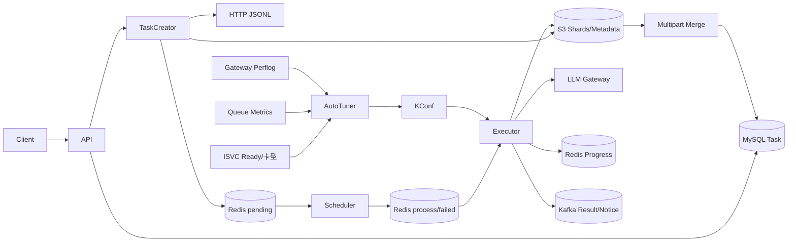

## 5. 核心技术决策

| 问题 | 决策 | 取舍 |
| --- | --- | --- |
| 大文件内存 | 流式扫描+Shard+Multipart | 输入为精确计数下载两遍；执行仍以Shard为内存边界 |
| 多实例领取 | Redis Lua pending→process | 自建ACK/heartbeat复杂，语义at-least-once |
| 并发隔离 | 每模型Shard/Request两级限制 | 配置和内存估算更复杂 |
| 实时进度 | Redis Set+snapshot | O(request count)内存，终态回MySQL |
| 结果顺序 | index回填+ShardIndex合并 | 需要保留整Shard results数组 |
| 动态容量 | Ready上界+反馈探测 | 参数需灰度，观测缺失时保守排除 |
| 配置生效 | KConf Watcher+WorkPool热更新 | 有传播/轮询延迟，需并发安全 |

## 6. 项目结果

`Experience Result`：

- 支持20GB单JSONL文件处理；
- 高峰容量相关失败率12.1%→1.8%，绝对下降10.3个百分点、相对约85.1%；
- KV Cache平均利用率37%→71%，提升34个百分点、相对约91.9%。

## 7. 你的职责口径

### 可以作为“我负责”的重点

- JSONL任务处理链路重构；
- 流式下载、网络中断分类和分片重试；
- 动态分片与S3对象布局；
- S3 Multipart流式结果合并；
- 模型并发自动探测/调谐；
- Gateway成功率、队列信号、容量上界和KConf闭环；
- 灰度、指标与效果分析。

### 作为“我熟悉并参与关键链路协作”

- Batch API和状态机；
- Redis调度/升级恢复；
- Gateway请求执行和重试；
- 实时进度与消息交付；
- 欠费冻结、通知和运维排障。

具体措辞必须按真实提交、评审和上线责任调整。

## 8. 最有深度的复盘

> 当前系统已经把大文件主风险从整文件内存转成了可控边界，但还有三处值得继续做：Task创建不是durable，Merge失败缺少Reconciler，Shard完成汇总会产生O(S²) OSS读。我会优先补create outbox、merging状态+分布式锁和增量Reducer，让系统从“故障可恢复”进一步变成“状态能自动收敛”。


---

来源：`10-experience-and-interview/02-large-file-chain-star.md`

## 核心经历一：20GB JSONL 链路重构

## 1. STAR 主回答

### Situation

原有批任务处理大文件时，如果下载、分片或结果合并需要整文件/整任务结果常驻内存，会出现OOM、临时磁盘不足、上传失败全量重做等问题；网络中途断流还可能被误报成末行JSON错误，定位困难。

### Task

在不改变用户JSONL协议和最终有序结果的前提下，降低内存与磁盘峰值，提高20GB级单文件的处理稳定性，并让网络错误、格式错误可区分、可恢复。

### Action

1. 自定义HTTP streaming reader，分别控制连接、响应头和read-idle timeout，并跟踪Content-Length/实际读取字节；
2. Scanner逐行验证JSON，结合EOF、读取状态和Content-Length区分输入格式错误与网络截断；
3. 第一遍校验/计数，按 `max(minShardSize, ceil(N/maxShardNumber))` 计算Shard行数，并由maxLine配置做硬上限；
4. 第二遍逐行生成稳定request ID，只缓冲当前Shard，写确定性S3 data/meta对象；
5. 结果按request index回填，Shard内和跨Shard保持原顺序；
6. 最终合并顺序读取Shard结果，只保留64MiB buffer，满Part即UploadPart；
7. Initiate/Part/Complete做重试，Complete响应丢失时用task/count/merge_time metadata确认对象是否实际完成；失败则Abort，配合指标和日志。

### Result

`Experience Result`：稳定支持20GB单文件处理。内存不再与整任务输入/输出总量线性增长，最终合并主要受固定64MiB Part和单行buffer约束。

## 2. 为什么不是单遍

当前精确动态分片需要先知道总行数，再决定linePerShard，所以下载两遍：

```text
pass1: validate + count
pass2: assign ID + shard + upload
```

优点是Shard数/大小可预测、非法输入在入队前整体失败；代价是源站带宽和时间约2倍，第二遍内容理论上可能变化。

后续可以：

- 首次下载同时落原始S3，再从稳定对象切分；
- 单遍按固定上限切分，结束后写manifest；
- URL提供ETag/version，两个pass做一致性校验。

## 3. 内存边界准确说法

不能说“全链路O(1)”：

```text
输入接入：O(当前Shard)
Shard执行：O(Shard requests + responses + serialized result)
最终合并：O(64MiB + 当前行)
```

20GB不整体常驻，但单Shard过大、响应大、Shard并发高仍会造成内存峰值，所以MaxLinePerShard、max_execute_shard和请求并发要联合压测。

## 4. 动态分片公式

设计公式：

```text
if N <= maxShardNumber × minShardSize:
    linesPerShard = minShardSize
else:
    linesPerShard = ceil(N / maxShardNumber)
```

但代码中 `max_line_per_shard>0` 会直接覆盖公式。面试时应主动指出“当前线上通过硬行数上限控制内存，动态公式是默认策略”。

## 5. 网络错误分类

Scanner返回false可能是：

- 正常EOF；
- token过长；
- reader网络错误；
- 响应提前结束；
- 最后一行本身非法JSON。

分类时组合：scanner.Err、reader.LastError、expected/actual bytes、当前行号和截断摘要。只有网络中断型错误才自动重跑createShards；确定性JSON错误立即失败，避免无意义重试。

## 6. Multipart细节

- 小于64MiB不启动Multipart，直接Put；
- 64MiB每Part，最多10000 Part；
- 20GiB约320 Part；
- Part按顺序记录ETag，最后Complete；
- Complete报错后HEAD metadata确认“远端成功、本地未知”；
- 真失败Abort，S3 lifecycle清残留会话。

## 7. 高频追问

### 为什么分片按行数而不是字节？

JSONL天然以请求行为边界，行数更容易保证请求完整和结果计数；缺点是行大小分布不均。改进是同时限制行数和累计bytes/token估算。

### 如何保证结果顺序？

请求并发执行但写 `results[inputIndex]`；Shard结果按数组顺序保存；最终按ShardIndex顺序读取，所以文件有序。Kafka消息不保证顺序。

### Complete为什么需要metadata确认？

Complete可能已在S3提交但响应丢失。仅凭客户端error会误判；匹配本轮唯一metadata可以确认目标对象确实是本次Merge的成功结果。

### 20GB如何验证？

说明真实做过的压测维度：文件大小/行数、Shard数、峰值RSS、临时磁盘、S3吞吐、总耗时、断流/Part失败/实例重启。没有留存的数字不要临时编造。

### 当前最大的遗留问题？

执行仍整Shard驻内存，Task汇总O(S²)，Merge失败无自动补偿、跨副本无锁。优先用有界pipeline、增量Reducer和per-task Merge lease解决。

## 8. 代码级调用链

```text
CreateBatch
→ TaskCreator.CreateTask
→ validateDataset
→ downloadFromHTTPWithProgress
→ getShardSize
→ createShardsWithRetry/createShardsOnce
→ uploadShard/enqueueShards
→ Executor.processShardData/saveResults
→ updateTaskProgress
→ MergeShardOutputs
→ multipartMergeWriter
→ RUN_COMPLETE
```


---

来源：`10-experience-and-interview/03-autotuner-star.md`

## 核心经历二：模型并发自动探测

## 1. STAR 主回答

### Situation

离线模型并发原先依赖人工静态配置。配置偏低时GPU/KV Cache吃不满，偏高时高峰出现429/529/5xx、排队和重试放大；副本数、卡型和请求长度变化使一个固定值很快失效。

### Task

做一个多模型、多KSN、多Batch服务副本下可运行的闭环控制器：能根据实时容量给出安全上界，在上界内自动探索吞吐，过载时快速回退，并可灰度、可解释、可人工关闭。

### Action

1. 容量建模：`ReadyReplicas × baselineConcurrency × cardTypeRatio` 求每KSN容量，汇总后按Batch实例数分摊并clamp；
2. 信号采集：Gateway perflog筛选Sheddable离线流量，2xx成功，429/5xx失败，30秒桶、10分钟窗口、最小100请求；
3. 队列信号：Scaler `waiting/running` 表示排队压力；Gateway样本不足回退Scaler成功率；
4. 决策策略：成功率0.990/0.995和队列0.4/1.0形成迟滞，fast/slow/hold/rollback分别+5%/+2%/0/-10%上界；
5. 多KSN：缺指标KSN及其容量排除，有效KSN按rollback>hold>slow>fast聚合；
6. 多实例：Redis全局采样锁和Reconcile锁，窗口/last result保存在Redis；
7. 执行闭环：统一写KConf，Watcher传播，定时热调模型WorkPool cap；
8. 灰度：shadow只决策不写，再单核心模型、高峰时段逐步放量，观察失败率、延迟、队列、KV Cache、完成率。

### Result

`Experience Result`：核心离线模型高峰期容量相关失败率12.1%→1.8%，KV Cache平均利用率37%→71%。

## 2. 控制公式

```text
perReplica = floor(baseline × cardRatio)
ksnCapacity = readyReplicas × perReplica
upperBound = clamp(ceil(ΣeffectiveCapacity × safety / batchInstances), min, max)

fastStep = ceil(upperBound × 5%)
slowStep = ceil(upperBound × 2%)
rollbackStep = ceil(upperBound × 10%)
```

## 3. 为什么两个信号

- 只看成功率：队列已积压但尚未失败时反应太慢；
- 只看队列：短请求/路由变化可能让ratio波动，无法体现真实SLO；
- 两个都好才快探，任一坏立即退，兼顾早期压力与最终结果。

Ready容量不是第三个反馈信号，而是硬搜索边界。

## 4. 为什么不用load1

load1是通用系统指标，不直接反映推理Engine的KV Cache、prefill/decode和请求排队。waiting/running更接近容量饱和，Gateway容量错误更接近用户SLO。KV Cache当前作为灰度效果指标，未来可作为输入。

## 5. 为什么能失败下降又利用率上升

闭环不是“统一降并发”或“统一加并发”：

- 健康低压时逐步加，提升cache/吞吐；
- 高峰过载时更大步回退，降低容量错误；
- 副本缩容时硬上界立即收缩；
- 迟滞和窗口避免来回震荡。

效果来自时间维度上更贴近实时容量。

## 6. 多KSN难点

一个模型可能跨不同卡型和资源池：

- 卡型用ratio归一单副本能力；
- 每KSN独立采信号；
- 缺指标容量不能支撑自动扩容；
- 任一有效KSN bad对共享总并发有veto；
- private模型允许非offline pool，public只用离线池。

更高级方案是每KSN独立预算并调Gateway路由权重，但复杂度更高。

## 7. 高频追问

### 阈值怎么定？

先依据SLO和历史失败分布设初值，再用历史窗口回放看误调/收敛速度，shadow验证decision，灰度调步长。当前默认坏<99.0%、好>99.5%，中间为迟滞区。

### 为什么10分钟窗口、5分钟调？

要达到最小请求量并过滤短抖动，又能在高峰内多次反应。共享历史样本稳定但有滞后，应结合模型请求时长和流量验证。

### 样本缺失怎么办？

Gateway不足100回退Scaler；任何必要信号仍缺则排除该KSN及容量；全部缺时保持当前并发且不覆盖上次有效状态。

### 如何防多实例重复写？

采样和Reconcile各有Redis全局锁；KConf统一批量写。更严格可加fencing/revision CAS，因为TTL锁超时后理论上仍可重入。

### 如何防震荡？

good/bad迟滞区、10分钟窗口、5分钟周期、升小步降大步、容量上界和最小样本。可再加连续N轮、冷却期和emergency breaker。

### 当前算法像什么？

是带硬容量上界和双信号迟滞的AIMD变体：固定比例上界的加性探测、较大步长下降，强调可解释和安全。

### 失败率口径？

控制器只统计Sheddable离线请求，2xx成功，429/5xx失败，排除业务4xx。项目看板口径需按真实历史定义说明，不把未知口径混为一谈。

### KV Cache是不是输入？

当前不是，是灰度效果指标。说成“基于KV Cache调节”不准确。

## 8. 代码级调用链

```text
Service.Start
→ StartRequestSuccessCollectorFromGlobal
→ SampleAutoTunerMetricsOnce
→ Scaler.SelectISVCMetrics
→ Redis ZSET window
→ ReconcileOnce
→ FetchRuntimeInfoMap/DeriveKSNConcurrency
→ EvaluateConcurrencySignal
→ selectAutoTuneKSNs/Aggregate/Apply
→ ApplyModelConfigUpdates
→ KConf Watcher
→ ConcurrencyController.Update
→ WorkPool.CompareAndChangeCap
```


---

来源：`10-experience-and-interview/04-interview-question-bank.md`

## 面试问题库

## 一、整体架构

### 1. 系统的核心链路是什么？

API落MySQL → HTTP流式校验/计数 → 动态分片写S3 → Redis模型队列 → Lua claim → Shard/Request两级并发 → Gateway → Redis实时进度和S3 Shard结果 → Multipart最终合并 → MySQL completed/Kafka交付。

### 2. 是微服务还是单体？

当前镜像只起apiserver，但进程内同时启动API、TaskCreator、Scheduler、Executor、AutoTuner和监控；部署是多副本单体编排。仓库独立scheduler等是未装配/历史代码。

### 3. MySQL、Redis、S3分别是什么角色？

MySQL是Task持久控制状态；Redis是短期调度、锁、缓存和实时视图；S3是大数据和Shard事实。不能只用一个系统判断全链路状态。

### 4. 为什么不用Kafka直接做全部调度？

Redis List+Lua容易实现模型独立队列和原子pending→process，代价是自建ACK、heartbeat、retry/DLQ。Kafka/Streams可降低这部分复杂度，是演进方向。

## 二、JSONL与分片

### 5. 20GB为什么不会OOM？

整文件不入内存：HTTP Scanner逐行、只缓冲当前Shard；最终Merge只保留64MiB Part。执行阶段仍整Shard驻内存，因此准确说是把边界降到Shard/Part，不是全链路常数内存。

### 6. 为什么下载两遍？

第一遍精确校验和计数，第二遍按总行数动态分片。代价是带宽翻倍和源内容变化风险，可改成首次落S3或单遍固定上限+manifest。

### 7. 如何区分坏JSON与网络截断？

组合scanner.Err、reader最后错误、Content-Length/实际字节、EOF和当前行。确定性JSON立即失败，网络中断才重试createShards。

### 8. 分片大小怎么计算？

小任务用minShardSize，大任务用ceil(N/maxShardNumber)；但maxLinePerShard>0会覆盖公式。更好是同时按行、bytes和token估算。

### 9. 如何保证结果顺序？

Request用input index回填results；Shard按数组写；最终按ShardIndex读。Kafka消息不保证顺序，只靠ID关联。

## 三、调度与执行

### 10. 多实例如何不领同一Shard？

Lua原子LPOP pending、RPUSH process并写heartbeat。单次claim不重复；执行故障恢复仍可能重做，整体at-least-once。

### 11. 为什么两级并发？

Shard并发限制常驻内存和大任务公平性；Request WorkPool限制Gateway压力/吞吐。只调Request并发不能控制同时加载多少Shard。

### 12. 哪些状态码重试？

429、529、500到505。确定性4xx不重试；未知网络错误默认可重试。MaxRetry实际是总attempt数。

### 13. 退避有什么问题？

指数退避有cap，但无jitter且time.Sleep不响应context，可能惊群和取消延迟；应full jitter+select timer。

### 14. 升级时Shard怎么恢复？

process元素保留，执行实例续Redis heartbeat。heartbeat过期且超过保护期后，全局扫描器重执行孤儿Shard。

### 15. 能保证exactly-once吗？

不能。进度和OSS副作用可幂等，但Gateway调用可能在响应丢失后重复。需要Gateway requestID幂等才能做到exactly-once effect。

### 16. 模型无Ready副本怎么办？

5秒起指数等待、最多60秒间隔；public只认offline，private允许其他池。Shard首次用Background可能无限等，是待改进点。

## 四、状态和结果

### 17. 实时进度为什么用Set？

Shard可能重做，INCR会重复；Set按稳定requestID去重，failed Set还能把失败后成功修正。snapshot让查询O(1)。

### 18. Task什么时候算成功？

所有completed Shard的TotalLines和等于Task总行数后Merge；Merge成功、output_file和计数写MySQL并触发RUN_COMPLETE后才真正completed。

### 19. 单条请求失败会让Task failed吗？

不会。Response带error，Shard仍completed，Task可completed但failed_count>0。基础设施导致Shard failed，所有Shard终结后Task才failed。

### 20. Multipart如何保证稳定？

64MiB buffer，Part独立重试；小文件直接Put；Complete error后用唯一metadata确认远端是否已成功；真失败Abort。

### 21. 当前Merge的主要风险？

每Shard完成全扫Metadata是O(S²)；outputLock只进程内且全Task串行；Merge失败不转终态/无自动重试。

### 22. 文件和消息模式差异？

文件最终有序JSONL；消息每Response异步发中转Topic再路由，可能丢/重且无序。消息模式最终文件当前只合并一个Shard，是契约风险。

## 五、AutoTuner

### 23. 自动调谐完整闭环？

ISVC Ready/卡型算上界；Gateway成功率+Scaler队列比做反馈；策略算target；写KConf；Watcher+定时器调整WorkPool；新指标进入下一轮。

### 24. 上界公式？

ceil(ΣReadyReplicas×baseline×cardRatio×safety / BatchInstances)，再clamp到1和goroutineMax之间。

### 25. 信号阈值？

成功率<.990 bad、>.995 good；queue ratio>1 bad、<.4 good；中间ok，等于边界也是ok。

### 26. 决策和步长？

任一bad回退10%上界；两个good快探5%；一个good一个ok慢探2%；其他hold；缺信号排除KSN。

### 27. 多KSN如何聚合？

缺指标KSN及容量先排除；有效KSN按rollback>hold>slow>fast。上界用有效容量重算。

### 28. 为什么只调有活跃任务的模型？

空载时queue=0看似good但没有真实成功率/吞吐，探测无意义且会改动无业务模型。DB查询失败时fail-open继续。

### 29. Gateway成功率如何防在线流量污染？

只取router request_cost中offline/Sheddable流量，2xx成功，429/5xx失败，最小100样本。

### 30. 为什么失败率下降且KV利用上升？

低压时上探提高利用率，高峰时信号恶化快速回退减少错误；不是固定增/减并发。

## 六、可靠性与演进

### 31. 最严重的卡任务窗口？

DB创建后本地goroutine丢失会卡init；Merge失败会卡running。需要create outbox和Task Reconciler。

### 32. 状态机有什么问题？

取消绕过stopping，FAIL/RUN_COMPLETE无条件，事务读不在tx且没可靠检查RowsAffected。应统一CAS/version和终态优先级。

### 33. 如何设计Task Reconciler？

扫描长init、无队列pending/running、heartbeat过期process、全Shard完成未终态、最终对象存在但DB未完成；按确定性规则补触发/重建/失败，并带lease。

### 34. 如何做消息可靠交付？

以OSS Shard结果为事实，写durable manifest/outbox和发送游标；Dispatcher重试/DLQ，对账器按taskID+requestID补发，消费者幂等。

### 35. 如何优化O(S²)进度？

Shard完成原子累加Reducer，只有最后一个触发一次全量Metadata校验和Merge；Reducer状态带幂等Shard ID。

### 36. 如何进一步降执行内存？

有界producer-consumer：Scanner读取请求提交Pool，完成结果按序号写分段文件/外排缓冲；限制reorder window，不保留整Shard requests/results字符串。

### 37. 安全风险？

禁止打印整个Config和保存真实token/预签名URL；Secret走密钥系统，日志白名单脱敏，CI secret scan并轮换历史暴露值。

### 38. 你会先做哪三个改进？

create outbox、merging状态+分布式锁/重试、Task Reconciler。先消灭永久卡死，再优化内存和消息exactly-once effect。


---

来源：`10-experience-and-interview/05-ownership-and-evidence-boundaries.md`

## 个人职责、团队能力与证据边界

## 1. 三层表达

### A. 我直接负责

只有满足真实事实时使用“我设计/开发/重构/推动上线”：

- 有主要代码提交或核心方案设计；
- 负责联调、压测或灰度；
- 能解释关键权衡、故障和指标口径；
- 能说明自己做了哪一部分，而非只说团队结果。

本项目简历已明确的A层：

1. JSONL流式下载、动态分片、S3 Multipart结果合并和大任务稳定性；
2. 模型并发自动探测、成功率/队列闭环、灰度与两项效果指标。

### B. 我参与/熟悉关键链路

适合表达：

> 作为核心后端开发，我需要对从任务创建、Redis调度、Gateway执行、状态进度到结果交付的全链路负责排障和联调，因此我系统读过并掌握这些模块。

不要把读代码/联调自动等价成“独立开发全部模块”。

### C. 团队/设计阶段能力

使用“平台支持”“团队实现”“我们设计过”，并标状态：

- 账号冻结/通知等可能由团队其他人负责；
- 私有模型任务窗口调度当前是Designed；
- TaskReconciler是空骨架，不能说已具备自动对账；
- 独立Scheduler/Statemanager不是当前线上架构。

## 2. 事实标签

| 标签 | 可说什么 |
| --- | --- |
| Code Fact | 代码明确实现、能定位调用链 |
| Runtime Inference | 由镜像入口/装配关系推断运行形态 |
| Experience Result | 压测/灰度/线上数据，代码无法单独证明 |
| Designed | 有方案但未接入 |
| Risk/Proposal | 代码审查发现或建议，尚未实现 |

例如：

> 代码事实是64MiB Multipart和Complete metadata确认；20GB是压测/线上实践结果。Task Reconciler则是我复盘后认为应该补的改进，不是现有能力。

## 3. 指标证据卡

对每个简历数字准备：

```text
指标名称：容量相关失败率
定义：<真实PromQL/分子分母>
范围：核心离线模型/Sheddable流量
时间：<before/after窗口>
聚合：请求加权/分钟平均
控制变量：副本、卡型、流量、版本
结果：12.1%→1.8%
局限：<无法完全控制的变化>
```

```text
指标名称：KV Cache平均利用率
来源：<真实Engine指标>
范围/聚合：<副本与时间口径>
结果：37%→71%
角色：灰度效果指标，不是当前控制输入
```

离开项目前只保留脱敏定义和方法，不带内部数据、链接、token或用户请求。

## 4. 20GB证据卡

准备可公开/可复述的非敏感信息：

- 20GB是输入还是输入+输出；
- JSONL总行数的数量级；
- 分片行数/Shard数量；
- 峰值内存前后对比；
- 是否用临时磁盘；
- 总耗时和S3吞吐数量级；
- 故障注入覆盖哪些场景；
- 上线后是否有真实大任务。

如果只有“成功跑过20GB”，就只说这个；不要补造内存下降百分比。

## 5. Commit与代码快照

本手册基于：

```text
branch: master
commit: 09ca42d0e4fc3fabbbd088e61823ace0b8154710
commit time: 2026-08-04T07:10:11Z
```

后续代码变化需要重新审查。手册描述的是该快照，不代表所有历史版本和线上环境完全一致。

## 6. 避免的说法

- “全链路O(1)内存”——执行仍以Shard为内存边界；
- “exactly-once”——Shard/Gateway/Kafka不是；
- “微服务架构”——当前运行是多副本单体编排；
- “基于KV Cache自动调节”——当前是效果指标；
- “0可以暂停模型”——Runtime回退默认；
- “消息模式一定有全量结果文件”——当前只合并第一Shard；
- “私有任务窗口已上线”——当前只看到设计；
- “失败率下降完全由控制器因果导致”——除非有严格A/B证据。

## 7. 可信表达模板

> 这部分是我直接负责的，我可以从设计、实现、压测和灰度展开。

> 这部分不是我独立开发，但它在我负责链路的上下游，我通过代码和线上排障掌握了具体实现。

> 这是仓库里的二阶段设计，当前快照还未接入，我会把它作为演进方案而不是现有能力介绍。

> 这个数字来自灰度看板，代码能证明机制但不能证明线上结果；它的统计口径是……

